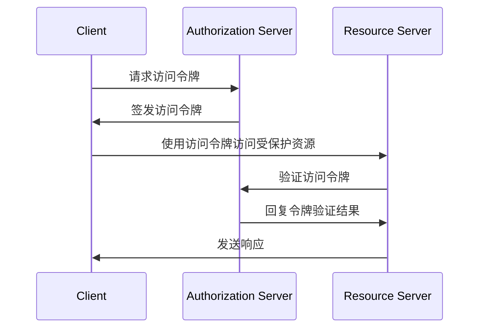
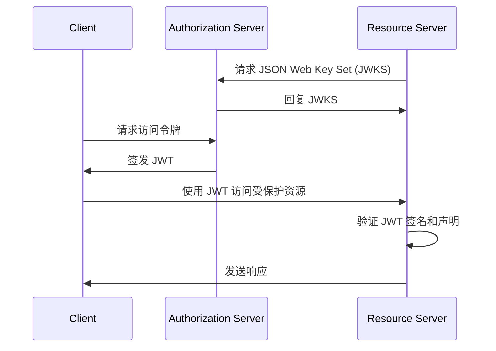
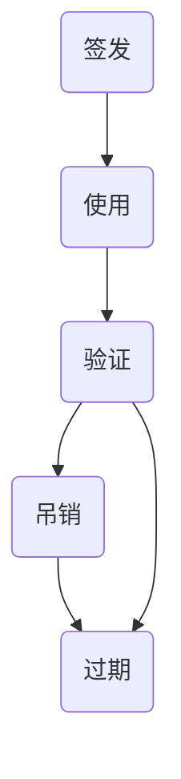

## 什么是访问令牌 (Access token)？

访问令牌 (access token) 是用于访问受保护资源的凭据，通常是一串字符。在 OAuth 2.0 和 OpenID Connect (OIDC) 的背景下，在成功认证 (authentication) 和授权 (authorization) 后，<Ref slug="authorization-server">授权服务器 (authorization server)</Ref> 可能会向客户端（应用程序）颁发访问令牌。

尽管 OAuth 2.0 和 OIDC 的 RFC 没有具体说明访问令牌的实现细节，但实际上有两种常见的访问令牌类型：

- <Ref slug="opaque-token" />：一个对客户端没有意义的随机字符串（“不透明”）。客户端向资源服务器 (resource server) 出示令牌，资源服务器会与授权服务器验证该令牌。
- <Ref slug="jwt" />：一个包含有数字签名的自包含令牌，包含<Ref slug="claim">声明 (claims)</Ref>（例如用户 ID、过期时间）。资源服务器无需向授权服务器发出额外请求即可验证该令牌。

## 访问令牌 (Access token) 如何工作？

根据访问令牌的类型，使用访问令牌的流程可能有所不同。

以下是使用不透明访问令牌的简化示例：

以下是使用 JWT 的简化示例：

两种类型访问令牌的区别在于资源服务器如何验证令牌：

- 每次资源服务器收到不透明令牌时，必须向授权服务器发出额外请求以验证该令牌。
- 资源服务器可以验证 JWT 而无需向授权服务器发出额外请求，因为该令牌包含所有必要的信息，资源服务器可以缓存来自授权服务器 JSON Web Key Set (JWKS) 的公钥。

访问令牌通常是短期的，有一个过期时间（例如 1 小时）。令牌到期后，客户端必须请求新的访问令牌。

## 我应该使用哪种类型的令牌？

在不透明令牌和 JWT 之间进行选择取决于应用程序的用例和安全要求。以下是两种令牌类型的对比：

|                | 不透明令牌                     | JWT                                                           |
|----------------|--------------------------------|---------------------------------------------------------------|
| 格式           | 随机字符串                     | 自包含 JSON 对象                                               |
| 性能           | 需要额外请求                   | 更快的验证                                                     |
| 自包含         | 否                             | 是                                                             |
| 令牌大小       | 较小                           | 较大                                                           |
| 吊销           | 即时                           | 需要令牌过期或与授权服务器交互                                 |
| 可扩展性       | 有限                           | 自定义声明                                                     |
| 无状态         | 否                             | 是                                                             |
| 安全性         | 需要令牌验证                   | 需要签名验证                                                   |
| 标准           | 否                             | 是 (RFC 7519)                                                  |

有关选择两种令牌类型的更多信息，请参见 [Opaque token vs JWT](https://blog.logto.io/opaque-token-vs-jwt)。

## 授权服务器和资源服务器的角色

在大多数情况下，<Ref slug="authorization-server" /> 具有以下职责：

- 在成功认证 (authentication) 和授权 (authorization) 后向客户端颁发访问令牌。授权服务器可能会根据访问控制策略（例如用户同意，<Ref slug="rbac" />，<Ref slug="abac" />）缩小范围（将范围缩小为一个子集）或拒绝令牌请求。
- 检查访问令牌是否由授权服务器签发，且未过期或被吊销 (<Ref slug="token-introspection" />)。
- 通过令牌内省或 <Ref slug="userinfo-endpoint" /> 提供有关令牌的信息（例如范围、过期时间）。

你可能会注意到授权服务器不解释访问令牌的含义。例如，访问令牌可能包含范围 `read:orders`，但授权服务器不知道该范围的含义。资源服务器负责解释访问令牌，并基于令牌的范围实施<Ref slug="access-control">访问控制 (access control)</Ref>。也就是说，<Ref slug="resource-server" /> 通常有以下职责：

- 验证访问令牌中的<Ref slug="claim">声明 (claims)</Ref>（例如过期时间、资源指示器、范围）。
- 基于令牌的声明（通常是范围）实施访问控制。
- 如果访问令牌有效，提供受保护的资源。

## 访问令牌 (Access token) 生命周期

访问令牌的生命周期通常涉及以下阶段：

<SeeAlso slugs={['opaque-token', 'jwt', 'token-introspection', 'userinfo-endpoint', 'access-control']} />

<Resources
  urls={[
    "https://blog.logto.io/opaque-token-vs-jwt",
    "https://blog.logto.io/oauth2-token-introspection",
    "https://blog.logto.io/understanding-tokens-in-oidc",
    {
      url: "https://datatracker.ietf.org/doc/html/rfc6749#section-1.4",
      result: {
        ogTitle: "OAuth 2.0 Access Token",
      },
    },
    "https://datatracker.ietf.org/doc/html/rfc7662",
  ]}
/>