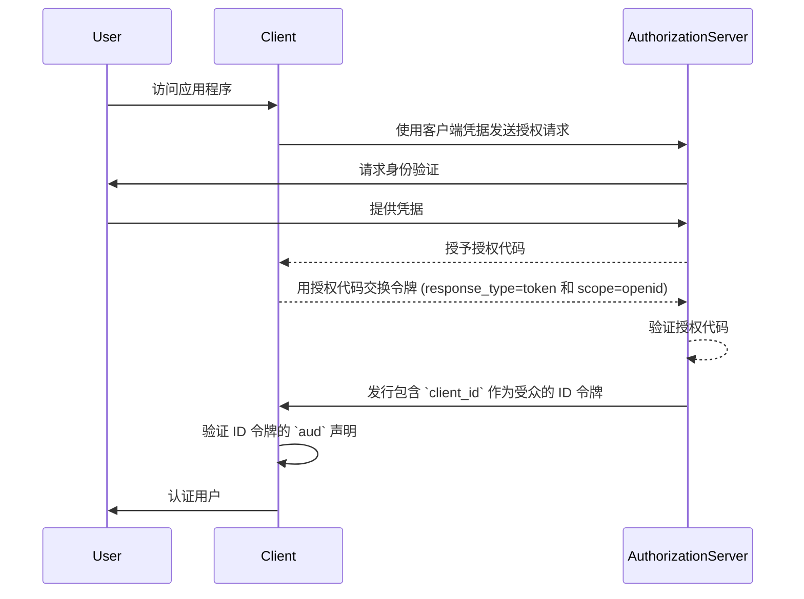
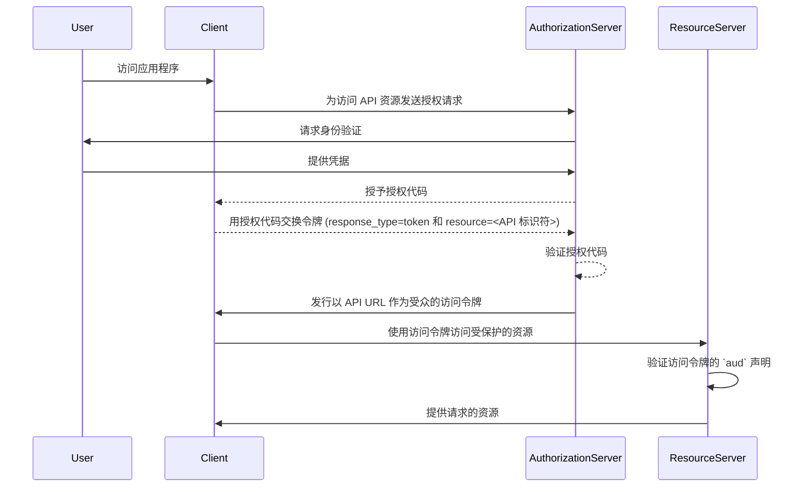

## 什么是受众 (Audience)？

在认证 (Authentication) 和授权 (Authorization) 的上下文中，受众 (audience) 是定义授权令牌预期接收者的关键组成部分。在 <Ref slug="jwt" /> 中被称为 [aud](https://datatracker.ietf.org/doc/html/rfc7519#section-4.1.3) 声明，这个声明确保令牌仅被指定的服务或应用程序接受。通常，受众声明包含令牌所针对的应用程序的 client_id 或表示令牌被授权访问的 API 或资源的 URL。通过指定受众，它作为一种安全控制措施来防止未经授权的服务或用户的滥用。

## 受众 (Audience) 如何工作？

当客户端从授权服务器请求访问令牌时，受众声明被包含在令牌响应中。然后，当令牌被展示时，资源服务器会验证这个受众值。资源服务器检查令牌中的受众声明是否与其自身的标识符或其所保护的服务的标识符匹配。如果不匹配，令牌将被拒绝，这在分布式系统中提升了安全性，特别是在涉及多个微服务或 API 的场景中。通过控制受众声明，开发者可以确保令牌在正确的上下文中使用，为他们的应用程序的认证 (Authentication) 和授权 (Authorization) 工作流增加一层保护。

- **请求者**: 客户端应用程序在请求令牌时指定受众值。
- **发行者**: 授权服务器在令牌响应中包含受众声明。
- **验证者**: 令牌的接收者检查受众声明与其自身的标识符是否匹配。如果受众声明与接收者的标识符匹配，则令牌被视为有效，否则，令牌将被拒绝。

## JWT 中受众 (Audience) 的示例

### OpenID Connect (OIDC) ID 令牌中的受众声明

```json
{
  "header": {
    "alg": "RS256",
    "typ": "JWT",
    "kid": "abc123"
  },
  "payload": {
    "iss": "https://auth.logto.io",
    "sub": "test_user",
    "aud": "client_id_foo",
    "exp": 1516239022,
    "iat": 1516239022,
    "nonce": "n-0S6_WzA2Mj",
    "primary_email": "foo@logto.io",
    "email_verified": true,
    "username": "foo"
  },
  "signature": "..."
}
```

<Ref slug="id-token" /> 在 OpenID Connect (OIDC) 中是一种安全令牌，包含关于已认证用户的信息，在成功的认证后传递给客户端应用程序。与用于授予访问资源权限的访问令牌不同，ID 令牌专门设计用于将用户身份信息传递给依赖方（客户端）。这些令牌通常被编码为 JWTs (JSON Web Tokens)，并包括用户标识符（sub 声明）、发行者（iss 声明）和受众（aud 声明）等声明。

在这种情况下，`aud` 声明指定了 ID 令牌的预期受众，即客户端应用程序。`aud` 声明的值通常对应请求令牌的应用程序的 `client_id`。当客户端应用程序接收到 ID 令牌时，它可以验证受众声明以确保令牌是为其消费而发行的。这个验证步骤有助于防止令牌滥用和未经授权访问用户信息，增强认证过程的安全性。



### 访问令牌中的受众声明

```json
{
  "header": {
    "alg": "RS256",
    "typ": "JWT",
    "kid": "abc123"
  },
  "payload": {
    "iss": "https://auth.logto.io",
    "sub": "test_user",
    "aud": "https://example.logto.app/api/users",
    "exp": 1516239022,
    "iat": 1516239022,
    "scope": "read write",
    "client_id": "client_id_foo"
  },
  "signature": "..."
}
```

与 ID 令牌不同，访问令牌用于授权访问受保护资源，如 APIs 或服务。访问令牌中的 `aud` 声明指定令牌的预期接收者，通常是令牌被授权访问的 API 或服务。通常，托管 API 的资源服务器与请求令牌的客户端应用程序具有不同的域。在这种情况下，`aud` 声明不是 `client_id`，而是令牌所针对的 API 端点的 URL。这个 URL 通常被称为资源指示器或 API 标识符，唯一标识目标资源。

当资源服务器收到访问令牌时，它会验证 `aud` 声明以确保令牌是为其消费而设计的。通过检查受众，资源服务器可以防止对其资源的未经授权访问，并根据令牌的预期受众执行访问控制策略。这种机制有助于保护敏感数据，并确保访问令牌在适当的上下文中使用，从而增强整个系统的安全性。



## 常见问题

### 为什么受众 (Audience) 声明在令牌验证中很重要？

受众声明在令牌验证中至关重要，因为它确保令牌仅被预期的接收者接受。通过验证受众声明，接收者可以防止令牌滥用和未经授权访问资源。这种安全控制在多个服务相互交互的分布式系统中特别重要，因为它有助于执行访问控制策略并保护敏感数据。

### 一个令牌可以有多个受众吗？

出于安全原因，建议一个令牌有一个单一的受众，以防止歧义并确保令牌在正确的上下文中使用。然而，一些场景可能需要具有多个受众的令牌，例如当一个令牌被设计用于同一域内的多个服务或 APIs 时。在这种情况下，开发者应该仔细考虑使用多受众令牌的后果，并实施适当的安全措施来降低潜在的风险。

### 在受众声明中应该使用什么作为我的 API 标识符？

当在代表 API 或服务的访问令牌中指定受众声明时，建议使用能够唯一标识资源的绝对 URI。这个 URI 可以是 API 端点的基本 URL，或者是令牌被授权访问的特定资源路径。通过使用 URI 作为 API 标识符，可以确保受众声明是明确的并准确表示令牌的预期接收者。