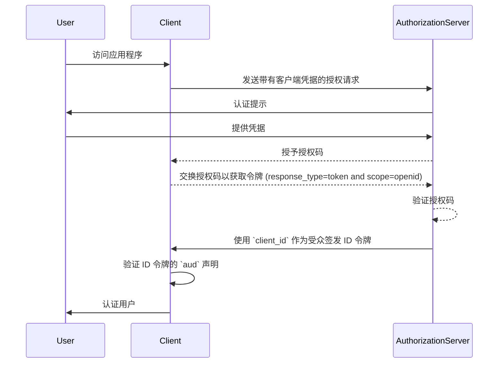
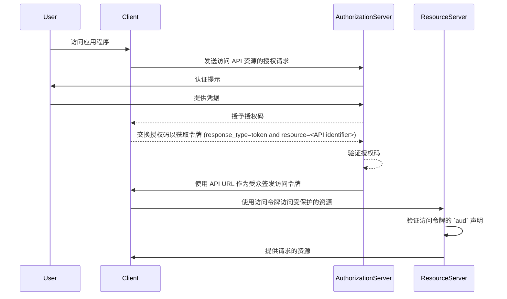

## 什么是受众 (Audience)？

在 <Ref slug="authentication" /> 和 <Ref slug="authorization" /> 的上下文中，受众 (audience) 是定义授权令牌预期接收者的关键组件。在 <Ref slug="jwt" /> 中被称为 [aud](https://datatracker.ietf.org/doc/html/rfc7519#section-4.1.3) 声明，这个声明确保令牌仅被指定的服务或应用程序接受。通常，受众 (audience) 声明包含令牌所针对的应用程序的 client_id 或者代表该令牌被授权访问的 API 或资源的 URL。通过指定受众 (audience)，它可作为一种安全控制措施，防止未经授权的服务或用户滥用。

## 受众 (Audience) 如何运作？

当客户端向授权服务器请求 <Ref slug="access-token" /> 时，受众 (audience) 声明会包含在令牌响应中。当令牌被呈现时，资源服务器会验证这个受众值。资源服务器检查令牌中的受众 (audience) 声明是否与其自身的标识符或它正在保护的服务的标识符匹配。如果不匹配，该令牌将被拒绝，从而增强分布式系统中的安全性，特别是在涉及多个微服务或 API 的场景中。通过控制受众 (audience) 声明，开发人员可以确保令牌在正确的上下文中使用，从而为应用程序的认证 (Authentication) 和授权工作流添加额外的保护层。

- **请求者**：客户端应用程序在请求令牌时指定受众 (audience) 值。
- **发行者 (Issuer)**：授权服务器在令牌响应中包含受众 (audience) 声明。
- **验证者**：令牌的接收者检查受众 (audience) 声明与自身标识符是否匹配。如果受众 (audience) 声明与接收者的标识符匹配，则令牌被视为有效。否则，将被拒绝。

## JWT 中受众 (Audience) 的示例

### OpenID Connect (OIDC) ID 令牌中的受众 (Audience) 声明

```json
{
  "header": {
    "alg": "RS256",
    "typ": "JWT",
    "kid": "abc123"
  },
  "payload": {
    "iss": "https://auth.logto.io",
    "sub": "test_user",
    "aud": "client_id_foo",
    "exp": 1516239022,
    "iat": 1516239022,
    "nonce": "n-0S6_WzA2Mj",
    "primary_email": "foo@logto.io",
    "email_verified": true,
    "username": "foo"
  },
  "signature": "..."
}
```

<Ref slug="openid-connect" /> 中的 <Ref slug="id-token" /> 是一种安全令牌，其中包含有关已认证用户的信息，在成功认证后发送给客户端应用程序。与用于授予访问资源权限的访问令牌不同，ID 令牌专门用于向依赖方（客户端）传达用户身份信息。这些令牌通常被编码为 JWT，并包含诸如用户标识符（sub 声明）、发行者 (issuer)（iss 声明）和受众 (audience)（aud 声明）等声明。

在这种情况下，`aud` 声明指定了 ID 令牌的预期受众，即客户端应用程序。`aud` 声明的值通常对应请求令牌的应用程序的 `client_id`。当客户端应用程序接收到 ID 令牌时，它可以验证受众 (audience) 声明以确保令牌是为其消费而签发的。此验证步骤有助于防止令牌滥用和未经授权访问用户信息，增强认证过程的安全性。



### 访问令牌中的受众 (Audience) 声明

```json
{
  "header": {
    "alg": "RS256",
    "typ": "JWT",
    "kid": "abc123"
  },
  "payload": {
    "iss": "https://auth.logto.io",
    "sub": "test_user",
    "aud": "https://example.logto.app/api/users",
    "exp": 1516239022,
    "iat": 1516239022,
    "scope": "read write",
    "client_id": "client_id_foo"
  },
  "signature": "..."
}
```

与 ID 令牌不同，<Ref slug="access-token" /> 用于授权访问受保护的资源，例如 API 或服务。访问令牌中的 `aud` 声明指定了令牌的预期接收者，通常是令牌被授权访问的 API 或服务。通常，托管 API 的资源服务器与请求令牌的客户端应用程序具有不同的域。在这种情况下，`aud` 声明包含令牌预期的 API 端点的 URL 而不是 `client_id`。该 URL 通常称为资源指示符或 API 标识符，用于唯一标识目标资源。

当资源服务器接收到访问令牌时，它会验证 `aud` 声明以确保令牌是为其使用而指定的。通过检查受众 (audience)，资源服务器可以防止对其资源的未经授权访问，并根据令牌的预期受众实施访问控制策略。这种机制有助于保护敏感数据，并确保访问令牌在适当的上下文中使用，从而增强整体系统的安全性。



## 常见问题

### 为什么在令牌验证中受众 (audience) 声明很重要？

在令牌验证中，受众 (audience) 声明至关重要，因为它确保令牌仅被预期的接收者接受。通过验证受众 (audience) 声明，接收者可以防止令牌滥用和未经授权访问资源。这一安全控制在多个服务相互交互的分布式系统中特别重要，因为它有助于实施访问控制策略并保护敏感数据。

### 令牌可以有多个受众 (audience) 吗？

出于安全原因，建议令牌有一个单一的受众 (audience) 以防止产生歧义，并确保令牌在正确的上下文中使用。然而，一些场景可能需要具有多个受众的令牌，例如当一个令牌用于同一域内的多个服务或 API 时。在这种情况下，开发人员应仔细考虑使用多受众令牌的影响，并实施适当的安全措施以减轻潜在风险。

### 在受众 (audience) 声明中我应该使用什么作为 API 标识符？

在表示 API 或服务的访问令牌的受众 (audience) 声明中，建议使用唯一标识资源的绝对 URI。该 URI 可以是 API 端点的基本 URL 或令牌被授权访问的某个特定资源路径。通过使用 URI 作为 API 标识符，可以确保受众 (audience) 声明明确无误，并准确代表令牌的预期接收者。