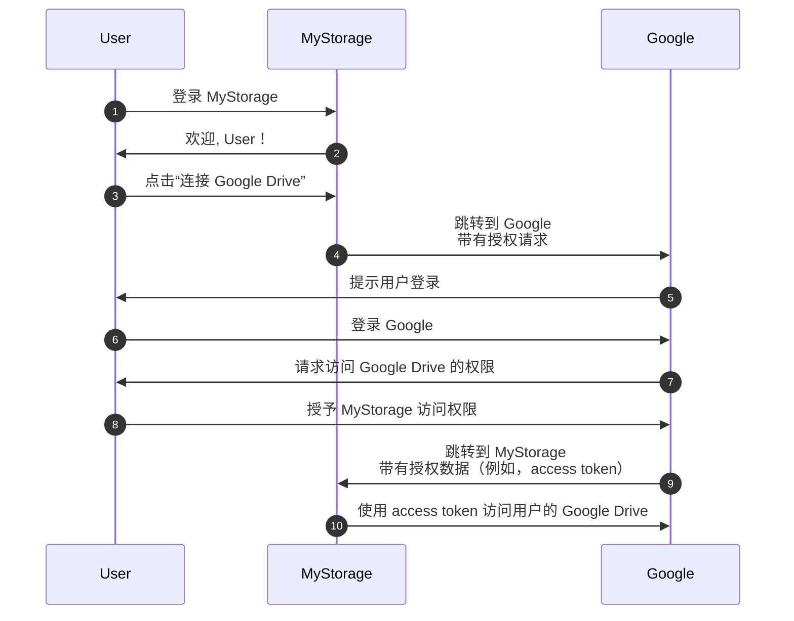

## Auth

本页面是术语“auth”的释义。它通常用作以下的缩写：

- <Ref slug="authentication" />：验证身份所有权（例如，用户或服务）的过程。它回答的问题是“你拥有什么身份？”
- <Ref slug="authorization" />：确定身份可以对资源执行哪些操作的过程。它回答的问题是“你能做什么？”

> [!Note]
> 有时，authentication 和 authorization 被分别称为“AuthN”和“AuthZ”。

这两个概念在 <Ref slug="iam" /> 领域中都很重要，但它们本质上是不同的。让我们看一个例子：一个名为 MyStorage 的 Web 应用具有上传文件和连接到 Google Drive 的功能。一个典型的用户流程是：

在这个流程中，用户执行了两个 authentication 步骤：一个是与 MyStorage（步骤 1），另一个是与 Google（步骤 6）；以及一个 authorization 步骤：授予访问 Google Drive 的权限（步骤 8）。

## 你指的是哪个？

当你看到“auth”这个术语时，重要的是要明确它指的是 authentication 还是 authorization；否则，你可能期望涵盖这两个过程（就像这个网站一样）。

<SeeAlso slugs={["authentication", "authorization", "iam", "oauth-2.0", "openid-connect"]} />