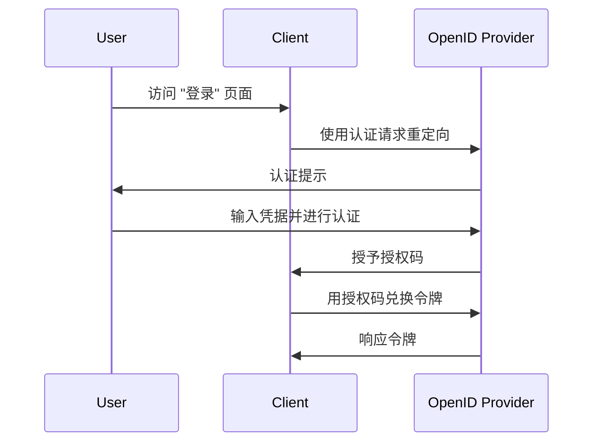

## 什么是认证请求 (Authentication request)？

虽然认证请求 (Authentication request) 的含义可以因上下文而异，但我们将重点关注 OpenID Connect (OIDC) 规范中的定义。在 OIDC 中，认证请求 (Authentication request) 是对授权服务器 (authorization server) 的<Ref slug="authorization-request" />以验证用户身份。

标准定义似乎非常混乱，因为使用了类似的术语，例如"授权请求 (authorization request)"。这是因为 OIDC 建立在主要为授权而设计的 OAuth 2.0 之上，OIDC 继承了 OAuth 2.0 的术语并扩展以支持认证。

为澄清这一点，我们来为定义添加一些上下文：

> 一个 (OpenID Connect) 认证请求是一个 (OAuth 2.0 授权) 请求，向 (OpenID Connect 授权) 服务器请求验证用户身份。

这变得更长了！现在让我们去掉所有的括号：

> 一个认证请求 (authentication request) 是向服务器请求验证用户身份的请求。

去掉所有的属性后，定义变得简单明了。以下是术语的分解：

- **认证请求 (Authentication request)**：来自 OIDC 规范的术语。
- <Ref slug="authorization-request" />：来自 OAuth 2.0 规范的术语。OIDC 重用了规范并对其进行了扩展。
- <Ref slug="authorization-server" />：来自 OAuth 2.0 规范的术语。OIDC 也使用术语 <Ref slug="openid-connect" headingId="openid-provider-op" /> 来指代能够验证用户身份的相同实体。

在接下来的部分中，我们将使用"OpenID Provider (OP)"来指代支持 OIDC 的授权服务器 (authorization server)。

## 认证请求 (Authentication request) 如何工作？

当一个客户端应用程序想要验证用户身份时，它会向 OpenID Provider (OP) 发起认证请求 (authentication request)。如前所述，认证请求 (authentication request) 也是 OAuth 2.0 中的授权请求 (authorization request)；因此，某些 OAuth 2.0 授权类型 (flows) 可以用来完成认证过程。

OIDC 定义了三种授权类型 (flows) 来支持认证：

1. <Ref slug="authorization-code-flow" />：最推荐的认证流。通常与 <Ref slug="pkce" /> 一起使用以获得更好的安全性，适用于大多数应用程序。
2. <Ref slug="implicit-flow" />：一种隐式流程，由于安全问题在 <Ref slug="oauth-2.1" /> 中已被弃用。
3. <Ref slug="hybrid-flow" />：授权码流和隐式流的组合。

认证请求 (authentication request) 是 OIDC 认证流程中的第一步。要包含的实际参数和要遵循的步骤取决于你选择的流程。点击上面的流程名称以了解更多关于每个流程的信息。

以下是使用授权码流进行认证请求 (authentication request) 的一个简化示例：

一旦客户端收到令牌，它可以使用这些令牌（例如，<Ref slug="access-token" />）代表用户访问受保护的资源（例如，一个 API）。

### 认证请求 (Authentication request) 中的关键参数

以下是认证请求 (authentication request) 中的一些关键参数：

- **`response_type`**：客户端从授权服务器 (authorization server) 期望的响应类型。对于授权码流可以是 `code`，对于隐式流可以是 `id_token`，对于混合流可以是 `code id_token`。
- **`client_id`**：由 OpenID Provider (OP) 颁发的客户端标识符。
- **`redirect_uri`**：授权服务器 (authorization server) 在认证请求后将用户代理重定向到的 URI。
- **`scope`**：为 <Ref slug="id-token" /> 和 <Ref slug="access-token" /> 请求的<Ref slug="scope">范围 (scopes)</Ref>（权限）。
- **`resource`**：可选参数，指定请求资源的<Ref slug="resource-indicator" />。授权服务器 (authorization server) 需要支持 [RFC 8707](https://datatracker.ietf.org/doc/html/rfc8707) 才能使用此参数。

请注意，上述参数并不详尽。在发出认证请求 (authentication request) 之前，你应参考所使用的特定流程的完整参数列表。

<SeeAlso slugs={["openid-connect", "oauth-2.0", "authorization-code-flow", "implicit-flow", "hybrid-flow"]} />

<Resources
  urls={[
    "https://openid.net/specs/openid-connect-core-1_0.html",
  ]}
/>
