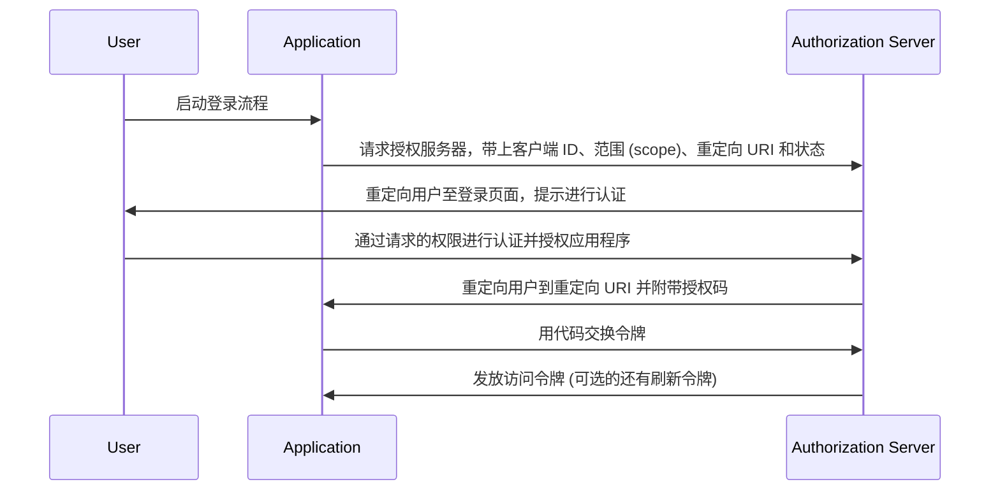

## 什么是授权码流程？

授权码流程 (Authorization code flow)（又称为授权码授权 (authorization code grant)），在 [OAuth 2.0 RFC 6749，第 4.1 节](https://datatracker.ietf.org/doc/html/rfc6749#section-4.1) 中定义，是一种广泛使用的 OAuth 2.0 授权机制，允许应用程序代表用户获取访问令牌 (access token)。该流程特别适合用于可以安全存储客户端密钥的机密应用程序（例如传统的服务端运行的 Web 应用程序）。

授权码流程是获取 OAuth 2.0 访问令牌 (access token) 的一种稳健而安全的方法，因此成为许多 Web 应用程序的首选。理解此流程对于从事 OAuth 2.0 和 API 集成开发的开发人员至关重要。

## 授权码流程如何运作？

授权码流程包括以下步骤：

1. **流程启动**：用户点击应用程序中的链接或按钮启动流程进行登录。应用程序将用户重定向到授权服务器的授权端点，同时传递客户端 ID、请求的范围 (scope)、重定向 URI 和状态参数。授权服务器验证参数并提示用户在授权服务器的登录页面上进行认证。
2. **用户认证与授权**：用户在授权服务器上进行认证，并授予应用程序访问请求资源的权限。
3. **代码生成与重定向**：授权服务器生成一个授权码并使用之前提供的重定向 URI 将用户重定向回应用程序。授权码包含在重定向 URI 的查询字符串中。
4. **代码交换**：应用程序从查询字符串中提取授权码，并向授权服务器的令牌端点发起 POST 请求，以将授权码交换为访问令牌 (access token)。请求中还必须包含客户端 ID、客户端密钥、重定向 URI 和授权码。
5. **访问令牌检索**：授权服务器验证授权码，并在验证成功后向应用程序发放访问令牌 (access token)（以及可选的刷新令牌 (refresh token)）。应用程序随后可以使用访问令牌代表用户发起已授权的 API 请求。

以下是该步骤的序列图：



## 认证请求 (Authentication request)

请求参数如下：

- **client_id**: 必需。有效的 OAuth 2.0 客户端标识符。
- **scope**: 必需。指定用户要从授权服务器请求的一组资源。例如，`openid profile email`。
- **response_type**: 必需。值必须为 `code`，表示应用程序需要授权码。
- **redirect_uri**: 必需。认证响应将被发送到的 URI，并且应该与客户端在授权服务器上预注册的重定向 URI 完全匹配。
- **state**: 推荐。用于在请求和回调之间保持状态的不透明值，亦用于防止 <Ref slug="csrf" /> 攻击。
- **nonce**: 可选。用于将客户端会话与 ID 令牌关联并缓解重放攻击的随机字符串。
- **prompt**: 可选。以空格分隔、区分大小写的字符串值列表，指定授权服务器是否提示终端用户重新认证和同意。定义的值为：
  - **none**: 授权服务器不得显示任何认证或同意的用户界面页面。如果终端用户尚未认证或客户端没有为请求的声明预先配置同意或不符合处理请求的其他条件，则返回错误。错误代码通常为 `login_required`，`interaction_required`。这可以用作检查现有认证和/或同意的方法。
  - **login**: 授权服务器应提示终端用户重新认证。如果无法重新认证终端用户，必须返回错误，通常为 `login_required`。
  - **consent**: 授权服务器应在将信息返回给客户端之前提示终端用户同意。如果无法获得同意，必须返回错误，通常为 `consent_required`。
  - **select_account**: 授权服务器应提示终端用户选择用户帐户。这使得拥有多个授权服务器帐户的终端用户可以从他们当前可能有会话的多个帐户中进行选择。如果无法获得终端用户做出的帐户选择，必须返回错误，通常为 `account_selection_required`。

[完整请求参数定义](https://openid.net/specs/openid-connect-core-1_0.html#AuthRequest)

### 认证请求示例

```bash
curl -X GET "https://authorization-server.com/auth" \
  -d "response_type=code" \
  -d "client_id=YOUR_APPLICATION_ID" \
  -d "redirect_uri=https://yourapp.com/callback" \
  -d "scope=openid profile email" \
  -d "state=RANDOM_STRING_FOR_STATE"
```

一个典型的成功响应：

```http
HTTP/1.1 302 Found
Location: https://yourapp.com/callback?
  code=YOUR_AUTHORIZATION_CODE
  &state=RANDOM_STRING_FOR_STATE
```

## 令牌交换请求

一旦上述认证请求成功响应，客户端将自动重定向到回调 URI `https://yourapp.com/callback`，并带有 code 作为 URI 参数。

客户端应该接收并处理 `code`，然后发起后续令牌交换请求，以换取访问令牌 (access token)。

### 令牌交换请求示例

```bash
curl -X POST "https://authorization-server.com/token" \
  -H "Content-Type: application/x-www-form-urlencoded" \
  -d "client_id=YOUR_CLIENT_ID" \
  -d "code=YOUR_AUTHORIZATION_CODE" \
  -d "redirect_uri=https://yourapp.com/callback" \
  -d "grant_type=authorization_code" \
```

## 优势

- **增强的安全性**：客户端密钥从不暴露给用户的浏览器，降低客户端冒充的风险。
- **一次性授权码**：授权码寿命很短且只能使用一次，降低截获和重放攻击的风险。
- **短期令牌**：此流程中发放的访问令牌 (access token) 有较短的有效期（通常为 1 小时），如果令牌被泄露，可降低未授权访问的风险。
- **刷新令牌 (Refresh token)**：授权服务器可以选择性地发放刷新令牌，允许应用程序在无需用户互动的情况下获取新的访问令牌。

## 授权码流程与隐式流程 (Implicit flow) 的区别是什么？

授权码流程和隐式流程 (Implicit flow) 的主要区别在于如何获取访问令牌 (access token)：

- **授权码流程**：客户端应用程序首先从授权端点接收授权码，然后在随后向令牌端点发起 POST 请求交换访问令牌。
- **隐式流程**：客户端应用程序直接从授权端点接收访问令牌。

## 授权码流程与客户端凭证流程 (Client credentials flow) 的区别是什么？

授权码流程和客户端凭证流程 (Client credentials flow) 的主要区别在于使用流程的上下文：

- **授权码流程**：在客户端应用程序需要代表用户访问资源时使用。该流程涉及用户认证和授权。
- **客户端凭证流程**：在客户端应用程序需要代表自己访问资源时使用。该流程涉及客户端认证，但不涉及用户认证，最适合机器对机器 (machine-to-machine) 的通信。

## 授权码流程的典型用例是什么？

- 需要用户认证和访问 API 的传统 Web 应用程序。
- 需要安全地访问第三方服务用户数据的应用程序。

<SeeAlso slugs={['device-flow', 'implicit-flow', 'client-credentials-flow']} />

<Resources urls={['https://datatracker.ietf.org/doc/html/rfc6749']} />
