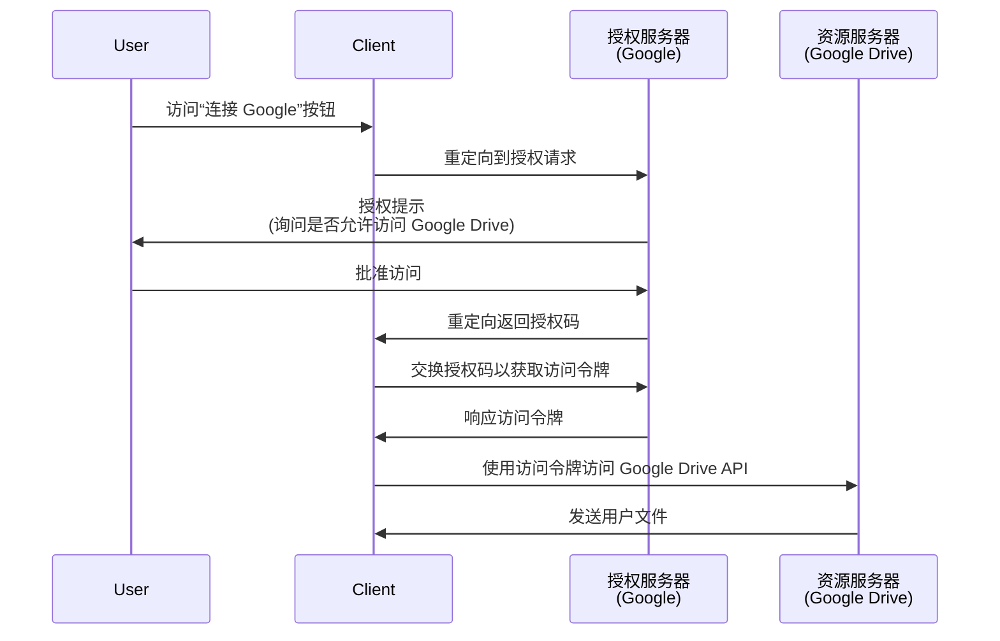

## 什么是授权请求 (Authorization request)？

根据上下文，术语“授权请求 (Authorization request)”可以指不同的内容。在本文中，我们将重点关注 <Ref slug="oauth-2.0" /> 规范中的定义。

在 OAuth 2.0 中，有几种授权类型 (流)，它们定义了<Ref slug="client" />如何从用户那里获得授权以访问受保护资源。

> ![注意]
> 在 <Ref slug="openid-connect" /> 的背景下，“授权请求 (Authorization requests)”常常与“认证请求 (Authentication requests)”混淆。有关 OIDC 的具体细节，请参阅 <Ref slug="authentication-request" />。

## 授权请求 (Authorization request) 如何工作？

当一个客户端（应用程序）想要代表用户访问受保护资源时，它会向<Ref slug="authorization-server" />发起授权请求 (Authorization request)。客户端应在请求中指明所请求的授权类型及必要参数。

以下是 OAuth 2.0 中一些典型的终端用户授权类型 (流)：

- <Ref slug="authorization-code-flow" />: 最推荐用于终端用户授权的流。通常与<Ref slug="pkce" />一起使用以增强安全性，适用于大多数应用程序。
- <Ref slug="implicit-flow" />: 一种简化的流，由于安全问题，在<Ref slug="oauth-2.1" />中被弃用。
- [资源所有者密码凭据 (ROPC) 授权 (flow)](https://datatracker.ietf.org/doc/html/rfc6749#section-4.3): 一种授权 (flow)，用户凭据直接交换为访问令牌。这种流因安全风险不推荐使用。

还有其他扩展，例如 <Ref slug="device-flow" /> ，用于输入受限的设备。每个流都有其特性和应用场景。对于大多数 Web 应用程序，推荐使用授权码流 (authorization code flow)。

> <Ref slug="machine-to-machine" /> 授权通常使用<Ref slug="client-credentials-flow" />完成，不涉及用户互动。

例如，客户端（应用程序）可能请求授权访问用户的 Google Drive 文件。以下是授权码流 (authorization code flow) 的简化序列图：

一旦获得<Ref slug="access-token" />，客户端可以使用它代表用户访问用户的 Google Drive 文件。

### 授权请求 (Authorization request) 中的关键参数

OAuth 2.0 授权请求 (Authorization request) 通常包括以下参数：

- **`response_type`**: 客户端期望的响应类型。常见值为授权码流 (authorization code flow) 的 `code` 和隐式流 (implicit flow) 的 `token`。
- **`client_id`**: 授权服务器签发的客户端标识符。
- **`redirect_uri`**: 授权过程完成后授权服务器发送用户的 URI。
- **`scope`**: 请求的 <Ref slug="scope">权限</Ref>（访问令牌的权限）。
- **`resource`**: 指定请求资源的<Ref slug="resource-indicator" />的可选参数。需要授权服务器支持 [RFC 8707](https://datatracker.ietf.org/doc/html/rfc8707) 才能使用此参数。

上述参数并非详尽无遗。实际参数及其值取决于授权类型和应用程序的具体要求。

<SeeAlso slugs={["oauth-2.0", "authentication-request", "authorization-code-flow", "implicit-flow", "device-flow"]} />

<Resources
  urls={[
    { url: "https://datatracker.ietf.org/doc/html/rfc6749#section-4", result: {
      ogTitle: "在 OAuth 2.0 中获取授权",
      ogDescription: " 要请求访问令牌，客户端需要从资源所有者那里获得授权。"
    } }
  ]}
/>
