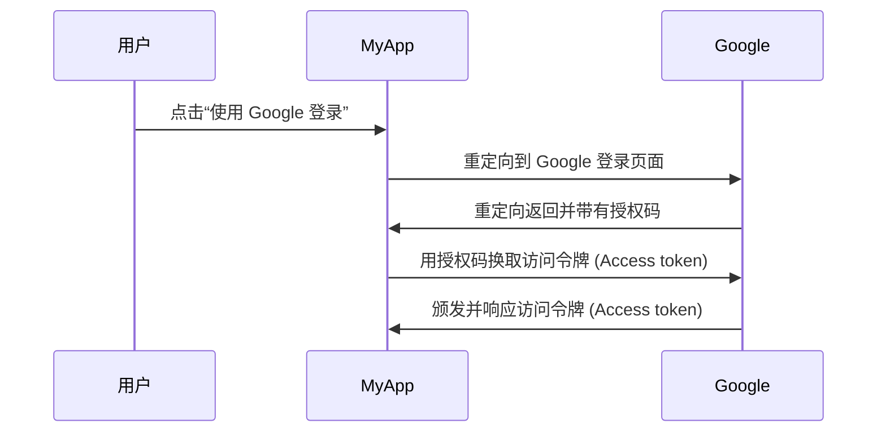

## 什么是授权服务器 (Authorization server)？

“授权服务器 (Authorization server)”这个术语可以广泛地指任何执行授权的服务器。我们将专注于 <Ref slug="oauth-2.0" /> 和 <Ref slug="openid-connect" /> 框架中的定义。

在 OAuth 2.0 中，授权服务器 (Authorization server) 是一个组件，它在成功认证 (Authentication) 和授权 (Authorization) 客户端后向其颁发<Ref slug="access-token">访问令牌 (Access tokens)</Ref>。客户端使用访问令牌 (Access tokens) 代表用户（资源所有者）访问受保护的资源。

太多术语了？让我们看一个真实案例：用户在一个应用 "MyApp" 上点击“使用 Google 登录”。这个应用使用 <Ref slug="authorization-code-flow" /> 进行 Google 登录。

在这个例子中，Google 作为**授权服务器 (Authorization server)**，在用户成功登录后向**客户端 (Client)**（MyApp）颁发访问令牌 (Access token)。然后，客户端可以使用**访问令牌 (Access token)**来获取用户在 Google 上的个人资料（受保护的资源）。

### OpenID Connect (OIDC) 中的授权服务器 (Authorization server)

由于 OpenID Connect 构建在 OAuth 2.0 之上，它重用了 OAuth 2.0 中的一些术语和概念。OIDC 为 OAuth 2.0 授权服务器 (Authorization server) 添加了认证 (Authentication) 能力，这使得授权服务器 (Authorization server) 也成为 <Ref slug="openid-connect" headingId="openid-provider-op" />。为避免混淆，我们建议在 OIDC 中提到授权服务器 (Authorization server) 时始终使用“OpenID 提供者 (OpenID Provider)”这个术语。

除了颁发访问令牌 (Access tokens)，OIDC 中的 OpenID 提供者 (Authorization server) 还会向客户端颁发<Ref slug="id-token">ID 令牌 (ID tokens)</Ref>。ID 令牌 (ID tokens) 包含用户信息，用于认证 (Authentication) 用户。

## 授权服务器 (Authorization server) 如何工作？

授权服务器 (Authorization server) 应该支持<Ref slug="oauth-2.0-grant">OAuth 2.0 授权 (Grants)（流程）</Ref>来向客户端颁发访问令牌 (Access tokens)。授权 (Grant) 类型通常由客户端和授权服务器 (Authorization server) 为获取访问令牌 (Access token) 共同遵循的一系列步骤组成。

- 对于用户授权 (Authorization)，大多数授权 (Grant) 类型要求客户端启动<Ref slug="authorization-request">授权请求 (Authorization request)</Ref>到授权服务器 (Authorization server)。在上述 Google 登录示例中，步骤“重定向到 Google 登录页面”就是客户端发起的授权请求 (Authorization request)。
- 对于<Ref slug="machine-to-machine">机器对机器 (Machine-to-machine)</Ref>授权 (Authorization)，客户端可以使用<Ref slug="client-credentials-flow">客户端凭证流程 (Client credentials flow)</Ref>直接向授权服务器 (Authorization server)发送<Ref slug="token-request">令牌请求 (Token request)</Ref>。

授权服务器 (Authorization server) 还应该验证客户端的请求，认证 (Authenticate) 客户端，并在颁发访问令牌 (Access token) 之前验证用户的身份。它还可能实施额外的安全措施，如在<Ref slug="authorization-code-flow">授权码流程 (Authorization code flow)</Ref>中使用 <Ref slug="pkce">PKCE</Ref>。

## 授权服务器 (Authorization server) 的使用案例

顾名思义，授权服务器 (Authorization server) 用于处理<Ref slug="authorization">授权 (Authorization)</Ref>。授权服务器 (Authorization server) 可能涉及第一方和第三方：

- 上述 Google 登录示例。
- 一个电子商务网站（客户端）请求访问另一个网站上用户的支付信息（受保护的资源）。
- 一个移动应用程序（客户端）请求从位置服务提供商处访问用户的位置数据（受保护的资源）。

或者，它可以仅用于内部授权 (Authorization)，例如：

- 用户需要访问他们在电子商务网站（客户端）上的订单（受保护的资源）。
- 一个服务（客户端）需要在微服务架构中访问数据库（受保护的资源）。

在现代应用中，授权服务器 (Authorization server) 还可以是一个支持<Ref slug="openid-connect">OpenID Connect</Ref>进行用户认证 (Authentication) 的<Ref slug="identity-provider">身份提供者 (Identity provider)</Ref>。

<SeeAlso slugs={["oauth-2.0", "authorization-request", "access-token"]} />

<Resources
  urls={[
    "https://blog.logto.io/ciam-102-authz-and-rbac",
    "https://tools.ietf.org/html/rfc6749",
  ]}
/>
