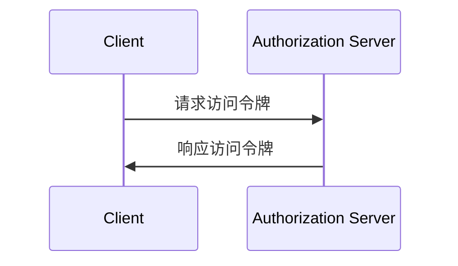
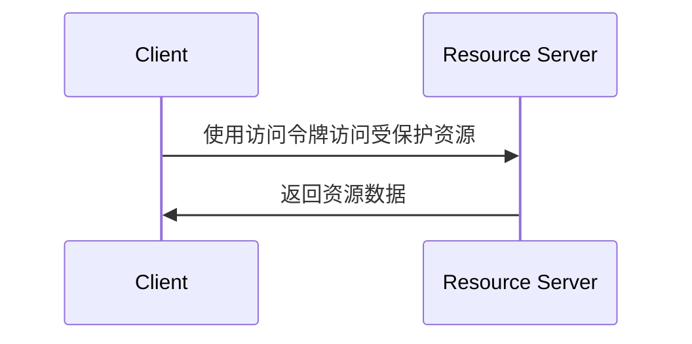

## 什么是客户端凭证流 (Client credentials flow)？

客户端凭证流 (Client credentials flow) 是一种 <Ref slug="oauth-2.0-grant" /> 类型，允许机密客户端获取 <Ref slug="access-token">访问令牌 (access tokens)</Ref> 以访问受保护资源。通常，此流用于 <Ref slug="machine-to-machine" /> 通信，其中客户端是服务器或服务。

> [!Note]
> 客户端凭证流不适合终端用户授权。对于终端用户授权，你应该使用 <Ref slug="authentication-request" /> 或 <Ref slug="authorization-request" />。

## 客户端凭证流 (Client credentials flow) 如何工作？

客户端凭证流是一个简单的两步过程：

1. **令牌请求 (Token request)**: 客户端发送带有其客户端凭证（客户端 ID 和客户端密钥）和请求的 <Ref slug="scope">scope (范围)</Ref> 的 <Ref slug="token-request" />。
2. **令牌响应 (Token response)**: <Ref slug="authorization-server" /> 验证客户端凭证，并在客户端被授权时颁发访问令牌 (access token)。

以下是客户端凭证流的简化序列图：



以下是一个客户端凭证流令牌请求的非规范示例：

```http
POST /token HTTP/1.1
Host: your-authorization-server.com
Content-Type: application/x-www-form-urlencoded

grant_type=client_credentials
  &client_id=YOUR_CLIENT_ID
  &client_secret=YOUR_CLIENT_SECRET
  &scope=read write
```

授权服务器将验证客户端凭证，并在客户端被授权时颁发访问令牌。一旦客户端收到访问令牌，它可以使用该令牌访问受保护资源（例如 API）代表其本身。以下是客户端如何使用访问令牌访问 API 的示例：



请注意，<Ref slug="resource-server" /> 应该验证访问令牌并实施 <Ref slug="access-control" /> 策略，以确保客户端有必要的权限访问资源。

### 客户端凭证流令牌请求中的关键参数

与其他 OAuth 2.0 流不同，客户端凭证流有一个简单的 <Ref slug="token-request" />，其关键参数如下：

- **`grant_type`**: 授权类型应设置为 `client_credentials` 以指示客户端凭证流。
- **`client_id`**: 授权服务器颁发的客户端标识符。
- **`client_secret`**: 授权服务器颁发的客户端密钥。
- **`scope`**: 访问令牌请求的 <Ref slug="scope">scope (范围)</Ref>（权限）。
- **`resource`**: 可选参数，指定请求资源的 <Ref slug="resource-indicator" />。授权服务器需要支持 [RFC 8707](https://datatracker.ietf.org/doc/html/rfc8707) 以使用此参数。

## 安全考虑

### 机密客户端

客户端凭证流适用于可以安全存储客户端密钥的 <Ref slug="client" headingId="confidential-clients" />（机密客户端）。如果客户端是公共客户端（例如单页应用），则不应使用客户端凭证流，因为客户端密钥可能会泄露。

### 令牌过期

尽管在客户端凭证流中获取的访问令牌可以有较长的过期时间，但建议使用短期访问令牌（例如，1 小时），以减少令牌泄露时未经授权访问的风险。

### 客户端密钥轮换

为了增强安全性，建议定期轮换客户端密钥。授权服务器应支持客户端密钥轮换，而不影响客户端获取访问令牌的能力。例如，授权服务器应支持多个客户端密钥，以便在轮换过程中保持向后兼容。

<SeeAlso slugs={["machine-to-machine", "token-request", "access-token", "scope", "resource-indicator"]} />

<Resources
  urls={[
    "https://blog.logto.io/programmatic-authentication-methods",
    { 
      url: "https://datatracker.ietf.org/doc/html/rfc6749#section-4.4",
      result: {
        ogTitle: "Client Credentials Grant",
        ogDescription: "The client can request an access token using only its client credentials (or other supported means of authentication) when the client is requesting access to the protected resources under its control, or those of another resource owner that have been previously arranged with the authorization server."
      }
    }
  ]}
/>