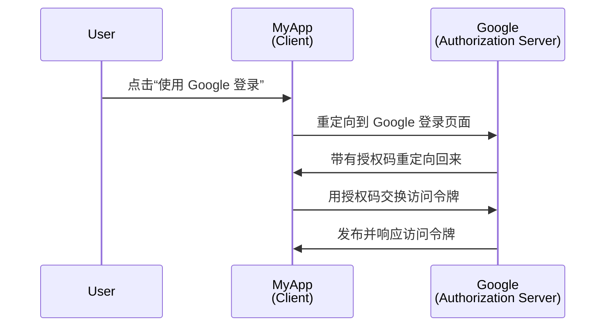
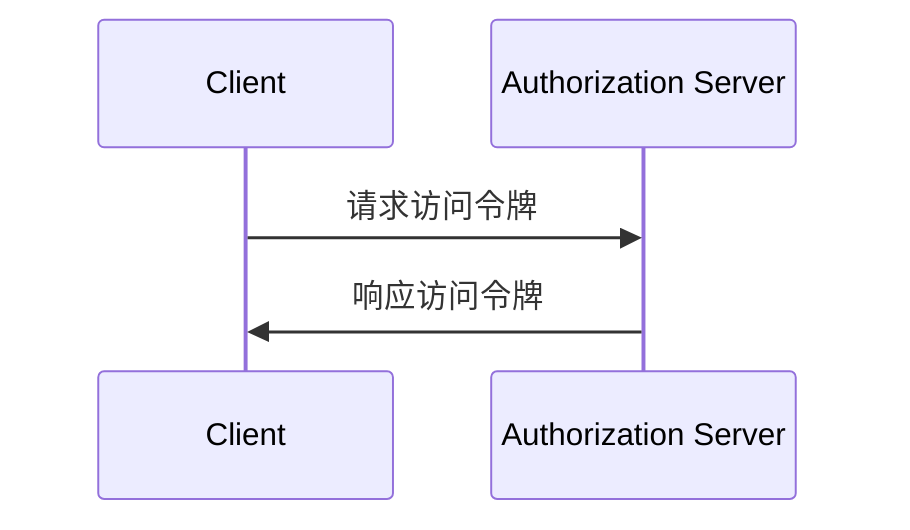

## 什么是客户端 (Client)？

在 <Ref slug="oauth-2.0" /> 和 <Ref slug="openid-connect" /> 的上下文中，客户端是请求认证 (Authentication) 或授权 (Authorization) 的应用程序。例如，当用户在应用程序上点击“使用 Google 登录”时，该应用程序即作为请求来自 Google 授权 (Authorization) 的**客户端**。

> 在 <Ref slug="iam" /> 的上下文中，“客户端”和“应用程序”通常可以互换使用。

根据功能和信任级别有多种客户端分类，但对于框架而言，重要的区别在于公共客户端和机密客户端。这影响客户端如何获取令牌以及可以使用的授权类型。

### 公共客户端 ||public-clients||

公共客户端是无法将其凭据保密的应用程序，这意味着资源所有者（用户）可以访问它们。公共客户端的例子包括：

- 单页应用程序 (SPAs)
- 移动应用
- 桌面应用

你可能会认为移动和桌面应用具有安全存储能力，但大多数框架将它们视为公共客户端，因为它们分发给终端用户，并假定终端用户可以访问凭据。

### 机密客户端 ||confidential-clients||

机密（私密）客户端是能够在不向资源所有者（终端用户）暴露的情况下保密存储敏感信息的应用程序。机密客户端的例子包括：

- Web 服务器
- 后端服务

## 客户端如何工作？

### 用户认证 (Authentication) 和授权 (Authorization)

当客户端想要认证 (Authenticate) 一个用户时，客户端会启动一个 <Ref slug="authorization-request" /> 向 <Ref slug="authorization-server" /> 申请一个 <Ref slug="access-token" />。客户端应在请求中包含必要的参数，如客户端 ID，redirect uri 和 scope。以下是授权码流程的简化序列图：

在这个例子中，Google 作为**授权服务器 (Authorization Server)**，在用户成功登录后向**客户端 (Client)**（MyApp）发布一个访问令牌。然后，客户端可以使用**访问令牌 (Access Token)**获取 Google 上的用户资料（受保护的资源）。

对于 OpenID Connect (OIDC) 客户端，客户端需要启动一个 <Ref slug="authentication-request" /> 来认证 (Authenticate) 用户。它使用的端点与授权请求相同，但参数和响应不同。

### 机器对机器 (Machine-to-Machine) 通信

对于 <Ref slug="machine-to-machine" /> 通信，客户端可以使用 <Ref slug="client-credentials-flow" /> 直接向授权服务器发送一个 <Ref slug="token-request" />。客户端应在请求中包含客户端 ID、客户端密钥和 scope。以下是客户端凭证流程的简化序列图：

授权服务器将验证客户端凭证，并在客户端获授权时发布访问令牌。由于客户端需要发送客户端密钥，因此使用客户端凭证流程时仅适用于机密客户端。

## 安全考虑

### 客户端类型

客户端类型（公共或私密）会影响客户端的安全考虑。

- 公共客户端不应使用客户端凭证流程，因为它们无法安全地存储客户端密钥。相反，推荐公共客户端使用带 <Ref slug="pkce" /> 的授权码流程来认证 (Authenticate) 用户。
- 机密客户端可以使用客户端凭证流程进行机器对机器通信。它们应安全地存储客户端密钥，并且仅在安全环境中使用。

### 令牌存储

客户端应使用最高级别的安全性来存储令牌。例如，在 Web 应用程序中，建议使用 HTTP-only cookies 存储访问令牌，以防止 XSS 攻击。

### 令牌过期

访问令牌有一个有限的生命周期，以降低未授权访问的风险。客户端应优雅地处理令牌过期，通过使用 <Ref slug="refresh-token">刷新令牌</Ref> 来获取新的访问令牌。

### 令牌撤销

客户端应做好处理令牌撤销的准备。如果用户退出登录或授权服务器撤销了令牌，客户端应从客户端存储中清除该令牌。

<SeeAlso slugs={["oauth-2.0", "oauth-2.0-grant", "openid-connect", "authorization-request", "authentication-request"]} />

<Resources
  urls={[
    "https://blog.logto.io/secure-cloud-apps-with-oauth-and-openid-connect",
    "https://datatracker.ietf.org/doc/html/rfc6749",
    "https://openid.net/specs/openid-connect-core-1_0.html"
  ]}
/>
