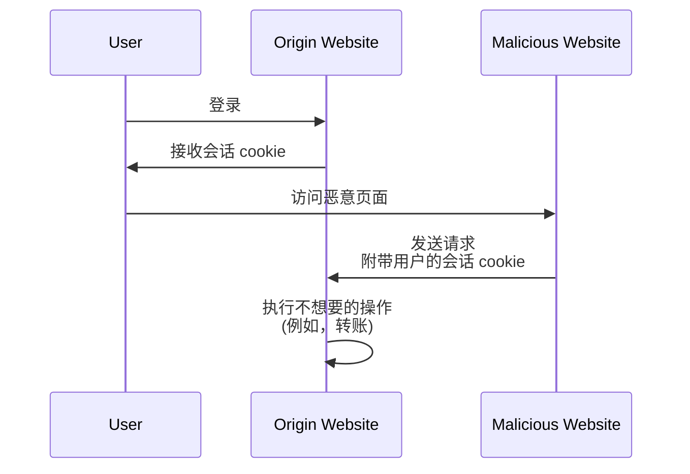

## 什么是跨站请求伪造 (CSRF)？

在开发 Web 应用程序时，CSRF 是一个经常听到的术语，让开发人员和安全专业人士感到恐惧。这是一种通过欺骗（或诱骗）已认证 (Authenticated) 用户在未同意的情况下在 Web 应用程序上执行不想要操作的攻击。

CSRF 也被称为 "一键攻击" 或 "会话劫持"，因为它依赖于用户的活跃会话来执行恶意操作。

## CSRF 如何工作？

CSRF 攻击通过利用 Web 应用程序对用户浏览器的信任而起作用。以下是它通常的工作原理：



关于这个序列你可能有一些疑问。让我们来探讨背后的原因。

### 为什么恶意网站可以向原网站发送请求？

同源策略 (SOP) 是 Web 浏览器中的一项安全功能，限制了一个来源加载的文档或脚本如何与另一个来源的资源（例如，cookies、DOM）进行交互。然而，SOP 并不阻止浏览器向另一个来源发送请求。

因此，尽管恶意网站无法直接读取或修改会话 cookie，但它仍然可以使用用户的活跃会话向原网站发送请求。

你可能会认为大多数 Web 应用程序也使用 [CORS](https://developer.mozilla.org/en-US/docs/Web/HTTP/CORS) 来防止未经授权的跨域请求，但 CSRF 仍然有办法绕过它：

1. 基于 GET 的攻击：恶意网站可以诱骗用户访问一个在原网站上执行操作的 URL：

    - 一个重定向到 `https://example.com/transfer?amount=1000&to=attacker`。
    - 一个加载 `https://example.com/transfer?amount=1000&to=attacker` 的图像标签。

    这就是为什么 GET 请求不应该有副作用的一个重要原因。

2. 基于表单的攻击：恶意网站可以创建一个隐藏的表单，将数据提交到原网站。例如，向 `https://example.com/transfer` 提交的 POST 请求，附带隐藏的表单字段。

### 为什么恶意网站拥有用户的会话 cookie？

用户的浏览器在发起请求时会自动将 cookie 发送到原网站。这就是原网站知道用户已认证 (Authenticated) 并能代表用户执行操作的方式。

事实上，恶意网站并没有 "拥有" 会话 cookie；它只是利用浏览器的行为与请求一起发送 cookie。

## 如何防止 CSRF 攻击？

防止 CSRF 攻击需要一种涉及服务器和客户端的多层方法。以下是一些缓解 CSRF 漏洞的常见技术：

### 使用防 CSRF 令牌

防 CSRF 令牌是由服务器生成并嵌入到 Web 应用程序表单中的随机值。当表单提交时，服务器验证令牌以确保请求是合法的。

例如，在 HTML 表单中的一个隐藏输入字段：

```html
<form action="/transfer" method="post">
  <input type="hidden" name="csrf_token" value="random_token_here" />
  <!-- 其他表单字段 -->
  <button type="submit">转账</button>
</form>
```

使用这种方法，恶意网站无法伪造请求，因为它不知道防 CSRF 令牌。<Ref slug="redirect-uri" /> 中的 `state` 参数是一个类似的概念。

### 使用 SameSite cookies

cookies 中的 `SameSite` 属性可以通过限制何时将 cookies 发送到服务器来防止 CSRF 攻击：

| `SameSite` 值   | 描述                                                                                       |
|------------------|-------------------------------------------------------------------------------------------|
| `Strict`         | cookies 仅在第一方环境中发送。                                                             |
| `Lax`            | cookies 在第一方环境中发送，并在来自外部站点的 GET 请求中发送。                           |
| `None`           | cookies 在所有环境中发送。需要 `Secure` 属性。                                              |

通过将 `SameSite` 属性设置为 `Strict` 或 `Lax` 并在 GET 请求中无副作用，你可以防止 CSRF 攻击。

此外，`Secure` 属性应始终设置，以确保 cookie 仅通过 HTTPS 连接发送。

### 检查头信息

1. **Origin 头**：`Origin` 头由浏览器发送，以指示请求的来源。服务器可以检查此头信息以确保请求来自预期的来源。
2. **Referer 头**：`Referer` 头包含前一个页面的 URL。尽管它可以被欺骗，但仍然可以用作额外的保护层。

<SeeAlso slugs={["authorization-code-flow", "redirect-uri"]} />

<Resources
  urls={[
    'https://blog.logto.io/csrf',
    "https://cheatsheetseries.owasp.org/cheatsheets/Cross-Site_Request_Forgery_Prevention_Cheat_Sheet.html",
  ]}
/>
