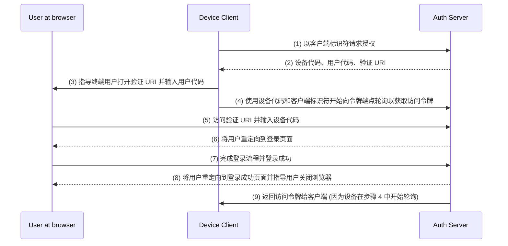

## 什么是设备流 (Device flow)？

[OAuth 设备授权流程](https://www.rfc-editor.org/rfc/rfc8628)，也称为设备流 (Device flow)，是一种[OAuth 2.0](https://oauth.net/2/) 实现，专为输入能力有限的设备（例如，智能电视、物联网设备、游戏机）或无界面应用（例如，CLI 工具）设计。它允许用户在这些设备上发起授权请求，然后使用输入能力较强的设备如智能手机或笔记本电脑完成该流程。

## 何时使用设备流 (Device flow)？

1. **输入受限设备**
    - 在智能电视上登录（例如，媒体应用）
    - 在游戏机上登录（例如，游戏系统或媒体应用）
    - 在会议设备上登录（例如，官方应用或视频会议应用）
    - 在可穿戴设备上登录（例如，输入受限的智能手表）
    - 访问物联网设备（例如，打印机、视频编码器或扬声器）
2. **无界面应用**
    - 命令行界面登录（例如，GitHub CLI 或 Stripe CLI）
3. **桌面应用的二维码登录**
    - 通过用智能手机扫描二维码快速、安全地登录到桌面应用（例如，Telegram，Steam 在桌面上的登录）。这种二维码登录流程可视为传统 OAuth 2.0 设备流的一种变体。

## 设备流 (Device flow) 的终端用户流程是什么样的？

忽略二维码登录变体，让我们关注标准的 OAuth 2.0 设备流。涉及两种设备：

### 设备代码展示设备

这是需要用户授权访问的输入受限设备或无界面应用。它显示[设备代码和验证 URI](#what-does-device-flow-workflow-look-like)，指导用户如何进行操作。

基本界面是：


为了提升用户体验，服务通常会为验证 URL 生成二维码：


为了提高效率，可以将 `verification_uri` 中的二维码资源（例如，`https://example.com/device`）替换为 `verification_uri_complete`（例如，`https://example.com/device?user_code=WDJB-MJHT`），其中包含 URL 中的设备代码，帮助用户预填写设备代码到字段中。

### 授权设备

按照登录目标设备上的说明，用户将：

1. 使用另一台具有浏览器访问和输入功能的设备打开验证 URL。
2. 输入显示的设备代码（可能已预填），然后继续。
3. 如果浏览器上没有现有会话，用户将首先登录到服务。
4. 同意页面将提示用户授权设备登录。
5. 授权后将显示一个成功页面。

以下是一些成熟产品的设备流验证 URL，供你测试：

- 登录到 [YouTube 在智能电视](https://www.youtube.com/watch?v=yTcuazSy5Cs) 上：[youtube.com/activate](https://youtube.com/activate)
- 登录到 Disney+ 在智能电视上：[disneyplus.com/begin](https://disneyplus.com/begin)
- 登录到 [Shopify 在三星 Galaxy 手表](https://www.drmare.com/spotify-music/spotify-on-galaxy-watch.html) 上：[spotify.com/pair](https://spotify.com/pair)
- 登录到 [Zoom 在会议设备](https://developers.zoom.us/blog/device-authorization/) 上：[zoom.us/oauth_device](https://zoom.us/oauth_device)
- 登录到 [GitHub CLI](https://docs.github.com/en/apps/oauth-apps/building-oauth-apps/authorizing-oauth-apps#device-flow)：[github.com/login/device](https://github.com/login/device)
- 利用 [Google 设备流](https://www.oauth.com/oauth2-servers/device-flow/user-flow/)：https://www.google.com/device

## 设备流 (Device flow) 的工作流程是什么样的？

首先，你应该理解设备授权响应的参数，它用于处理在设备代码展示设备上显示的信息：

| 参数                                     | 描述                                                        |
| -------------------------------------- | ---------------------------------------------------------- |
| `device_code`                          | 设备验证代码。                                               |
| `user_code`                            | 终端用户验证代码。                                           |
| `verification_uri`                     | 在授权服务器上的终端用户验证 URI。URI 应该简单易记，因为终端用户将被要求手动输入到他们的用户代理中。 |
| `verification_uri_complete` (optional) | 包含 "user_code"（或其他具备 "user_code" 同样功能的信息）的验证 URI，设计用于非文本传输。 |
| `expires_in`                           | "device_code" 和 "user_code" 的有效期（以秒为单位）。        |
| `interval`                             | 客户端在轮询请求令牌端点之间等待的最短时间（以秒为单位）。如果没有提供值，客户端必须使用 5 作为默认值。 |

```json
{
    "device_code": "GmRhmhcxhwAzkoEqiMEg_DnyEysNkuNhszIySk9eS",
    "user_code": "WDJBMJHT",
    "verification_uri": "https://custom.domain.com/device",
    "verification_uri_complete":
        "https://custom.domain.com/device?user_code=WDJB-MJHT",
    "expires_in": 900,
    "interval": 5
}
```

当用户使用设备流进行认证 (Authentication) 时，主要包括以下步骤：



1. 设备客户端使用客户端标识符（通常为授权服务器平台上的客户端 ID）向授权服务器请求授权。
2. 授权服务器将设备代码、用户代码和验证 URI 返回给设备客户端。
3. 设备客户端以文本（或二维码等）形式向用户展示验证 URI 和用户代码，指导用户访问 URI 并输入代码。
4. 与步骤 3 同时，设备客户端开始向授权服务器中的令牌端点使用设备代码和客户端标识符轮询访问令牌，并等待用户审核授权请求并完成用户授权。
5. 用户通过另一设备的浏览器访问由授权服务器托管的验证 URI，并输入用户代码。
6. 授权服务器将用户重定向到登录页面，并指导用户完成登录。
7. 用户完成登录流程并成功登录。
8. 授权服务器将用户重定向到登录成功页面，并指导用户关闭浏览器。
9. 与步骤 8 同时，授权服务器将访问令牌返回给设备客户端，因为客户端自步骤 4 以来一直在轮询。

经过这些流程后，设备客户端将能够获得访问令牌以用于后续服务！

欲了解更多详细信息，请阅读 [RFC 8628 OAuth 2.0 设备授权许可 (Device Authorization Grant)](https://datatracker.ietf.org/doc/html/rfc8628#autoid-3)。

<SeeAlso slugs={['authorization-code-flow', 'implicit-flow', 'client-credentials-flow']} />

<Resources urls={['https://blog.logto.io/a-brief-introduction-to-oauth2-device-flow', 'https://datatracker.ietf.org/doc/html/rfc8628']} />
