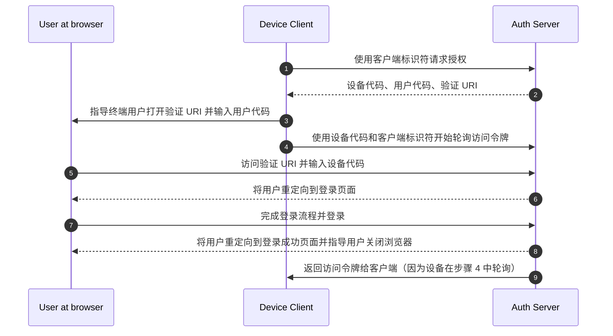

## 什么是设备流 (Device flow)？

[OAuth 设备授权流](https://www.rfc-editor.org/rfc/rfc8628)，也称为设备流 (Device flow)，是一种<Ref slug="oauth-2.0-grant" />，专为输入能力有限的设备（例如智能电视、物联网设备、游戏机）或无头应用程序（例如 CLI 工具）设计。它允许用户在这些设备上发起<Ref slug="authorization-request">授权请求</Ref>，然后使用输入能力更强的设备（如智能手机或笔记本电脑）完成流程。

## 何时使用设备流 (Device flow)？

1. **输入受限的设备**
    - 在智能电视上登录（例如，媒体应用程序）
    - 在游戏机上登录（例如，游戏系统或媒体应用程序）
    - 在会议设备上登录（例如，官方应用程序或视频会议应用程序）
    - 在可穿戴设备上登录（例如，输入受限的智能手表）
    - 访问物联网设备（例如，打印机、视频编码器或扬声器）
2. **无头应用程序**
    - 命令行界面登录（例如，GitHub CLI 或 Stripe CLI）
3. **桌面应用程序的二维码登录**
    - 通过使用智能手机扫描二维码快速安全地登录桌面应用程序（例如，Telegram、Steam 在桌面上的登录）。这种二维码登录流程可以视为传统 OAuth 2.0 设备流的一种变体。

## 设备流 (Device flow) 的终端用户流程是什么样的？

忽略二维码登录变体，让我们专注于标准的 OAuth 2.0 设备流。涉及两种类型的设备：

### 设备代码显示设备

这是用户需要授权访问的输入受限设备或无头应用程序。它显示[设备代码和验证 URI](#what-does-device-flow-workflow-look-like)，指导用户如何继续。

基本的用户界面是：


为了增强用户体验，服务通常会为验证 URL 生成二维码：


为了提高效率，将 `verification_uri` 中的二维码资源（例如，`https://example.com/device`）替换为 `verification_uri_complete`（例如，`https://example.com/device?user_code=DSHP-SNCT`），其中包含 URL 中的设备代码，帮助用户预填设备代码到字段中。

### 授权设备

根据登录目标设备上的说明，用户将：

1. 使用具有浏览器访问和输入能力的另一台设备打开验证 URL。
2. 输入显示的设备代码（可能已预填）并继续。
3. 如果浏览器上没有现有会话，用户将首先登录服务。
4. 同意页面将提示用户授权设备登录。
5. 最后，在授权后将显示成功页面。


以下是一些已建立产品的设备流验证 URL 供你测试：

- 登录 [Youtube 在智能电视上](https://www.youtube.com/watch?v=yTcuazSy5Cs)：[youtube.com/activate](https://youtube.com/activate)
- 登录 Disney+ 在智能电视上：[disneyplus.com/begin](https://disneyplus.com/begin)
- 登录 [Shopify 在三星 Galaxy Watch 上](https://www.drmare.com/spotify-music/spotify-on-galaxy-watch.html)：[spotify.com/pair](https://spotify.com/pair)
- 登录 [Zoom 在会议设备上](https://developers.zoom.us/blog/device-authorization/)：[zoom.us/oauth_device](https://zoom.us/oauth_device)
- 登录 [GitHub CLI](https://docs.github.com/en/apps/oauth-apps/building-oauth-apps/authorizing-oauth-apps#device-flow)：[github.com/login/device](https://github.com/login/device)
- 使用 [Google 设备流](https://www.oauth.com/oauth2-servers/device-flow/user-flow/)：https://www.google.com/device

## 设备流 (Device flow) 的工作流程是什么样的？

首先，你应该了解设备授权响应的参数，用于处理设备代码显示设备上显示的信息：

| 参数                                   | 描述                                                                                                                                                                    |
| -------------------------------------- | ----------------------------------------------------------------------------------------------------------------------------------------------------------------------- |
| `device_code`                          | 设备验证代码。                                                                                                                                                           |
| `user_code`                            | 终端用户验证代码。                                                                                                                                                       |
| `verification_uri`                     | 授权服务器上的终端用户验证 URI。URI 应该简短且易于记忆，因为终端用户将被要求手动将其输入到用户代理中。                                                                   |
| `verification_uri_complete` (可选)     | 包含 "user_code"（或具有与 "user_code" 相同功能的其他信息）的验证 URI，设计用于非文本传输。                                                                              |
| `expires_in`                           | "device_code" 和 "user_code" 的有效期（以秒为单位）。                                                                                                                    |
| `interval`                             | 客户端在轮询 token 端点之间应等待的最小时间（以秒为单位）。如果未提供值，客户端必须使用 5 作为默认值。                                                                  |

```json
{
    "device_code": "GmRhmhcxhwAzkoEqiMEg_DnyEysNkuNhszIySk9eS",
    "user_code": "WDJBMJHT",
    "verification_uri": "https://custom.domain.com/device",
    "verification_uri_complete":
        "https://custom.domain.com/device?user_code=WDJB-MJHT",
    "expires_in": 900,
    "interval": 5
}
```

当用户使用设备流进行认证 (Authentication) 时，主要包括以下步骤：



1. 设备客户端使用客户端标识符（通常是授权服务器平台上的客户端 ID）向授权服务器请求授权。
2. 授权服务器向设备客户端响应设备代码、用户代码和验证 URI。
3. 设备客户端以文本（或二维码等）形式向用户显示验证 URI 和用户代码，指导用户访问 URI 并输入代码。
4. 与步骤 3 同时，设备客户端开始使用设备代码和客户端标识符从授权服务器轮询访问令牌，并开始等待用户查看<Ref slug="authorization-request" />并完成用户授权。
5. 用户通过另一台设备上的浏览器访问由授权服务器托管的验证 URI，并输入用户代码。
6. 授权服务器将用户重定向到登录页面，并指导用户完成登录。
7. 用户完成登录流程并成功登录。
8. 授权服务器将用户重定向到登录成功页面，并指导用户关闭浏览器。
9. 与步骤 8 同时，授权服务器返回访问令牌给设备客户端，因为客户端自步骤 4 起一直在轮询。

经过这些流程，设备客户端将能够获取<Ref slug="access-token" />以进行后续服务。

有关更多详细信息，请阅读 [RFC 8628 OAuth 2.0 设备授权许可](https://datatracker.ietf.org/doc/html/rfc8628#autoid-3)。

## 设备流 (Device flow) 的安全注意事项是什么？

设备流涉及跨两个设备的交互，使其面临潜在的安全风险，如设备代码暴露、暴力攻击或中间人 (MitM) 攻击。

虽然仅获取设备代码并不会立即授予授权（因为用户仍然必须进行身份验证和授权），但攻击者可能会在设备代码的有效期内尝试重放设备代码请求。这可能导致未经授权的重复访问。为了增强安全性，请考虑以下预防措施：

- **缩短 `expires_in` 持续时间：** 通过缩短设备代码的有效期来减少攻击的机会窗口。
- **限制失败尝试次数：** 限制错误代码输入的次数，以防止暴力攻击。
- **强制使用 HTTPS：** 确保设备与授权服务器之间的所有通信都使用 HTTPS 加密，以防止中间人攻击。
- **限制单次使用设备代码：** 限制每个设备代码仅用于**单个会话**，以防止其被未经授权的方重复使用。

请注意，单次使用设备代码并不是 OAuth 2.0 设备流的内置要求。这是一种可选的最佳实践。一些开发人员可能有意设计用于使用相同代码进行并发设备授权（例如，在数百个设备上），但这种方法增加了安全风险，应谨慎评估。

## OIDC 提供商是否支持设备流 (Device flow)？

虽然设备流传统上与 OAuth 相关联，但<Ref slug="openid-connect" />提供商也可以支持它。OIDC 提供了超越 OAuth 主要关注授权的额外优势。它扩展到认证 (Authentication)，允许应用程序在单个流程中获取<Ref slug="access-token" />和<Ref slug="id-token" />。

OIDC 的强大统一身份管理，包括令牌验证和<Ref slug="refresh-token">刷新</Ref>，使其非常适合在设备和应用程序之间进行安全、可靠的<Ref slug="authentication" />和<Ref slug="authorization" />，特别是那些输入能力有限的设备。

<SeeAlso slugs={['oauth-2.0-grant', 'authorization-code-flow', 'implicit-flow', 'client-credentials-flow']} />

<Resources urls={['https://blog.logto.io/a-brief-introduction-to-oauth2-device-flow', 'https://datatracker.ietf.org/doc/html/rfc8628']} />