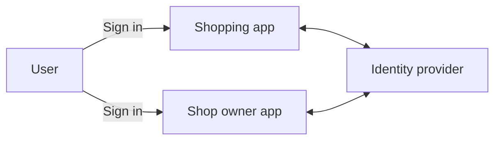
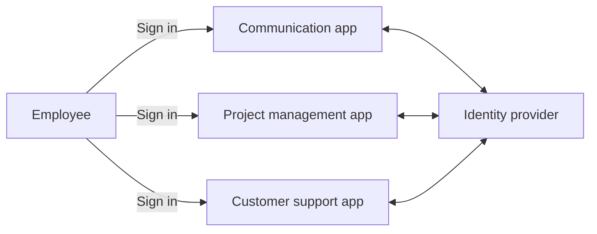
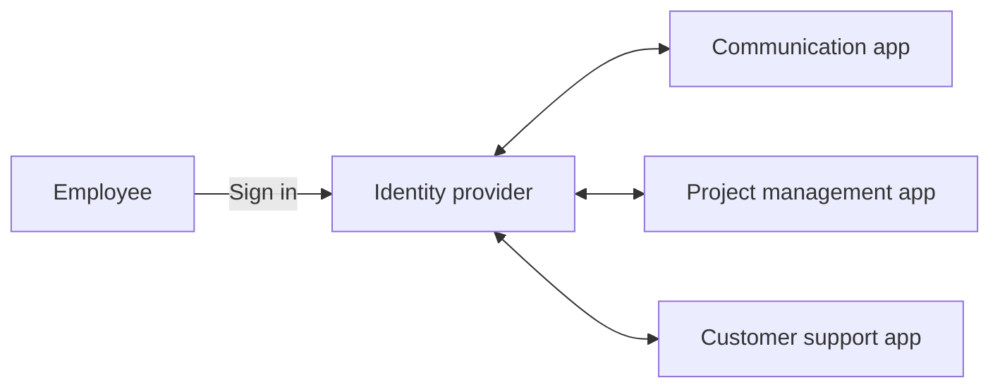
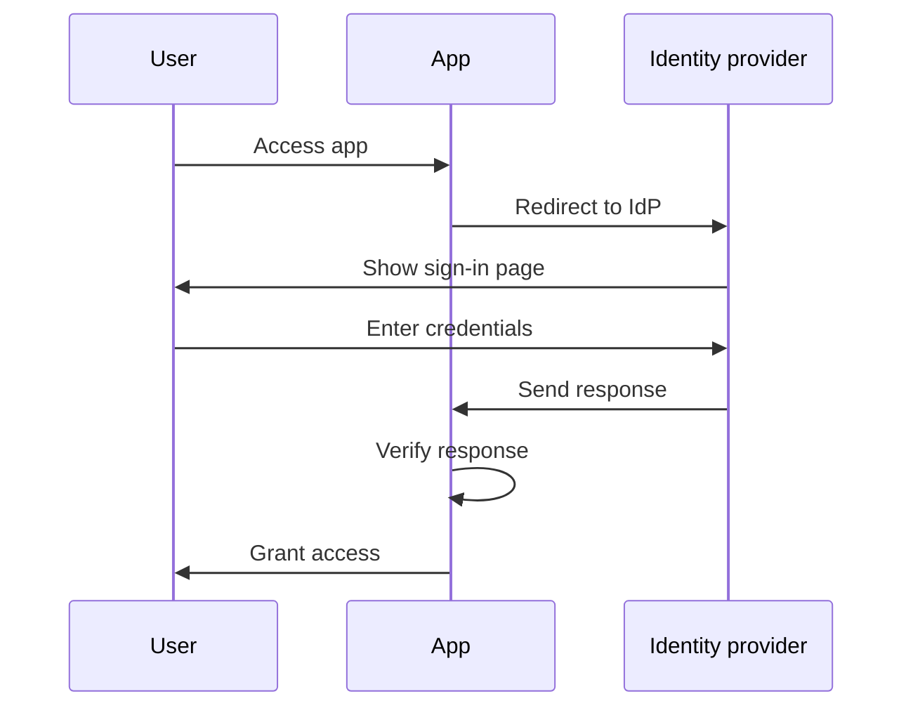
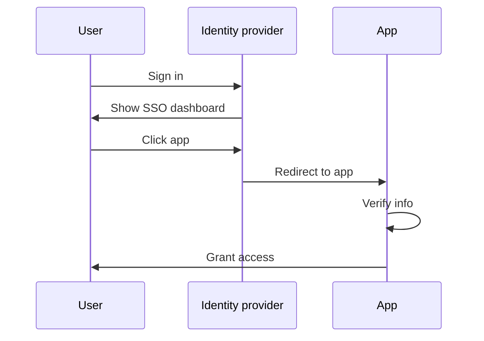
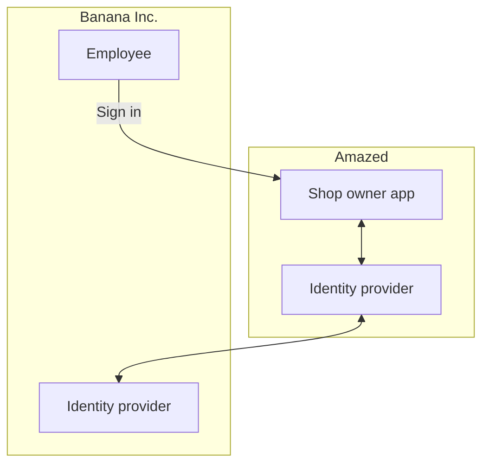

## 什么是企业 SSO？

在深入定义之前，重要的是要明确 SSO 和企业 SSO 之间的区别，因为这常常会引起混淆。

- <Ref slug="single-sign-on" /> 是一个广义术语，指的是用户可以一次登录并访问多个应用程序或资源，而无需再次登录。
- 企业 SSO 是一种专为组织内员工设计的特定类型的 SSO。

仍然不确定？我们来看一个例子：

一个名为 _Amazed_ 的在线购物网站有两个 Web 应用程序：一个供客户使用，一个供店主使用。客户登录到购物应用程序以购买产品，而店主登录到店主应用程序以管理他们的商店。两个应用程序都使用相同的身份提供商进行认证 (Authentication)。因此，用户只需登录一次即可访问这两个应用程序，从而提供单点登录体验。

在内部，_Amazed_ 使用多个应用程序进行团队沟通、项目管理和客户支持。为了简化日常工作流程，_Amazed_ 为其员工实施企业 SSO。通过企业 SSO，员工只需一次登录即可访问所有内部应用程序。

通常，企业 SSO 解决方案还提供一个集中的仪表板，员工可以通过单击访问所有应用程序。此仪表板通常被称为 SSO 仪表板。

简而言之，这两种情况都是单点登录的例子。区别在于第一个例子是通用 SSO，而第二个是企业 SSO。这些是客户 IAM (Identity and Access Management) 和员工 IAM 的典型用例。

## 企业 SSO 如何工作？

企业 SSO 通过将多个应用程序连接到一个集中的身份提供商来工作。连接可以是单向的（从应用程序到身份提供商）或双向的（在应用程序和身份提供商之间）。各种标准和协议，如 SAML、OpenID Connect 和 OAuth 2.0，用于这些连接。

无论协议如何，基本工作流程通常是相似的：

1. 用户访问需要认证的应用程序（例如，通信应用程序）。
2. 应用程序将用户重定向到身份提供商以进行认证。
3. 用户在身份提供商处登录。
4. 身份提供商向应用程序发送认证响应。
5. 应用程序验证响应并授予用户访问权限。

当用户访问连接到相同身份提供商的另一个应用程序（例如，项目管理应用）时，他们会自动登录，无需再次输入凭据。在这种情况下，步骤 3 被跳过，并且因为步骤 2、4 和 5 在后台进行，用户可能甚至不会注意到认证过程。

这个过程被称为服务提供者 (SP) 启动的 SSO，即应用程序 (SP) 启动认证过程。

在另一种情况下，身份提供商为用户提供一个集中化的仪表板以访问所有连接的应用程序。简化的工作流程是：

1. 用户在身份提供商处登录。
2. 身份提供商显示用户可以访问的应用程序列表。
3. 用户点击一个应用程序（例如，客户支持应用）来访问它。
4. 身份提供商重定向用户到包含认证信息的应用程序。
5. 应用程序验证信息并授予用户访问权限。

该过程被称为身份提供商 (IdP) 启动的 SSO，即身份提供商 (IdP) 启动认证过程。

## 为什么企业 SSO 重要？

### 企业 SSO 在员工 IAM 中的重要性

#### 集中管理

企业 SSO 的主要好处不仅是为员工提供便利，还为组织提供了增强的安全性和合规性。组织可以将用户身份、访问控制策略和审计日志的管理集中化，而不是为不同的应用程序单独管理多个凭据和配置认证和授权。

例如，当员工离职时，IT 部门可以在身份提供商中禁用该员工的账户，立即撤销对所有应用程序的访问。这对于防止未经授权的访问和数据泄露至关重要，这个过程被称为生命周期管理。

#### 访问控制

企业 SSO 解决方案通常包含访问控制功能，例如基于角色的访问控制 (RBAC) 和基于属性的访问控制 (ABAC)。这些功能允许组织根据用户角色、属性和其他上下文信息定义详细的访问策略，确保员工拥有对正确资源的正确访问权限。

有关 RBAC 和 ABAC 的详细比较，请查看 [RBAC 和 ABAC：你应该了解的访问控制模型](https://blog.logto.io/rbac-and-abac)。

#### 增强安全性

另一个好处是能够在所有应用程序中强制实施强认证方法，如多因素认证 (MFA)、无密码认证和自适应认证。这些方法有助于保护敏感数据并符合行业法规。

有关 MFA 的更多信息，请参考 [探索 MFA：从产品角度看待认证](https://blog.logto.io/elaborate-mfa)。

### 企业 SSO 在客户 IAM 中的重要性

“企业 SSO”一词也出现在客户 IAM 解决方案中。在此上下文中，它意味着什么？让我们重温 _Amazed_ 的例子：一些店主作为企业注册。一个店主，_Banana Inc._，为其员工实施企业 SSO。作为协议的一部分，_Banana Inc._ 要求 _Amazed_ 在访问店主应用程序时对所有来自 _Banana Inc._ 的电子邮件地址（例如 `*@banana.com`）强制实施企业 SSO。

在这种情况下，_Amazed_ 需要将其身份提供商与 _Banana Inc._ 的身份提供商集成，以启用 _Banana Inc._ 员工的企业 SSO。这种通过标准协议（如 SAML、OpenID Connect 或 OAuth）进行的集成通常被称为企业 SSO 连接、企业 SSO 连接器或 SSO 联合。

有关客户 IAM 的详细解释，请查看 CIAM 系列：

- [CIAM 101：认证、身份、SSO](https://blog.logto.io/ciam-101-intro-authn-sso)
- [CIAM 102：授权与基于角色的访问控制](https://blog.logto.io/ciam-102-authz-and-rbac)

#### 准备好面向企业

在 B2B（企业对企业）的场景中，企业 SSO 是像 _Amazed_ 这样的 SaaS 提供商支持其企业客户的必备功能。这不仅是为了方便，也是为了双方的安全和合规。企业 SSO 可以强制要求由企业客户管理的所有身份通过企业身份提供商进行认证，确保企业对其用户、数据、访问和安全策略保持控制。

企业 SSO 是实现_企业就绪_的关键因素，即满足企业客户需求的能力。然而，身份和访问管理，尤其是在企业客户的背景下，是复杂的，并且需要大量的时间、资源和专业知识。现代 SaaS 提供商往往选择 IAM 平台来处理这些复杂性。

<SeeAlso slugs={['single-sign-on']} />
