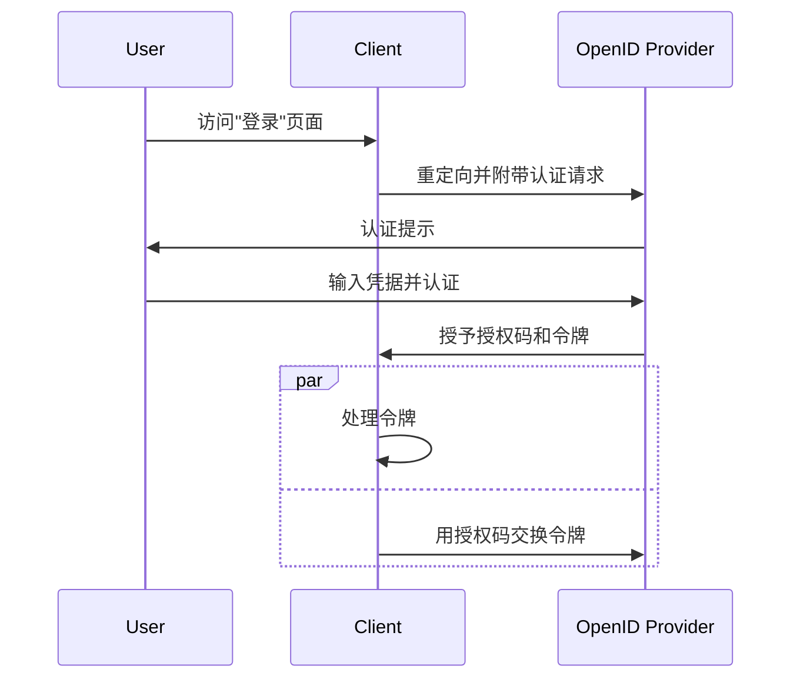

## 什么是混合流 (Hybrid flow)？

混合流 (Hybrid flow) 是一种结合了<Ref slug="authorization-code-flow" />和<Ref slug="implicit-flow" />特征的认证 (Authentication) 过程。值得注意的是，混合流 (Hybrid flow) 并不是<Ref slug="oauth-2.0" />规范的一部分，而是由<Ref slug="openid-connect" />提供的扩展。

此流程旨在为用户认证 (Authentication) 提供安全性与可用性之间的平衡。然而，由于与隐式流 (Implicit flow) 相关的[安全考虑](#security-considerations)，不推荐在新应用中使用混合流 (Hybrid flow)。混合流 (Hybrid flow) 的一个流行替代方案是使用配有<Ref slug="pkce" />的授权码流 (Authorization code flow) 以提高安全性。

## 混合流 (Hybrid flow) 如何工作？

以下是混合流 (Hybrid flow) 的主要步骤：

1. 与其他 OIDC 流程类似，混合流 (Hybrid flow) 由<Ref slug="client" />向<Ref slug="openid-connect" headingId="openid-provider-op" />发起<Ref slug="authentication-request" />开始。

    注意：客户端应包括`response_type`参数，结合`code`和至少一个`id_token`或`token`，这意味着有三种可能的组合：

      - `code id_token`：客户端期望授权码和 ID 令牌。
      - `code token`：客户端期望授权码和访问令牌 (Access token)。
      - `code id_token token`：客户端期望授权码、ID 令牌和访问令牌 (Access token)。

    要求是显而易见的：客户端期望授权码和一个或多个令牌，这分别对应授权码流 (Authorization code flow) 和隐式流 (Implicit flow)。
2. 用户在<Ref slug="openid-connect" headingId="openid-provider-op" />进行认证 (Authentication)。
3. <Ref slug="openid-connect" headingId="openid-provider-op" />将用户重定向回客户端应用程序，并提供授权码和请求的令牌。
4. 客户端应用程序处理令牌，并可以代表用户访问受保护资源；还可以使用授权码通过<Ref slug="token-request" />获取其他令牌。

以下是混合流 (Hybrid flow) 的简化序列图：



以下是一个非规范的混合流 (Hybrid flow) 认证请求示例：

```http
GET /authorize?response_type=code%20id_token
  &client_id=YOUR_CLIENT_ID
  &redirect_uri=https%3A%2F%2Fclient.example.com%2Fcallback
  &scope=openid%20profile%20email
  &nonce=123456
  &state=abc123 HTTP/1.1
Host: your-openid-provider.com
```

### 混合流 (Hybrid flow) 认证请求中的关键参数

混合流 (Hybrid flow) 认证请求包括以下关键参数：

- **`response_type`**：值应为`code`和至少一个`id_token`或`token`的组合。例如，`code id_token`或`code token`。
- **`client_id`**：由<Ref slug="openid-connect" headingId="openid-provider-op" />（授权服务器 (Authorization server)）颁发的客户端标识符。
- **`redirect_uri`**：授权服务器在认证过程后发送用户的 URI。
- **`scope`**：请求的<Ref slug="scope">范围</Ref>（权限）用于令牌。
- **`resource`**：可选参数，用于指定请求资源的<Ref slug="resource-indicator" />。授权服务器需要支持 [RFC 8707](https://datatracker.ietf.org/doc/html/rfc8707) 来使用该参数。

有关参数及其描述的完整列表，请参阅[使用混合流 (Hybrid Flow) 进行认证](https://openid.net/specs/openid-connect-core-1_0.html#HybridFlowAuth)。

## 安全性考虑

混合流 (Hybrid flow) 包含隐式流 (Implicit flow)，而隐式流 (Implicit flow) 是以其安全性限制而闻名的。令牌仍通过前台通道（浏览器）传输，可能会暴露给潜在攻击。由于这些顾虑，隐式流 (Implicit flow) 即将在<Ref slug="oauth-2.1" />中被弃用。

配有<Ref slug="pkce" />的<Ref slug="authorization-code-flow" />是混合流 (Hybrid flow) 的推荐替代方案。它提供了一种更安全的方式来认证用户，而无需在前台通道中暴露令牌。

<SeeAlso slugs={["openid-connect", "oauth-2.1", "authorization-code-flow", "pkce", "implicit-flow"]} />

<Resources
  urls={[
    "https://blog.logto.io/implicit-flow-is-dead",
    "https://blog.logto.io/oauth-2-1",
    "https://openid.net/specs/openid-connect-core-1_0.html#HybridFlowAuth",
  ]}
/>
