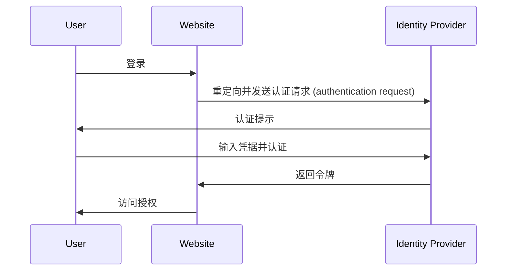

## 什么是身份与访问管理 (IAM)？

正如定义所示，身份与访问管理 (IAM) 是一个广泛的概念，涉及管理数字身份和进行 <Ref slug="access-control" /> 的许多方面。首先，我们来分解这些术语：

- **身份**：用户、服务或设备的数字表示。身份可以包括标识符、角色和权限等属性。
- **访问**：与资源交互、执行操作或使用服务的能力。总结来说，访问是关于在某些资源上执行哪些操作。

### 身份管理

身份管理是管理、认证和保护数字身份的过程。它涉及以下关键活动：

- **身份注册**：为用户、服务或设备创建新的身份。
- **身份认证 (Authentication)**：通过各种机制（如密码、生物识别或多因素认证 (MFA)）验证身份的所有权。
- **身份安全**：保护身份免受未经授权的访问、滥用或泄露。

每个主题都很庞大，可以进一步分为子主题，如密码管理、身份联合和身份生命周期管理。

### 访问管理

访问管理（或 <Ref slug="access-control" />）是控制谁可以对某些资源执行哪些操作的过程。它涉及以下关键活动：

- **访问控制策略**：定义规则和政策，规定谁可以访问哪些资源以及他们可以执行哪些操作。
- **访问执行**：通过诸如认证、授权和审计等机制执行访问控制策略。
- **访问治理**：监控和管理访问权限，以确保遵从法规和安全最佳实践。

每个活动在现代应用程序和系统中都起着重要作用，以确保只有经过授权的身份（用户、服务或设备）可以根据定义的策略访问资源。

## IAM 的组成是什么？

在应用中，IAM 是通过软件、服务和最佳实践的组合实现的。IAM 的两个重要组成部分是：

- **<Ref slug="identity-provider" />**：管理用户身份和认证的服务。
- **<Ref slug="service-provider" />**：依赖于身份提供者进行认证和授权的服务。在大多数情况下，它是你正在开发的应用程序或服务。

身份提供者和服务提供者之间的明确分离将有助于将 IAM 与应用程序逻辑解耦，使管理和扩展变得更容易。

## 实践中的身份与访问管理

让我们看看 IAM 如何工作的一个例子：当你登录一个网站时，验证你身份并授予你网站访问权限的过程可以被视为一个身份与访问管理过程。

通常，IAM 过程涉及两个主要步骤：认证 (Authentication) 和授权 (Authorization)：

- <Ref slug="authentication" /> 回答问题 “你拥有哪个身份？”
- <Ref slug="authorization" /> 回答问题 “你可以做什么？”

> 有时，认证 (Authentication) 会被解释为 “你是谁？” 然而，当讨论数字身份时，更准确地说，认证是通过“证明身份所有权”来体现的。

此外，身份与访问管理的概念大到足以产生新的概念，如 WIAM（员工身份与访问管理）和 CIAM（客户身份与访问管理）。

虽然 WIAM 和 CIAM 基于相同的基础，但它们有不同的用例：WIAM 通常用于内部用户，而 CIAM 用于外部客户。例如：

- **WIAM**：你的公司有一个统一的员工身份系统，因此每个人都可以使用相同的账户访问公司资源，如软件订阅、云计算服务等。
- **CIAM**：你的在线书店需要一个客户和卖家的用户身份系统。登录体验是引导用户和商家的关键部分，因为它位于转化漏斗的顶部。

要了解有关 CIAM 概念和相关主题的更多信息，可以参考 [CIAM 101: Authentication, Identity, SSO](https://blog.logto.io/ciam-101-intro-authn-sso)。

### 认证 (Authentication)

以下是 IAM 中常用的一些认证方法：

- **基于密码的认证**：最常见的方法，用户提供用户名和密码以证明其身份。
- **<Ref slug="passwordless" /> 认证**：一种允许用户无需密码登录的方法，例如使用发送到其电子邮件或手机的一次性代码。请注意，无密码认证也可以指其他方法，例如生物识别认证。
- **社交登录**：一种允许用户使用其社交媒体账户（如 Google、Facebook 或 Twitter）登录的方法。
- **<Ref slug="passkey" /> (WebAuthn)**：一种允许用户使用安全密钥（如 USB 密钥或支持 WebAuthn 的智能手机）登录的方法。
- **生物识别认证**：一种使用身体特征（如指纹、人脸识别或声音识别）验证用户身份的方法。
- **<Ref slug="machine-to-machine" /> 认证**：一种允许服务或设备在没有人工干预的情况下相互认证的方法，例如使用 API 密钥或证书。

为了增加安全层次，可以将 <Ref slug="mfa" /> 与这些认证方法结合使用。MFA 要求用户提供两个或更多的因素来证明其身份，例如他们知道的东西（密码）、他们拥有的东西（安全密钥或 <Ref slug="totp" />）、或者他们的身份特征（生物识别数据）。

### 授权 (Authorization)

在有认证 (Authentication) 的前提下，授权 (Authorization) 决定一个身份可以执行什么操作。授权可以基于各种因素，如身份的角色、组成员资格、权限、属性、策略等。有几种常见的授权模型：

- **<Ref slug="rbac" />**：一种模型，将权限赋予角色，然后将角色赋予身份。例如，员工角色可能有权访问某些资源，而管理员角色可能有权访问所有资源。
- **<Ref slug="abac" />**：一种模型，使用身份、资源和环境的属性来做出访问控制决策。例如，具有属性“department=engineering”的身份可能有权访问工程资源。
- **基于策略的访问控制 (PBAC)**：一种使用策略定义访问控制规则的模型。政策可以基于各种因素，如时间、地点、设备类型等。
- **细粒度访问控制**：一种模型，提供更细粒度的访问控制，允许在单个资源或动作级别设置权限。

## IAM 的广泛使用的开放标准是什么？

有几个在 IAM 中广泛使用的开放标准和协议：

- **<Ref slug="oauth-2.0" />**：一种协议，允许应用程序在不共享用户凭据的情况下代表用户访问资源。OAuth 2.0 通常用于授权，例如允许第三方应用程序访问用户的 Google Drive 文件。
- **<Ref slug="openid-connect" />**：基于 OAuth 2.0 之上的身份层，允许应用程序验证用户身份并获取用户的基本个人信息。单点登录 (SSO) 是 OpenID Connect 的常见用例。结合使用 OAuth 2.0 和 OpenID Connect 是现代 IAM 的常见做法。
- **<Ref slug="saml" />**：一种基于 XML 的标准，用于在身份提供者和服务提供者之间交换认证和授权数据。SAML 通常用于企业环境中的 SSO。
- **SCIM (跨域身份管理系统)**：一种标准，用于自动化在身份提供者和服务提供者之间交换用户身份信息。SCIM 通常用于云应用中的用户供应和去供应。

## IAM 的关键设计考虑因素是什么？

在设计 IAM 系统时，有几个关键考虑因素需要牢记：

- **安全性**：安全性在 IAM 中至关重要。确保认证方法遵循最佳实践，例如使用强密码哈希、实施 MFA 并防止常见攻击如网络钓鱼和暴力破解。
- **隐私**：尊重用户隐私，只收集必要的信息，并在需要时获得用户同意。
- **可扩展性**：使 IAM 系统具有可扩展性，以处理大量用户和应用程序。考虑使用基于云的身份提供者以实现可扩展性。
- **互操作性**：使用开放标准的好处是它允许不同系统之间的互操作性。例如，Google、Facebook 和 Microsoft 等最受欢迎的身份提供者大多支持 OAuth 2.0 和 OpenID Connect。
- **用户体验**：认证和授权的用户体验极大地影响用户转化和留存。在 IAM 中，平衡安全与易用性是一门艺术。

<SeeAlso slugs={['openid-connect', 'oauth-2.0', 'single-sign-on', 'enterprise-sso']} />

<Resources
  urls={[
    "https://blog.logto.io/ciam-101-intro-authn-sso",
    "https://blog.logto.io/ciam-102-authz-and-rbac"
  ]}
/>
