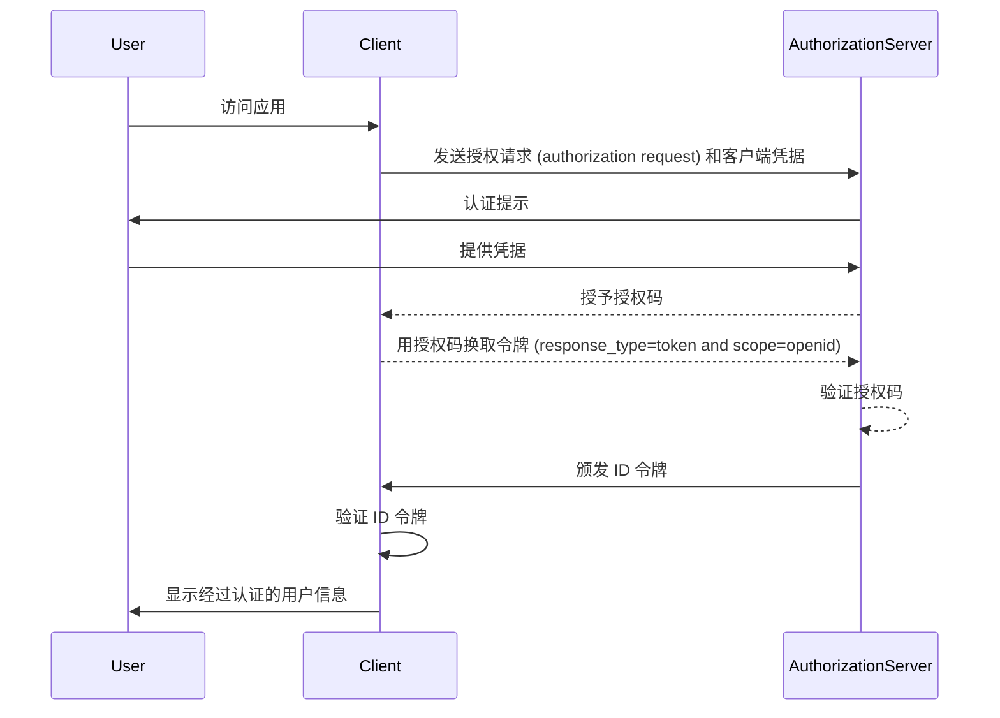

## 什么是 ID 令牌？

ID 令牌是一种特定类型的安全令牌，包含关于经过身份验证用户的信息，在成功认证 (authentication) 后传递给客户端应用程序。ID 令牌是区分 OpenID Connect (OIDC) 和 OAuth 2.0 的关键特性。虽然 OAuth 2.0 仅关注授权 (authorization)，但 OIDC 在其基础上通过引入 ID 令牌添加了用户认证 (authentication)。

在 OIDC 认证 (authentication) 过程中，客户端应用程序（依赖方）通过将用户重定向到授权服务器 (authorization server) 来启动认证 (authentication)。在成功认证 (authentication) 后，服务器响应一个 ID 令牌，以及其他令牌如访问令牌 (access token)。ID 令牌通常编码为 JWT（JSON Web 令牌）并包含关键声明 (claims)，如用户的标识符 (sub)、发行者 (iss)、受众 (aud) 和其他用户具体信息。

ID 令牌的主要功能是验证用户的身份，并将此信息传递给客户端应用程序。这使得应用程序可以在不直接处理凭据的情况下进行用户认证 (authentication)。由于客户端在用户已被授权服务器 (authorization server) 授权后才收到 ID 令牌，因此 ID 令牌可用作验证用户身份的安全方式。

## ID 令牌如何工作？

客户端应用程序通过重定向用户到授权服务器 (authorization server) 来启动认证 (authentication) 过程。用户在服务器上进行认证 (authentication)，然后服务器颁发一个 ID 令牌以及其他令牌如访问令牌 (access token)。ID 令牌返回给客户端应用程序，客户端应用程序可以使用它验证用户的身份。

由于 OIDC 是一种流行且标准化的协议，许多库和框架提供了内置的支持来处理 ID 令牌。这使得 ID 令牌易于集成到客户端应用程序中，并被广泛用于单点登录 (SSO) 和联合身份场景中。

## ID 令牌中的声明 (claims)

ID 令牌是一个 JWT（JSON Web 令牌），其中包含一组关于经过身份验证用户的声明 (claims)。这些声明包括在 [JWT 规范](https://datatracker.ietf.org/doc/html/rfc7519#section-4) 中定义的标准 JWT 声明以及用于传递用户身份信息的 OIDC 特定声明。

JWT 标准令牌声明：

- **iss (Issuer)**：必需。发行者声明标识 ID 令牌的发行者。这通常是颁发令牌的授权服务器 (authorization server) 的 URL。
- **sub (Subject)**：必需。主题声明标识 ID 令牌所述的用户。这通常是用户的唯一标识符。
- **aud (Audience)**：必需。受众声明标识 ID 令牌的受众。这通常是请求令牌的客户端应用程序。
- **exp (Expiration time)**：必需。过期时间声明标识令牌过期的时间。在此时间之后，不应接受该令牌进行处理。
- **iat (Issued at)**：必需。签发时间声明标识令牌签发的时间。
- **auth_time (Authentication time)**：可选。认证时间声明标识用户被认证的时间。仅当用户在当前会话期间被认证时，此声明才会出现。
- **nonce**：可选。随机数声明用于将客户端会话与 ID 令牌关联。它通常用于防止重放攻击。

OIDC 标准用户信息声明：

- **name**：用户的全名。
- **given_name**：用户的名字。
- **family_name**：用户的姓氏。
- **middle_name**：用户的中间名。
- **nickname**：用户的昵称或其他短名。
- **preferred_username**：用户的首选用户名。
- **profile**：指向用户个人资料页面的 URL。
- **picture**：指向用户头像的 URL。
- **website**：指向用户网站的 URL。
- **email**：用户的电子邮件地址。
- **email_verified**：布尔值，表示用户的电子邮件地址是否已验证。
- **gender**：用户的性别。
- **birthdate**：用户的出生日期。使用 YYYY-MM-DD 格式表示的字符串。
- **zoneinfo**：用户的时区。来自 [IANA 时区数据库](https://www.iana.org/time-zones) 的字符串。
- **locale**：用户的语言环境。表示用户用于格式化日期、时间和数字的首选语言和区域。
- **phone_number**：用户的电话号码。
- **phone_number_verified**：布尔值，表示用户的电话号码是否已验证。
- **address**：用户的邮寄地址。值为包含用户地址信息的 JSON 对象。
- **updated_at**：用户信息最后一次更新的时间。

这些声明为在 ID 令牌中传递用户身份信息提供了一种标准化的方式。尽管规范仅定义了一组标准声明，也可以在 ID 令牌中包含自定义声明来传递其他用户特定信息。

## ID 令牌验证

当客户端应用程序收到 ID 令牌时，必须验证令牌以确保其真实性和完整性。验证过程通常涉及以下步骤：

1. **验证签名**：客户端必须使用授权服务器 (authorization server) 的公钥验证 ID 令牌的签名。这确保了令牌没有被篡改，并且由预期方颁发。
2. **检查发行者**：客户端应验证 ID 令牌中的 `iss` 声明与颁发令牌的授权服务器 (authorization server) 的 URL 是否匹配。这有助于防止令牌替换攻击。
3. **检查受众**：客户端应验证 ID 令牌中的 `aud` 声明与客户端应用程序的 `client_id` 是否匹配。这确保了令牌是为客户端应用程序颁发的。
4. **检查过期时间**：客户端应验证 ID 令牌中的 `exp` 声明是否尚未到期。如果令牌已过期，则不应接受。实现可能会提供一个宽限期以解决时钟偏差。
5. **检查随机数**：如果客户端在认证请求 (authentication request) 中包含了 `nonce` 参数，则应验证 ID 令牌中的 `nonce` 声明是否与 `nonce` 参数的值匹配。这有助于防止重放攻击。

## ID 令牌与访问令牌 (access token)

虽然 ID 令牌和访问令牌 (access token) 在 OIDC 中广泛使用，但它们的用途不同，具有不同的特性：

|              | ID 令牌                                                                                              | 访问令牌 (Access token)                                                                                                      |
| ------------ | ----------------------------------------------------------------------------------------------------- | ---------------------------------------------------------------------------------------------------------------------------- |
| **目的**     | 验证用户身份并将用户信息传递给客户端应用程序。                                                       | 代表用户访问受保护资源。                                                                                                      |
| **格式**     | 通常是包含用户身份声明 (claims) 的 JWT。                                                              | 可以是 JWT 或不透明令牌 (opaque token)（随机字符串）。                                                                         |
| **受众**     | 面向请求令牌的客户端应用程序。                                                                       | 面向托管受保护资源的资源服务器 (resource server)。                                                                            |
| **生命周期** | 短期令牌，通常有效期为几分钟。仅可使用一次。                                                         | 长期令牌，有效期较长（例如，数小时）。在有效期内可以多次重复使用。                                                               |
| **内容**     | 包含用户身份信息，例如姓名、电子邮件和其他用户特定数据。                                              | 包含有关用户访问特定资源的权限 (scopes)。                                                                                       |

## ID 令牌使用的最佳实践

在 OIDC 中使用 ID 令牌时，遵循最佳实践对于确保认证 (authentication) 过程的安全性和完整性至关重要。一些关键的最佳实践包括：

1. **验证 ID 令牌**：始终验证从授权服务器 (authorization server) 接收到的 ID 令牌以确保其真实性和完整性。这有助于防止令牌替换攻击和未授权访问。
2. **使用安全通道**：确保 ID 令牌通过安全通道（例如 HTTPS）传输，以防止拦截和篡改。
3. **保护敏感信息**：由于 JWT 通常被编码而不是加密，这使得内容透明。避免在 ID 令牌负载中包含敏感信息，以防止在令牌泄漏的情况下曝光敏感数据。
4. **不用于授权**：ID 令牌用于用户认证 (authentication)，不应用于授权 (authorization) 目的。使用访问令牌 (access token) 进行授权访问受保护资源。
5. **单次使用**：ID 令牌通常是一次性使用的。一旦客户端应用程序验证了 ID 令牌，就不应在后续请求或会话状态保持中重复使用。为了维持用户会话状态，客户端应用程序应使用刷新令牌和令牌交换请求等机制。（刷新令牌是可以在访问令牌和 ID 令牌过期时用来获取新令牌的长期不透明令牌。）

<SeeAlso slugs={["openid-connect", "jwt", "signing-key", "access-token"]} />
