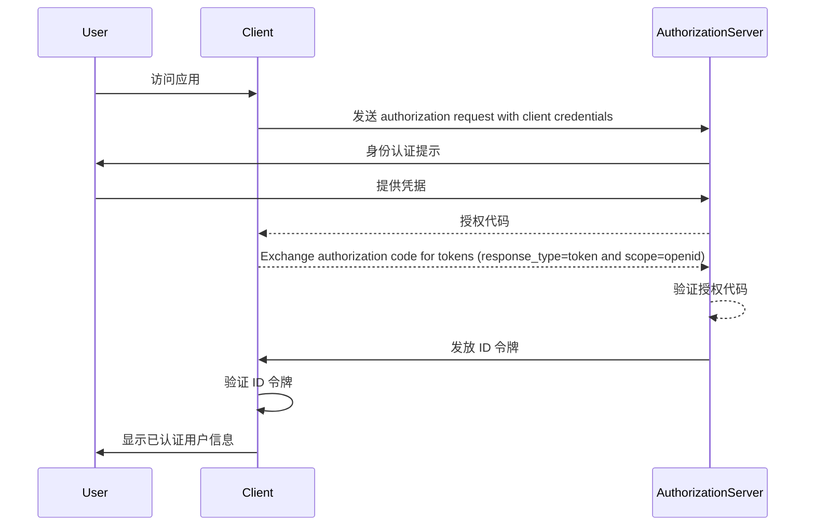

## 什么是 ID 令牌 (ID token)？

ID 令牌 (ID token) 是一种特殊类型的安全令牌，包含已认证用户的信息，在成功 <Ref slug="authentication" /> 后传递给客户端应用。ID 令牌是 <Ref slug="openid-connect" /> 与 <Ref slug="oauth-2.0" /> 的主要区别。虽然 OAuth 2.0 仅关注授权，OIDC 则在其基础上通过引入 ID 令牌添加了用户身份验证。

在 OIDC 认证流程中，客户端应用（依赖方）通过将用户重定向到授权服务器发起认证。在成功认证后，服务器会响应一个 ID 令牌，以及其他令牌如 <Ref slug="access-token" />。ID 令牌通常被编码为 <Ref slug="jwt" />，并包括关键声明 (claim)，如用户的标识符 (sub)、issuer、audience 和其他用户特定信息。

ID 令牌的主要功能是验证用户的身份并将此信息传递给客户端应用。这使得应用能够在不直接处理凭据的情况下认证用户。由于客户端仅在用户通过授权服务器认证后接收到 ID 令牌，所以 ID 令牌可用作安全的方式来验证用户身份。

## ID 令牌 (ID token) 如何工作？

客户端应用通过将用户重定向到授权服务器来启动认证过程。用户在服务器上进行认证，然后服务器签发一个 ID 令牌及其他令牌如访问令牌。ID 令牌返回给客户端应用，应用可以使用它来验证用户的身份。

由于 OIDC 是一个受欢迎的标准化协议，许多库和框架提供了处理 ID 令牌的内置支持。这使 ID 令牌易于集成到客户端应用中，并在 <Ref slug="single-sign-on" /> 和联合身份验证场景中广泛使用。

## ID 令牌 (ID token) 中的声明 (Claims)

ID 令牌是一个包含一组有关已认证用户的 <Ref slug="claim" /> 的 JWT。这些声明包括在 [JWT 规范](https://datatracker.ietf.org/doc/html/rfc7519#section-4) 中定义的标准 JWT 声明，以及用于传递用户身份信息的 OIDC 特定声明。

JWT 标准令牌声明：

- **iss (Issuer)**: 必须。有 issuer 声明标识 ID 令牌的颁发者。通常是颁发令牌的授权服务器的 URL。
- **sub (Subject)**: 必须。有 subject 声明标识与 ID 令牌相关的用户。通常是用户的唯一标识符。
- **aud (Audience)**: 必须。audience 声明标识 ID 令牌的 audience。通常是请求令牌的客户端应用。
- **exp (Expiration time)**: 必须。expiration time 声明标识令牌到期的时间。在此时间之后，令牌不应被接受处理。
- **iat (Issued at)**: 必须。issued at 声明标识令牌颁发的时间。
- **auth_time (Authentication time)**: 可选。authentication time 声明标识用户认证的时间。若用户在当前会话中进行认证，此声明才会出现。
- **nonce**: 可选。nonce 声明用于将客户端会话与 ID 令牌关联。通常用于防止重放攻击。

OIDC 标准用户信息声明：

- **name**: 用户的全名。
- **given_name**: 用户的名字。
- **family_name**: 用户的姓氏。
- **middle_name**: 用户的中间名。
- **nickname**: 用户的昵称或其他短名。
- **preferred_username**: 用户的首选用户名。
- **profile**: 指向用户个人资料页面的 URL。
- **picture**: 指向用户头像的 URL。
- **website**: 指向用户网站的 URL。
- **email**: 用户的电子邮件地址。
- **email_verified**: 表示用户电子邮件地址是否已验证的布尔值。
- **gender**: 用户的性别。
- **birthdate**: 用户的出生日期，以字符串格式表示，格式为 YYYY-MM-DD。
- **zoneinfo**: 用户的时区。从 [IANA 时区数据库](https://www.iana.org/time-zones)中获取的字符串。
- **locale**: 用户的语言环境。表示用户在格式化日期、时间和数字时首选的语言和地区。
- **phone_number**: 用户的电话号码。
- **phone_number_verified**: 表示用户电话号码是否已验证的布尔值。
- **address**: 用户的邮政地址。该值是一个包含用户地址信息的 JSON 对象。
- **updated_at**: 用户信息最后更新的时间。

这些声明提供了一种标准化方式来在 ID 令牌中传递用户身份信息。虽然规范只定义了一组标准声明，但也可以在 ID 令牌中包含自定义声明以传递额外的用户特定信息。

## ID 令牌 (ID token) 验证

当客户端应用接收到 ID 令牌时，必须验证令牌以确保其真实性和完整性。验证过程通常涉及以下步骤：

1. **验证签名**：客户端必须使用授权服务器的公钥验证 ID 令牌的签名。这确保了令牌未被篡改，并且由预期的一方颁发。
2. **检查 issuer**：客户端应验证 ID 令牌中的 `iss` 声明是否与颁发令牌的授权服务器的 URL 匹配。这有助于防止令牌替换攻击。
3. **检查 audience**：客户端应验证 ID 令牌中的 `aud` 声明是否与客户端应用的 `client_id` 相匹配。这确保令牌是为客户端应用颁发的。
4. **检查过期时间**：客户端应验证 ID 令牌中的 `exp` 声明是否未过期。如果令牌已过期，则不应接受。实现可以提供一定的宽限期以应对时钟偏差。
5. **检查 nonce**：如果客户端在认证请求中包含了 `nonce` 参数，则应验证 ID 令牌中的 `nonce` 声明是否与 `nonce` 参数的值匹配。这有助于防止重放攻击。

## ID 令牌 (ID token) vs 访问令牌 (Access Token)

虽然 ID 令牌和访问令牌在 OIDC 中被广泛使用，但它们的用途不同且具有不同的特征：

|              | ID 令牌 (ID token)                                                                             | 访问令牌 (Access Token)                                                                                                        |
| ------------ | ---------------------------------------------------------------------------------------------- | ---------------------------------------------------------------------------------------------------------------------------- |
| **目的**     | 验证用户身份并向客户端应用传递用户信息。                                                          | 提供对用户名义下受保护资源的访问。                                                                                              |
| **格式**     | 通常是包含用户身份声明的 JWT。                                                                  | 可以是 JWT 或 <Ref slug="opaque-token" />。                                                                                  |
| **audience** | 针对请求令牌的客户端应用。                                                                      | 针对托管受保护资源的资源服务器。                                                                                            |
| **有效期**   | 短期令牌，通常仅在几分钟内有效。一-time use only。                                              | 较长有效期的令牌，通常在更长时间内有效（例如几小时）。在其有效期内可以多次重用。                                           |
| **内容**     | 包含用户身份信息，如姓名、电子邮件和其他用户特定数据。                                          | 包含有关用户对特定资源的权限范围的信息。                                                                                     |

## 使用 ID 令牌 (ID token) 的最佳实践

在 OIDC 中使用 ID 令牌时，务必遵循最佳实践以确保认证过程的安全性和完整性。一些关键的最佳实践包括：

1. **验证 ID 令牌**：始终验证从授权服务器收到的 ID 令牌，以确保其真实性和完整性。这有助于防止令牌替换攻击和未经授权的访问。
2. **使用安全通道**：确保 ID 令牌通过安全通道（例如 HTTPS）传输，以防止拦截和篡改。
3. **保护敏感信息**：由于 JWT 通常是编码而非加密的，这使得内容透明。在 ID 令牌负载中避免包含敏感信息，以防止数据泄漏情况下的敏感数据暴露。
4. **不用于授权**：ID 令牌用于用户认证，不应用于授权目的。使用访问令牌来授权访问受保护资源。
5. **单次使用**：ID 令牌通常旨在一次性使用。一旦客户端应用验证了 ID 令牌，它不应在后续请求或会话状态保留中重用。为了维持用户会话状态，客户端应用应采用类似 <Ref slug="refresh-token" /> 和令牌交换请求等机制。（Refresh 令牌是长期有效的不透明令牌，可以在访问令牌和 ID 令牌过期时用于获取新令牌。）

<SeeAlso slugs={["openid-connect", "jwt", "signing-key", "access-token"]} />
