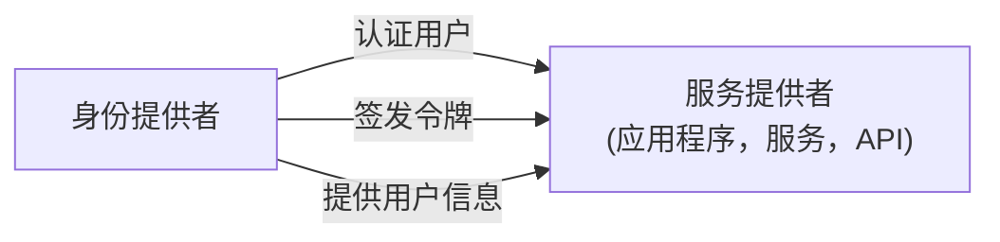
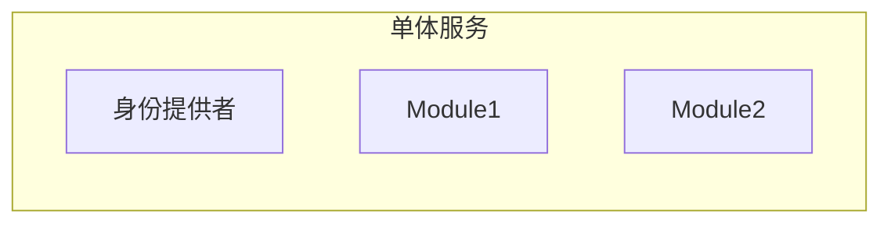
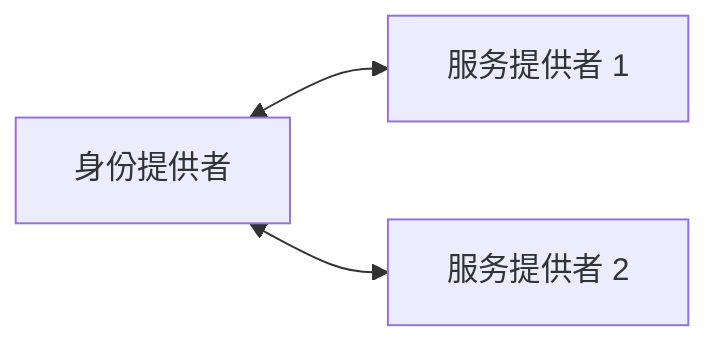

## 什么是身份提供者 (IdP)？

在 <Ref slug="iam" /> 领域，身份提供者 (IdP) 是管理身份的中央服务。它负责认证 (Authentication) 用户、签发身份令牌，并向 <Ref slug="service-provider">服务提供者</Ref>（例如应用程序、服务、API）提供用户信息。

除了 <Ref slug="authentication" />，现代身份提供者还负责 <Ref slug="authorization" />（执行 <Ref slug="access-control" /> 策略）并支持高级功能，如 <Ref slug="single-sign-on" /> 和 <Ref slug="multi-tenancy" />。

## 身份提供者标准

由于身份管理的性质以及互操作性的需求，没有标准来构建身份提供者将是不切实际的且效率低下。以下是一些典型场景：

- 两个身份提供者需要相互通信以交换用户信息（例如，社交登录）。
- 一个应用程序需要使用多个身份提供者来认证 (Authentication) 用户（例如，联合身份）。
- 一个身份提供者需要支持多种类型的客户端（例如，Web、移动、物联网）。

为了应对这些场景，业界为身份提供者开发了几种流行的标准：

- <Ref slug="oauth-2.0" />：一种广泛使用的授权 (Authorization) 框架，使应用程序能够代表用户或服务获取访问权限。
- <Ref slug="openid-connect" />：一个基于 OAuth 2.0 之上的身份层，提供认证 (Authentication) 和用户信息。
- <Ref slug="saml" />：一种在安全域之间交换认证 (Authentication) 和授权 (Authorization) 数据的标准。

对于新应用程序，OpenID Connect (OIDC) 是构建身份提供者或集成现有身份提供者的推荐标准。

## 身份提供者架构

术语“身份提供者”并不指定特定的架构或实现。这就是说，身份提供者可以是单体应用程序、微服务或云服务。

由于身份管理的复杂性和重要性，现代应用程序倾向于使用作为独立服务或供应商解决方案的专业身份提供者。

## 身份提供者功能

现代身份提供者提供广泛的功能以支持各种使用场景和需求。以下是一些常见功能：

- <Ref slug="authentication" />：使用多种方法验证用户身份（例如，用户名/密码，社交登录，<Ref slug="mfa" />）。
- <Ref slug="authorization" />：执行访问控制策略并管理用户权限（例如，<Ref slug="rbac" />，<Ref slug="abac" />）。
- **用户管理**：创建、更新和删除用户账户和配置文件；向 <Ref slug="service-provider">服务提供者</Ref> 提供用户数据。
- **令牌管理**：签发和管理身份令牌（例如，ID 令牌，访问令牌，刷新令牌）。
- <Ref slug="single-sign-on" />：允许用户一次认证 (Authentication) 后访问多个应用程序。
- <Ref slug="multi-tenancy" />：支持多组织或租户，具有隔离的用户数据和配置。

<SeeAlso slugs={["service-provider", "iam", "openid-connect", "oauth-2.0"]} />

<Resources
  urls={[
    "https://blog.logto.io/secure-cloud-apps-with-oauth-and-openid-connect",
    "https://blog.logto.io/incorporate-identity-solution",
    "https://blog.logto.io/centralized-identity-system"
  ]}
/>
