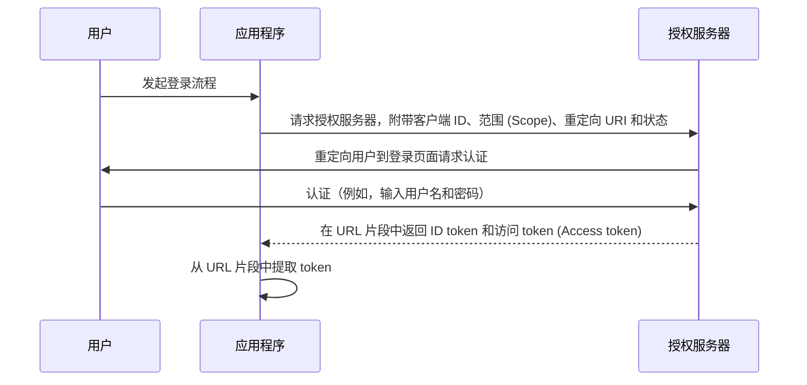

## 什么是隐式流程 (Implicit flow)

OIDC (OpenID Connect) 隐式流程 (Implicit flow) 是一种主要由使用脚本语言在浏览器中实现的客户端应用程序使用的认证 (Authentication) 过程，例如，单页应用程序 (SPAs)。它允许客户端应用程序直接从授权服务器 (Authorization server) 获取 ID token 和访问 token (Access token) ，而无需执行客户端认证 (Client authentication)。

## 隐式流程 (Implicit flow) 是如何工作的？

隐式流程 (Implicit flow) 的主要步骤如下：

1. **发送认证请求 (Authentication request)**：用户通常通过在应用程序中点击一个链接或按钮来启动流程。应用程序向授权服务器 (Authorization server) 的授权端点发送认证请求 (Authentication request)。授权服务器 (Authorization server) 验证参数并将用户重定向到授权服务器 (Authorization server) 的登录页面进行认证 (Authentication)。
2. **用户认证 (Authentication)**：用户在授权服务器 (Authorization server) 上进行认证，例如，输入用户名和密码。
3. **授权服务器 (Authorization server) 响应**：授权服务器 (Authorization server) 将 ID token 和（如果请求）访问 token (Access token) 作为 URL 片段返回给客户端应用程序。
4. **客户端处理 token**：客户端应用程序从 URL 片段中提取 token。



### 认证请求 (Authentication request)

请求参数如下：
- **client_id**: 必填。有效的 OAuth 2.0 客户端标识符，可以在 Logto 中作为应用程序 ID（或 app ID）获取。
- **scope**: 必填。该值指定用户请求从授权服务器 (Authorization server) 获取的一组资源。例如，`openid profile email`
- **response_type**: 必填。值可以是 `id_token` 或 `id_token token`。当值为 `id_token` 时，不返回访问 token (Access token)。
- **redirect_uri**: 必填。认证响应将被发送到的 URI，应与客户端在 <Ref slug="openid-connect" headingId="openid-provider-op" /> 上预注册的重定向 URI 完全匹配。例如，Logto 管理控制台中的“登录重定向 URI”。
- **nonce**: 必填。用于减轻重放攻击的随机字符串，它从认证请求 (Authentication request) 到 ID token 声明 (Claim) 中不变。

### 认证请求 (Authentication request) 示例

```bash
curl -X GET "https://authorization-server.com/auth" \
  -d "response_type=id_token token" \
  -d "client_id=YOUR_APPLICATION_ID" \
  -d "redirect_uri=https://yourapp.com/callback" \
  -d "scope=openid profile email" \
  -d "nonce=RANDOM_STRING"
```

## 限制

隐式流程 (Implicit flow) 是在浏览器尚未普遍采用跨域资源共享 (CORS) 的时代开发的。因此，禁止向托管在不同域上的授权服务器 (Authorization server) 发送 POST 请求。

由于这一限制，授权服务器 (Authorization server) 直接在 URL 片段中返回 token，可能会将其暴露给终端用户和可以访问终端用户用户代理的应用程序。

此外，隐式流程 (Implicit flow) 中没有执行客户端认证 (Client authentication)，意味着任何应用程序都可以假装是请求认证的那个客户端，因为客户端 ID 总是在基于浏览器的应用程序中暴露。

由于上述限制，隐式流程 (Implicit flow) 通常被认为不如授权码流程 (Authorization Code Flow) 安全。

## 隐式流程 (Implicit flow) 的替代方案

鉴于隐式流程 (Implicit flow) 的安全限制，通常建议使用其他流程：
- **授权码流程 (Authorization Code Flow)**：此流程涉及一个额外步骤，客户端将授权码兑换为 token，提供了额外的安全层。
- **PKCE (Proof Key for Code Exchange)**：授权码流程 (Authorization Code Flow) 的扩展，通过使用代码验证器和代码挑战增加了一层安全性。

<SeeAlso slugs={['device-flow', 'authorization-code-flow', 'client-credentials-flow']} />

<Resources
  urls={[
    "https://blog.logto.io/implicit-flow-is-dead",
    {
      url: "https://tools.ietf.org/html/rfc6749#section-4.2",
      result: {
        ogTitle: "The OAuth 2.0 Authorization Framework: Implicit Grant",
        ogDescription: "The implicit grant type is used to obtain access tokens (it does not support the issuance of refresh tokens) and is optimized for public clients known to operate a particular redirection URI. These clients are typically implemented in a browser using a scripting language such as JavaScript."
      }
    },
    "https://openid.net/specs/openid-connect-core-1_0.html",
  ]}
/>
