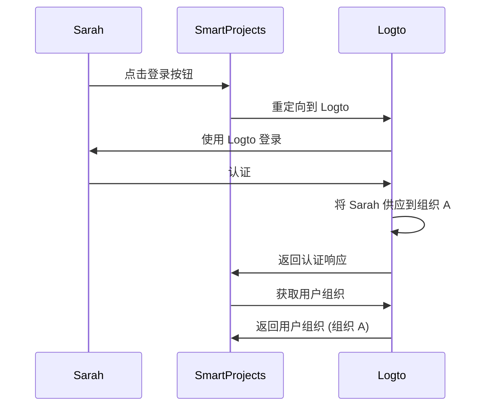
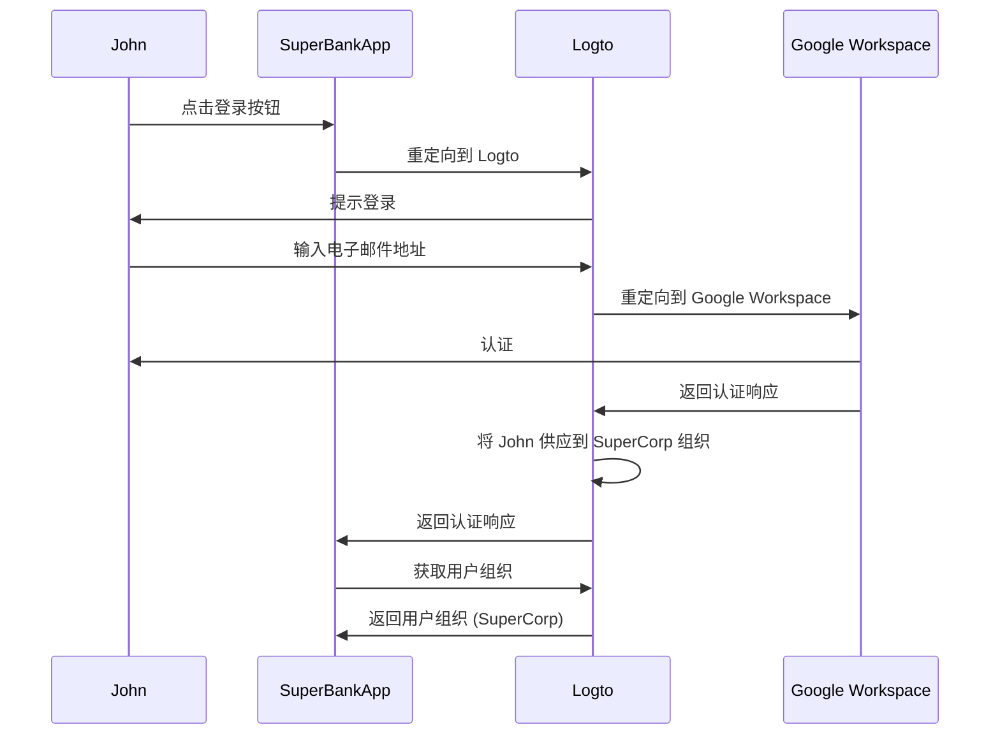

## 什么是即时供应？

即时 (JIT) 供应是在 <Ref slug="iam" /> 中使用的一个过程，当用户首次尝试登录时，根据用户的身份和系统的配置即时供应用户账户。

## 即时供应的使用场景是什么？

这些场景在构建涉及多租户架构、企业 SSO (Enterprise SSO) 或需要团队入职功能的 B2B 应用时很常见。以下是你或你的客户可能遇到的一些示例场景。

### 员工入职

想象一下，你的一个客户 *SuperFantasy* 正在经历频繁的招聘或快速增长，可以使用 JIT 供应快速为新员工设置用户账户。*SuperFantasy* 使用 Logto 进行身份和访问管理，并使用 SmartProjects 进行项目管理。当新员工 Sarah 第一次登录 SmartProjects 时，她的账户会根据她的 Logto 凭证自动创建和配置。

根据上面的图表，当 Sarah 第一次登录 SmartProjects 时，她的账户会自动供应到 Logto 中的组织 A。这个过程确保了 Sarah 能够访问 SmartProjects，而无需 IT 团队的人工干预。

### 企业客户入职

想象另一个客户 *SuperBank* 是一家为其客户提供在线银行服务的金融机构。*SuperBank* 使用 Logto 进行身份和访问管理，并使用 SuperBankApp 进行在线银行服务。*SuperBank* 最近与一个新企业客户 *SuperCorp* 签订了合同，为其员工提供在线银行服务。

*SuperCorp* 使用 Google Workspace 进行员工账户管理。SuperBankApp 需要确保当 *SuperCorp* 的员工首次登录时，他们的账户会自动添加到 Logto 中的 *SuperCorp* 组织。

在上面的图表中，当 John 第一次登录 SuperBankApp 时，他的账户会根据他的 Google Workspace 身份自动供应到 Logto 中的 SuperCorp 组织。

## 它是否特定于 SAML 和企业 SSO？

即时 (JIT) 供应通常与 SAML 认证中的 <Ref slug="enterprise-sso" /> 相关联，但它并不局限于 <Ref slug="saml" />。JIT 供应也可以与其他认证协议一起使用，如 <Ref slug="oauth-2.0" /> 和 <Ref slug="openid-connect" />，并且不总是需要 <Ref slug="enterprise-sso" /> 设置。

例如，当你的 <Ref slug="identity-provider" /> 支持此功能时，可以使用基于电子邮件的 JIT 供应。在这种情况下，用户的电子邮件地址是供应所需的唯一属性，无论认证协议或 SSO 配置如何。

## 它适用于应用的新用户还是现有用户？

即时 (JIT) 供应通常指首次尝试访问应用。然而，不同的产品对这一功能的理解不同。有些仅将 JIT 供应用于身份和账户创建，而其他产品还包括即时账户更新，如重新供应和属性同步。

例如，SAML JIT 供应允许在供应过程中授予和撤销组成员资格。它还可以更新已供应的用户，以保持他们在 <Ref slug="service-provider" /> 存储中的属性与 <Ref slug="identity-provider" /> 用户存储属性同步。

如果你确实想考虑后续现有用户登录的场景，请确保你有一个健全的供应系统以及你的 JIT 系统。例如：

- **冲突解决**：如果在 JIT 过程中 IdP 提供的信息与现有账户不同，你的系统应该有处理冲突的策略。这可能需要对组织政策和 IdP 配置的详细控制。
- **审计跟踪**：维护通过 JIT 过程创建新账户和更新现有账户的日志对于安全和合规性很重要。
- **性能**：虽然 JIT 供应发生得很快，但要考虑对登录时间的潜在影响，特别是对于现有用户，如果你在每次登录时更新他们的信息。
- **数据一致性**：确保你的 JIT 供应过程保持数据一致性，特别是在更新现有用户账户时。

## JIT 和跨域身份管理系统 (SCIM) 有什么区别？

SCIM 是一个开放标准协议，旨在简化和自动化跨不同系统和域的用户身份管理。它通常用于目录同步场景。

JIT 和 SCIM 的主要区别在于 JIT 通常指首次尝试访问应用（或新用户入职），它是一个描述动态供应用户账户过程的广义术语；而 SCIM 是一个用于跨系统管理用户生命周期的特定协议，并不限于首次登录。

此外，JIT 缺乏跨系统的标准化实现，而 SCIM 是一个为身份管理定义的标准化协议 [RFC 7644](https://datatracker.ietf.org/doc/html/rfc7644)。

一些大型组织使用 SCIM 进行账户供应，将其与自己的系统集成。这可能非常复杂，并且因情况而异。对于大多数用例，JIT 供应是一种更简单和直接的方法。

<Resources urls={['https://blog.logto.io/jit-provisioning', 'https://datatracker.ietf.org/doc/html/rfc7644']} />