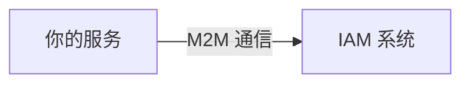
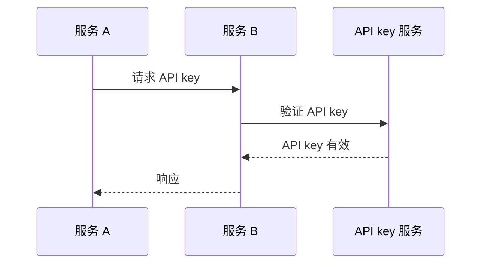
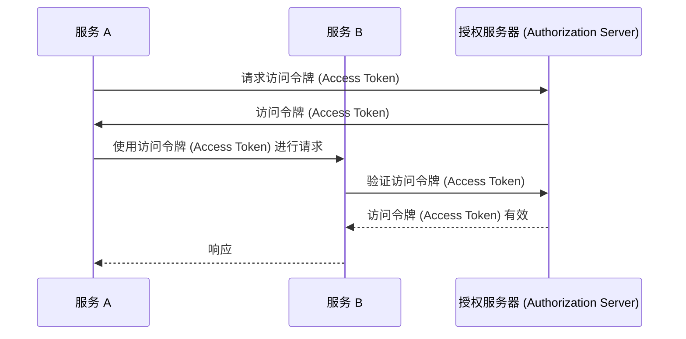
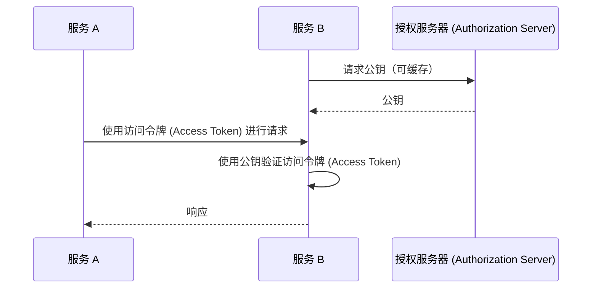

## 什么是机器对机器通信？

机器对机器 (Machine-to-machine, M2M) 通信指的是设备之间无需人为干预的自动化数据交换。在认证 (Authentication) 和授权 (Authorization) 的环境中，M2M 通信通常涉及需要访问资源的客户端应用程序，其中客户端应用程序是机器（服务）或代表用户行事的机器。

## 为什么我们需要处理机器对机器通信？

当你只有一个服务且没有任何依赖时，它很可能不需要与其他服务通信。但随着系统的增长，或者你想要与身份和访问管理 (IAM) 系统集成，你需要处理机器对机器通信。

然而，这看起来仍然很简单 —— 你需要做的就是识别服务并对其进行认证 (Authentication)。但在现实中，仍然有几个挑战需要解决：

### 1. 认证 (Authentication)

你如何对服务进行认证 (Authentication)？你不能使用用户名和密码，因为没有人来输入它们。你需要使用不同的机制，例如 API keys、客户端证书或 OAuth 客户端凭据 (Client Credentials)。

### 2. 授权 (Authorization)

一旦你对服务进行认证 (Authentication)，你如何确定该服务可以执行的操作？你需要为服务定义权限和角色 (Role)，类似于为用户定义权限和角色 (Role)。你最不希望的就是在代码中对权限进行硬编码。

### 3. 安全性

你如何确保服务之间的通信是安全的？凭据会定期更新吗？你如何监控和审计通信？

### 4. 可扩展性

随着服务数量的增长，你如何管理每个服务的认证 (Authentication) 和授权 (Authorization)？

## 机器对机器通信的常见方法

考虑到这些挑战，业界有几种常见的方法：

### 1. API keys

<Ref slug="api-key">API keys</Ref> 是对服务进行认证 (Authentication) 的一种简单方式。每个服务可以拥有一个或多个 API keys，用于认证 (Authentication)（有时也用于授权 (Authorization)）。你可能会看到某些服务要求你在请求头中提供 API key，例如 `X-API-Key: your-api-key`。

一个关于 API keys 如何工作的非规范性示例：

优点：

- 实施和使用简单。
- 通过安全的随机生成和足够长，API keys 很难被猜测。
- 验证是动态的，这意味着你可以在任何时间撤销 API key。

缺点：

- 需要网络通信来验证 API key。
- 它不是自包含的，这意味着需要一个服务来进行 introspection。
- 其他服务与拥有 API key 的服务具有相同的访问级别（可以通过使用 API 网关部分缓解）。
- 在服务之间管理大量 API keys 很难。

### 2. OAuth 客户端凭据 (Client Credentials)

OAuth (或 OIDC，因为 OpenID Connect 基于 OAuth 2.0) <Ref slug="client-credentials-flow" /> 是一种更高级的服务认证 (Authentication) 方式。它基于 OAuth 2.0 框架，广泛用于用户认证 (Authentication) 和授权 (Authorization)。通过 OAuth 客户端凭据 (Client Credentials)，服务可以通过向授权服务器 (Authorization Server) 提交客户端 ID 和客户端密钥来获取访问令牌 (Access Token)。

关于 OAuth 客户端凭据 (Client Credentials) 如何工作的非规范性示例：

通常，访问令牌 (Access Token) 是一个 JSON Web Token (JWT)，其中包含有关服务及其权限的信息。然后其他服务可以在无需与授权服务器 (Authorization Server) 通信的情况下验证访问令牌 (Access Token)（只要它具有验证 JWT 签名所需的公钥）。工作流程变为：

有关 JSON Web Tokens 的更多信息，请参阅 <Ref slug="jwt" />。

优点（对于 JWT）：

- 自包含，意味着其他服务可以立即了解必要的信息，例如权限，无需额外的网络通信。
- 访问令牌 (Access Token) 可以是短期的，减少了误用的风险。
- 其他服务不需要知道客户端密钥，只需要公钥来验证 JWT 签名。
- 访问令牌 (Access Token) 可用于审计服务的操作（例如，哪个服务访问了哪些资源）。
- 管理大量服务更容易，因为它在服务和权限之间设定了明确的边界。

缺点：

- 比 API keys 实现和使用稍微复杂一些。
- 如果其他服务只执行离线验证，它可能不知道访问令牌 (Access Token) 是否已被撤销。

### 3. Mutual TLS

Mutual TLS (mTLS) 是一种使用客户端证书对服务进行认证 (Authentication) 的方式。通过 mTLS，每个服务持有一个带有私钥的客户端证书，另一个服务使用公钥验证证书。然而，mTLS 侧重于 TLS 层，意味着它通常不适合应用层级的认证 (Authentication) 和授权 (Authorization)。

对于高级用例，mTLS 可以与证书绑定的访问令牌 (Access Token) 结合使用，以进一步保护通信。有关更多信息，请参见 [RFC 8705: OAuth 2.0 Mutual-TLS Client Authentication and Certificate-Bound Access Tokens](https://datatracker.ietf.org/doc/html/rfc8705)。

优点：

- 强认证 (Authentication)，因为它基于公钥加密。
- 通信默认是加密和安全的。
- 客户端证书可用于识别服务，类似于 JWT 的工作方式。

缺点：

- 比 API keys 和 OAuth 客户端凭据 (Client Credentials) 实现和管理更复杂。
- 客户端证书需要定期更新。
- 需要更多的技术知识来正确管理客户端证书。
- 其他服务可能不支持 mTLS，这意味着你需要有备用机制。

<SeeAlso slugs={["api-key", "client-credentials-flow", "jwt"]} />