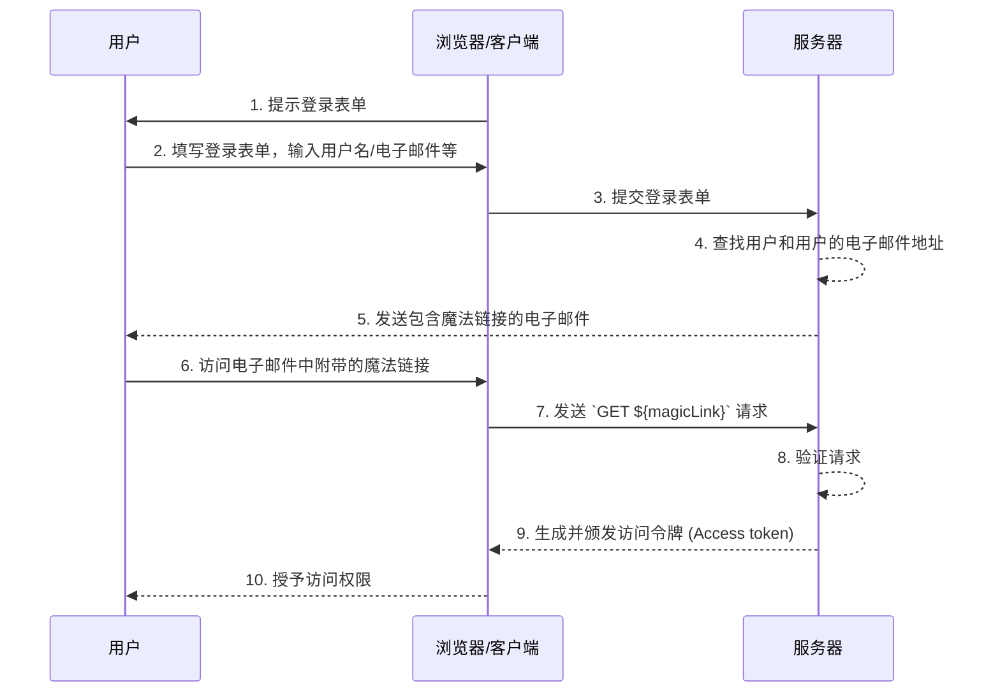

## 什么是魔法链接 (Magic link)？

魔法链接 (Magic link) 是在认证 (Authentication) 过程中发送给用户的一次性使用链接。

通过访问此链接，用户完成访问所需资源的授权流程，并被授予适当的资源访问权限。之后，魔法链接 (Magic link) 将失效。

## 魔法链接 (Magic link) 和一次性密码 (OTP) 有什么区别？

假设用户使用电子邮件接收魔法链接 (Magic link) 或 <Ref slug='otp' />。

在许多情况下，用户使用电子邮件接收一次性密码 (OTP) 以验证登录或作为 <Ref slug='mfa' /> 的附加验证因素。使用电子邮件魔法链接 (Magic link) 和电子邮件一次性密码 (OTP) 有什么区别？

使用一次性密码 (OTP)，用户需要检查他们的电子邮件，记住一次性密码 (OTP)，然后在登录/验证过程中输入。这需要用户在不同的应用程序或页面之间反复手动切换。

使用电子邮件魔法链接 (Magic link)，用户只需在他们的电子邮件应用程序中打开包含魔法链接 (Magic link) 的电子邮件并点击链接即可。这提供了更简单的用户体验。

此外，使用魔法链接 (Magic link) 允许在链接中包含超出一次性令牌的信息，例如与登录相关的会话信息。这可以提高安全性和用户体验。

## 魔法链接 (Magic link) 如何工作？

在此序列图中，我们展示了用户如何使用魔法链接 (Magic link) 登录并获得适当资源的访问权限。

在此序列图中，我们假设魔法链接 (Magic link) 是通过电子邮件发送的。然而，还有其他可能的发送魔法链接 (Magic link) 的方法，例如通过短信发送到手机。由于这些替代方法的流程几乎相同，这里将不作讨论。

1. **提示登录表单**  
   浏览器/客户端通过提示用户登录表单来启动认证 (Authentication) 过程。
2. **用户填写登录表单**  
   用户在登录表单中输入他们的标识符，例如用户名、电子邮件地址或电话号码。  
   提供的信息需要足以帮助系统识别唯一用户。例如，在大多数系统中，用于登录的用户名是唯一的。在这样的系统中，用户只需提供他们的用户名即可帮助系统唯一识别他们想要登录的账户。
3. **提交登录表单**  
   浏览器/客户端将表单提交到服务器，包含步骤 2 中描述的用户信息。
4. **查找用户和电子邮件**  
   服务器通过在数据库中定位唯一用户并检索用户的关联电子邮件地址来处理请求。
5. **发送包含魔法链接的电子邮件**  
   服务器向用户的电子邮件地址发送一封电子邮件。此电子邮件包含用于认证 (Authentication) 的魔法链接。
6. **用户访问魔法链接**  
   用户收到电子邮件并点击其中提供的魔法链接。
7. **发送带有魔法链接的 GET 请求**  
   浏览器/客户端使用魔法链接 URL 向服务器发送 `GET` 请求。
8. **验证请求**  
   服务器验证请求以确保魔法链接有效、未使用且未过期。
9. **生成并颁发访问令牌 (Access token)**  
   一旦请求被验证，服务器生成访问令牌 (Access token) 并将其颁发给浏览器/客户端。
10. **授予访问权限**  
    浏览器/客户端接收访问令牌 (Access token) 并允许用户访问请求的资源。

## 魔法链接 (Magic link) 的好处是什么？

魔法链接 (Magic link) 通过采用基于令牌的交互模型增强了认证 (Authentication) 系统的安全架构。每个链接都是唯一加密的，并且通常包含一个过期时间戳。由于其短暂性，即使魔法链接 (Magic link) 被截获或泄露，其短暂的有效窗口也限制了恶意利用的机会。

此外，由于使用魔法链接 (Magic link) 需要用户控制的接收方法，例如受信任的电子邮件地址或电话号码，它提供了除用户名和密码之外的额外验证方法，提供了额外的账户安全性。而且，由于魔法链接 (Magic link) 消除了输入凭据的需要，用户的账户安全性得到了更好的保护，过程也更加方便。