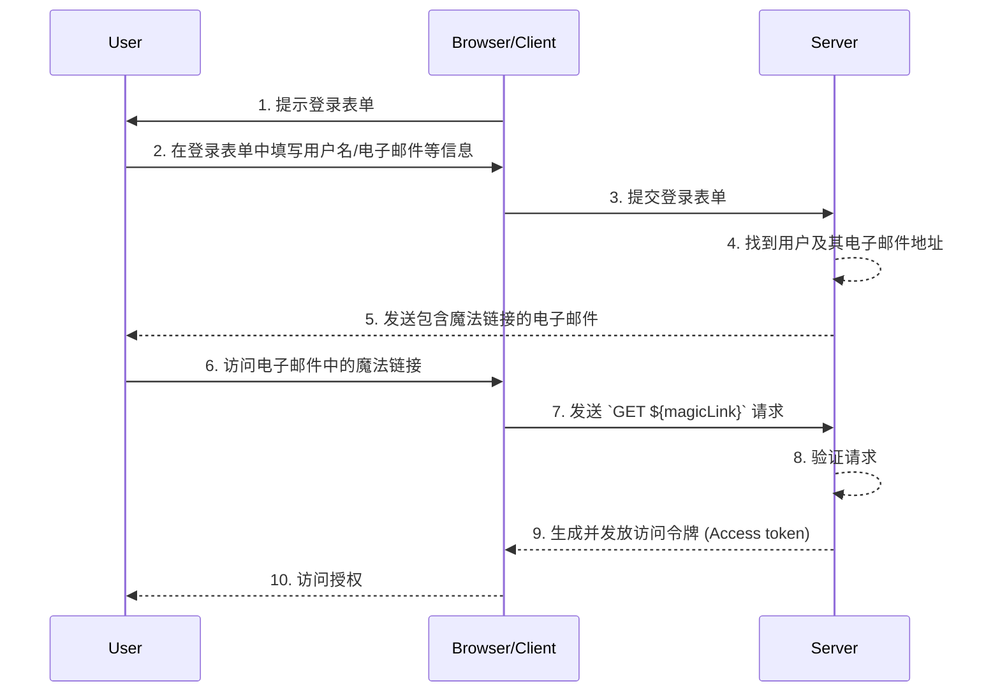

## 什么是魔法链接 (Magic links)？

魔法链接 (Magic link) 是在认证 (Authentication) 过程发送给用户的一次性使用链接。

通过访问此链接，用户完成访问所需资源的认证请求 (Authorization flow)，并被授予适当的资源访问权限。此后，魔法链接 (Magic link) 失效。

## 魔法链接 (Magic link) 和一次性密码 (OTP) 的区别是什么？

假设用户使用电子邮件接收魔法链接 (Magic link) 或 OTP。

在很多情况下，用户使用电子邮件接收 OTP 来验证登录或作为 MFA 的附加验证因素。使用电子邮件魔法链接 (Magic link) 和电子邮件 OTP 的区别是什么？

使用 OTP 时，用户需要查阅他们的电子邮件，记住 OTP，然后在登录/验证过程中输入。这要求用户在不同的应用程序或页面之间多次手动切换。

使用电子邮件魔法链接 (Magic link)，用户只需在他们的电子邮件应用中打开包含魔法链接 (Magic link) 的邮件并点击链接。这提供了更简单的用户体验。

此外，使用魔法链接 (Magic link) 可以在链接中包含超越一次性令牌的信息，例如与登录相关的会话信息。这可以提高安全性和用户体验。

## 魔法链接 (Magic link) 如何工作？

在这个时序图中，我们展示了用户如何登录并通过魔法链接 (Magic link) 获得适当资源的访问权限。

在这个时序图中，我们假设魔法链接 (Magic link) 是通过电子邮件发送的。然而，还有其他可发送魔法链接 (Magic link) 的方法，例如将其通过短信发送到手机。由于流程几乎相同，这些替代点不会在此讨论。

1. **提示登录表单**  
   浏览器/客户端通过提示用户登录表单来启动认证 (Authentication) 过程。
2. **用户填写登录表单**  
   用户在登录表单中输入其标识符，如用户名、电子邮件地址或电话号码。
   所提供的信息需要足以帮助系统识别唯一用户。例如，在大多数系统中，用于登录的用户名是唯一的。在这样的系统中，用户只需提供其用户名来帮助系统唯一识别他们要登录的账户。
3. **提交登录表单**  
   浏览器/客户端将包含第 2 步中用户信息的表单提交到服务器。
4. **查找用户和电子邮件**  
   服务器通过在数据库中定位唯一用户并检索用户相关联的电子邮件地址来处理请求。
5. **发送包含魔法链接的电子邮件**  
   服务器将包含用于认证 (Authentication) 的魔法链接 (Magic link) 的电子邮件发送到用户的电子邮件地址。
6. **用户访问魔法链接**  
   用户收到电子邮件，并点击其中提供的魔法链接 (Magic link)。
7. **发送包含魔法链接 (Magic link) 的 GET 请求**  
   浏览器/客户端使用魔法链接 (Magic link) 的 URL 向服务器发送 `GET` 请求。
8. **验证请求**  
   服务器验证请求，以确保魔法链接 (Magic link) 有效、未使用且未过期。
9. **生成并发放访问令牌 (Access token)**  
   请求被验证后，服务器生成访问令牌 (Access token) 并将其发放给浏览器/客户端。
10. **授权访问**  
    浏览器/客户端接收访问令牌 (Access token)，允许用户访问请求的资源。

## 魔法链接 (Magic links) 有何好处？

魔法链接 (Magic link) 通过使用基于令牌的交互模型增强了认证 (Authentication) 系统的安全架构。每个链接都是唯一加密的，通常包含一个过期时间戳。由于它们的短暂性质，即使魔法链接 (Magic link) 被拦截或泄露，其短暂的有效窗口也将限制恶意利用的可能性。

此外，由于使用魔法链接 (Magic link) 需要用户控制的接收方法，如可信的电子邮件地址或电话号码，它提供了一种超越用户名和密码的附加验证方法，提供了额外的账户安全性。并且由于魔法链接 (Magic link) 消除了输入凭据的需要，用户的账户安全性得到了更好的保护，过程更加便捷。