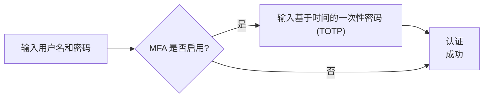
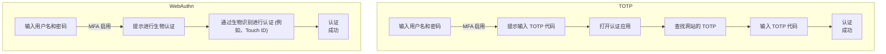

## 什么是多因子认证 (MFA)？

多因子认证 (MFA) 通过要求用户提供多种形式的身份验证来验证其身份，从而增强安全性。它在 <Ref slug="authentication" /> 过程中增加了一个额外的安全层，使攻击者更难进行未经授权的访问。

以下是 MFA 的示例：

### “因子”的定义

在上面的示例中，有两个因子：

1. 用户名和密码
2. 来自移动应用的 <Ref slug="totp" />

每个因子代表可以用于认证用户（证明你就是所说的那个人）的不同类别的凭证。实际上，因子可以分为三大类：

|            | 意思             | 验证因子                                                                        |
| ---------- | ---------------- | ------------------------------------------------------------------------------- |
| 知识       | 你知道的东西     | 密码，电子邮件验证码，备份代码                                                  |
| 拥有       | 你拥有的东西     | 短信验证码，认证应用 OTP，硬件 OTP（安全密钥），智能卡                          |
| 固有特征   | 你是什么         | 生物特征如指纹、面部 ID                                                         |

常见的 MFA 设置涉及组合来自不同类别的两个因子，例如密码（知识）和认证应用的 <Ref slug="totp" />（拥有）。

### 为什么 MFA 很重要？

> 没有完美的安全，只有不同等级的不安全。— 萨尔曼·拉什迪

MFA 的重要性在数据中是显而易见的：MFA 将整个用户群体内的风险降低了 99.22%，在泄露凭证的情况下降低了 98.56%[^1]。借助 MFA，可以更有信心地执行更关键的操作，如访问敏感数据和执行金融交易。与仅仅使用密码或单一因子认证相比，这是一种简单而有效的方法，可以提供更高的安全级别。

## 现代应用中的 MFA

正如其名，MFA 可以涉及两个以上的因子。随着因子数量的增加，安全级别和认证过程的复杂性也会增加，这可能会降低用户友好性。尽管 <Ref slug="totp" /> 在近年来是一个流行的选择，但像 <Ref slug="passkey" /> 这样的新技术正在出现，以提供更安全且更用户友好的 MFA 体验。

例如，现代应用可能会使用 <Ref slug="webauthn" /> API 来通过 passkey 实现 MFA，这些 passkey 是通过公钥加密技术保护的防钓鱼凭证。苹果等公司已将 passkey 与生物认证（Touch ID、Face ID）集成，在 MFA 过程中本地添加固有特征因子，提高安全性和用户便利性。

为了更好地理解，我们来做一个快速比较。假设我们有一个用户，他有：

1. 在手机上安装的应用生成 TOTP 代码。
2. 与设备的生物认证集成的 passkey。

当他们在笔记本电脑上启用 MFA 登录网站时，这两个过程如下所示：

显然，WebAuthn 过程需要更少的步骤并且耗时更短。更重要的是，苹果等公司支持在设备（如 iPhone、iPad、Mac）之间同步 passkey，以使 MFA 过程更顺畅，同时保持高水平的安全性。

## 安全考量

在实施 MFA 时，应该考虑一些安全问题：

- 使用来自不同类别的因子的组合以确保更高水平的安全性。例如，结合密码（知识）和 TOTP 代码（拥有）。
- 由于易受 SIM 交换攻击，不要使用短信作为 MFA 因子。
- 恢复选项不应绕过 MFA。例如，如果用户丢失了他们的认证应用，他们应该被要求使用备份代码或其他 MFA 因子来重新获得访问权限。
- 在多次 MFA 尝试失败之间强制执行冷却期以防止暴力攻击。

[^1]: [多因子认证在阻止网络攻击方面的效果如何？](https://query.prod.cms.rt.microsoft.com/cms/api/am/binary/RW166lD)

<SeeAlso slugs={["totp", "webauthn", "passkey"]} />

<Resources
  urls={[
    "https://blog.logto.io/elaborate-mfa",
    "https://blog.logto.io/web-authn-and-passkey-101",
    "https://blog.logto.io/webauthn-base-knowledge",
  ]}
/>
