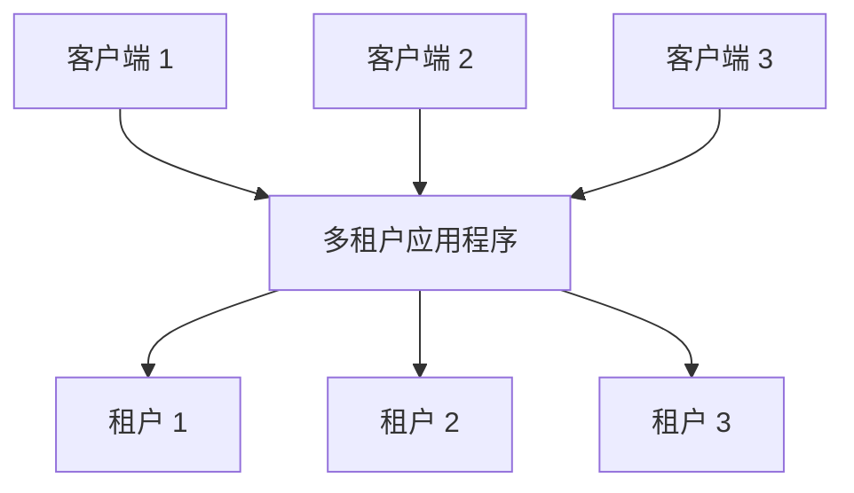
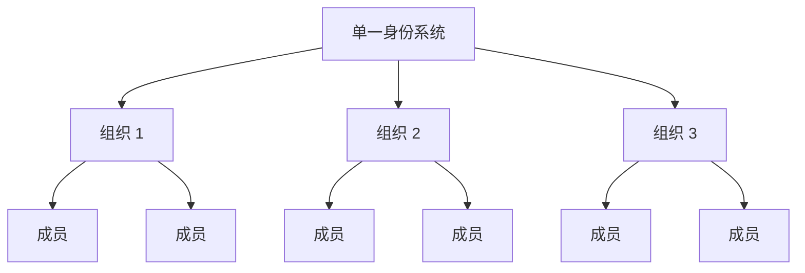

## 什么是多租户 (Multi-tenancy)？

软件多租户 (Multi-tenancy) 是一种软件，其中单个软件实例在服务器上运行并为多个租户服务。以这种方式设计的系统是“共享的”（而不是“专用的”或“隔离的”）。

租户是共享对软件实例的特定权限访问的一组用户。

例如，CRM（客户关系管理）系统通常使用多租户架构为所有客户提供相同的服务。

多租户 (Multi-tenancy) 的一个关键原则是“共享”。这并不意味着解决方案的**每个**部分都是共享的；这意味着至少**某些**组件在多个租户之间被重用。理解这一更广泛的概念可以帮助你更好地满足客户的需求。

## 多租户 (Multi-tenant) 产品的使用案例是什么？

多租户 (Multi-tenant) 应用程序通常用于软件即服务 (SaaS) 产品，如生产力工具、协作软件等。在这种设置中，每个“租户”通常代表一个商业客户，拥有多个用户（通常是员工）。在不同的产品中，根据上下文，它可能被称为租户、工作区或项目。一个企业也可能有多个租户来代表不同的部门或组织。

在更复杂的情况下，如超越 SaaS 的 B2B 应用程序，多租户 (Multi-tenant) 应用程序为各种团队、商业客户和合作公司提供了一个共享的平台来访问你的服务。

## 为什么要在 SaaS 产品中采用多租户 (Multi-tenancy)

### 通过多租户 (Multi-tenancy) 实现扩展

对于企业业务，多租户 (Multi-tenancy) 是有效满足其可用性、资源管理、成本管理和数据安全需求的关键。从技术层面上，采用多租户 (Multi-tenancy) 方法可以简化开发过程，减少技术挑战，并促进无缝扩展。

### 创建统一的体验

当审视 SaaS 产品的根源时，它类似于一个包含多个公寓的建筑。所有租户共享水、电和燃气等公共设施，但他们对管理自己的空间和资源保持独立控制。这种方法简化了物业管理。

### 通过租户隔离确保安全

在多租户 (Multi-tenancy) 架构中，引入了“租户”一词，以创建边界，将不同租户在共享实例中的资源和数据分隔并保护。这确保了每个租户的数据和操作保持独立和安全，即使他们使用相同的底层资源。

## 如何在多租户 (Multi-tenancy) 架构中实现租户隔离？

在讨论多租户 (Multi-tenant) 应用程序时，总是需要实现**租户隔离**。这意味着在共享系统（例如，云基础设施或多租户应用程序）中保持不同租户的数据和资源的分离和安全。这可以防止任何未经授权的尝试访问其他租户的资源。

### 租户隔离与多租户 (Multi-tenancy) 的“共享”概念一致

这是因为租户隔离不一定是一个基础设施资源级别的构造。在多租户 (Multi-tenancy) 和隔离的领域中，有些人将隔离视为实际基础设施资源之间的严格划分。这通常导致每个租户拥有单独的数据库、计算实例、账户或私有云的模型。在共享资源场景中，如多租户 (Multi-tenant) 应用程序，实现隔离的方法可以是一个逻辑构造。

### 认证 (Authentication) 和授权 (Authorization) 不等于“隔离”

使用认证 (Authentication) 和授权 (Authorization) 来控制对 SaaS 环境的访问很重要，但这并不保证“隔离”。隔离意味着保持不同用户或数据集的分离，以便一个用户的数据或操作不会干扰或被另一个用户访问。

例如，即使你已经设置了认证 (Authentication) 和授权 (Authorization)，用户登录并接收定义其权限的令牌，这提高了安全性，但并不能确保用户彼此完全隔离。需要引入另一个上下文来实现“隔离”。

### 使用“组织”作为上下文来表示 SaaS 产品租户，以实现租户隔离

仅靠认证 (Authentication) 和授权 (Authorization) 无法阻止具有正确角色的用户访问其他租户的资源。为了限制访问，我们需要添加一个“租户”上下文，如租户 ID、组织 ID 或工作区 ID。这些标识符就像墙壁、门和锁，保持租户分离。

术语“组织”通常用于租户隔离。许多 <Ref slug="identity-provider" /> 包含一个“组织”功能，以帮助隔离租户，同时保持统一的身份系统。组织内的用户称为“成员”。

## 如何在多租户 (Multi-tenant) 应用程序中管理身份？

第一个关键问题是考虑你的业务或产品的哪些部分需要单独的身份系统。这将指导你的系统设计。以下是两个例子：

1. 单一身份系统：一个人在同一身份系统中可以有两个身份。例如，Sarah 可能注册了一个个人电子邮件，并通过 <Ref slug="enterprise-sso" /> 连接使用公司电子邮件。
2. 多个身份系统：用户也可以在完全不相关的产品中跨不同的身份系统拥有两个不同的身份。

在大多数多租户 (Multi-tenant) 应用程序中，身份通常在一个池中管理，而每个租户的资源保持分离。

## 规划和构建多租户 (Multi-tenant) 应用程序的注意事项

1. 专注于你的模型：B2B 或 B2C。
2. 谁将处理身份管理任务：开发人员、客户的管理员，还是最终客户？
3. 对于 B2B，客户是否需要管理其组织的身份？
4. 确定哪些权限 (<Ref slug="scope" />) 和 <Ref slug="role" /> 需要为组织定义，哪些不需要。
5. 你的客户是否需要 <Ref slug="enterprise-sso" />？
6. 考虑添加协作功能，如邀请。

<Resources
  urls={[
    "https://blog.logto.io/implement-multi-tenancy",
    "https://blog.logto.io/multi-tenant-ultimate-guide",
    "https://blog.logto.io/case-study-multi-tenancy",
    "https://blog.logto.io/multi-tenancy-explained",
    "https://blog.logto.io/are-multi-tenant-apps-equal-saas",
    "https://blog.logto.io/tenancy-models",
    "https://blog.logto.io/do-you-need-multiple-tenants-identity-model",
  ]}
/>