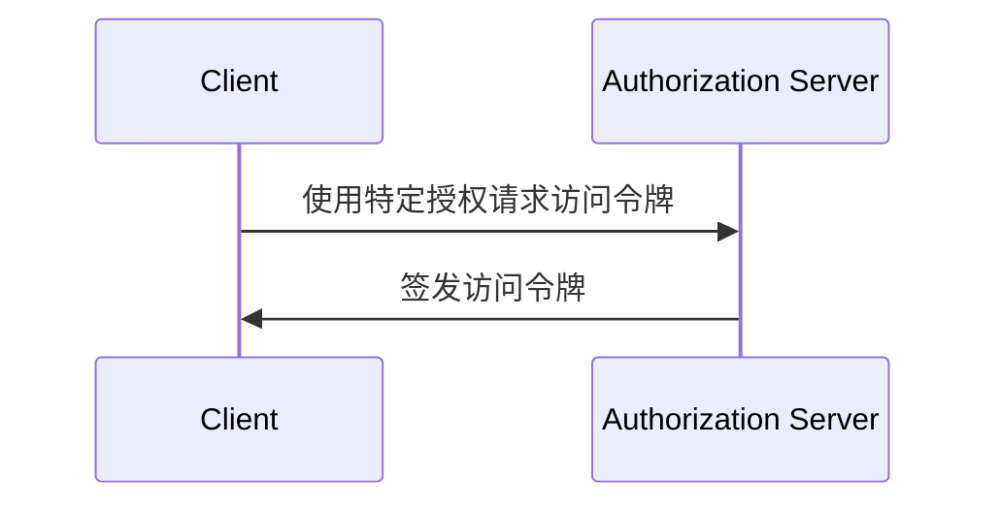

## 什么是 OAuth 2.0 授权 (Grant)？

OAuth 2.0 授权 (Grant) 是一种授权 (authorization) 过程，允许 <Ref slug="client" /> 向 <Ref slug="authorization-server" /> 请求 <Ref slug="access-token" />。你可能听到与此概念相关的其他术语，因此在深入探讨之前，我们先澄清一下这些术语：

- **OAuth 2.0 授权 (Grant)**：也称为 "OAuth 2.0 grant type"、"OAuth 2.0 flow" 或 "OAuth 2.0 authorization grant"。在大多数情况下，这些术语指的是相同的概念。
- <Ref slug="authorization-server" />：向客户端签发访问令牌 (access token) 的服务器。在 OpenID Connect (OIDC) 中，授权服务器与 <Ref slug="openid-connect" headingId="openid-provider-op" /> 相同。
- <Ref slug="authorization-request" />：客户端向授权服务器 (authorization server) 发出的请求，以获取访问令牌 (access token)。在 OpenID Connect (OIDC) 中，也称为 <Ref slug="authentication-request" />。

为了清晰起见，我们将在本文中一致使用上述初始术语。

OAuth 2.0 授权 (Grant) 的高层次流程相当简单：

客户端接收到访问令牌 (access token) 后，可以使用它代表用户或自身访问受保护的资源（例如，API）。

请注意，根据具体的授权，客户端和授权服务器 (authorization server) 可能会交换更多信息，并涉及更多处理步骤。例如，<Ref slug="authorization-code-flow">授权代码授权 (authorization code grant)</Ref> 涉及用户认证 (authentication) 和授权 (authorization)、代码生成和令牌 (token) 交换。

## 不同的 OAuth 2.0 授权 (Grants)

基本的 OAuth 2.0 规范定义了四种授权 (Grant)，客户端可以使用它们来获取访问令牌 (access token)：

1. <Ref slug="authorization-code-flow">授权代码授权 (authorization code grant)</Ref>：对大多数应用程序来说最安全且推荐的授权。<Ref slug="oauth-2.1" /> 中强制要求所有客户端使用 <Ref slug="pkce" />。
2. <Ref slug="implicit-flow">隐式授权 (implicit grant)</Ref>：由于安全问题在 OAuth 2.1 中被弃用的简化授权。
3. [资源所有者密码凭证 (ROPC) 授权](https://datatracker.ietf.org/doc/html/rfc6749#section-4.3)：用户的凭证被直接交换获取访问令牌 (access token) 的授权。由于安全风险，不推荐大多数应用程序使用。
4. <Ref slug="client-credentials-flow">客户端凭证授权 (client credentials grant)</Ref>：<Ref slug="client" headingId="confidential-clients" /> 用于在无用户参与的情况下获取访问令牌的授权。

随着行业的发展，隐式授权和 ROPC 授权正在被更安全和标准化的流程取代。对于新应用程序，选择非常简单：

- 对于用户认证 (authentication) 和授权 (authorization)，使用带 PKCE 的授权代码授权。
- 对于 <Ref slug="machine-to-machine" /> 通信，使用客户端凭证授权。

### 其他 OAuth 2.0 授权 (Grants)

除四种基本授权外，还有其他扩展定义了针对特定用例的新授权。例如：

- <Ref slug="device-flow">设备授权 (device authorization grant)</Ref> 是为具有有限输入能力的设备（例如智能电视和物联网设备）设计的授权。
- <Ref slug="hybrid-flow">混合流 (hybrid flow)</Ref> 是一种 OpenID Connect 授权，将授权代码授权与隐式授权结合在一起。

## OpenID Connect (OIDC) 中的授权 (Grants)

在 <Ref slug="openid-connect" /> 中，授权 (Grant) 的概念被扩展为包括不仅代表用户身份信息的 ID 令牌 (ID tokens)，还包括访问令牌 (access tokens)。OIDC 扩展了两种 OAuth 2.0 授权（授权代码和隐式授权）以包括 ID 令牌，并引入了一种称为 <Ref slug="hybrid-flow">混合流 (hybrid flow)</Ref> 的新授权，将两者结合在一起。

> 如同 OAuth 2.0，OIDC 中只推荐使用带 PKCE 的授权代码授权进行用户认证 (authentication) 和授权 (authorization)。

同时，由于 OIDC 是建立在 OAuth 2.0 之上的，其他授权 (Grant) 如客户端凭证授权仍然可以在同一授权服务器 (authorization server) 上使用，只要服务器支持它们。

<SeeAlso slugs={["pkce", "oauth-2.1", "authorization-code-flow", "implicit-flow", "client-credentials-flow", "device-flow"]} />

<Resources
  urls={[
    "https://blog.logto.io/implicit-flow-is-dead",
    "https://datatracker.ietf.org/doc/html/rfc6749",
    "https://openid.net/specs/openid-connect-core-1_0.html"
  ]}
/>
