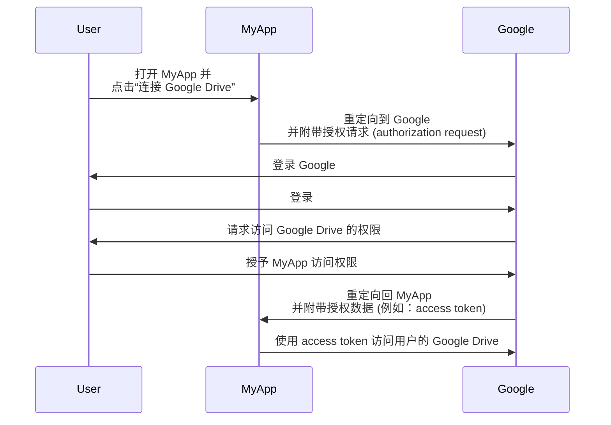
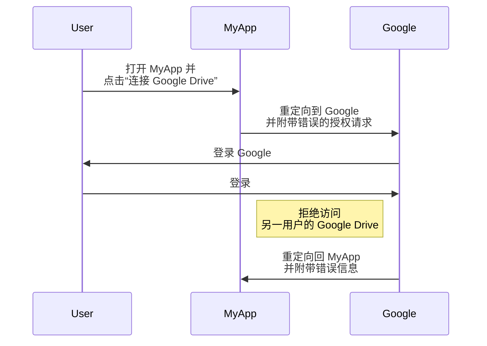
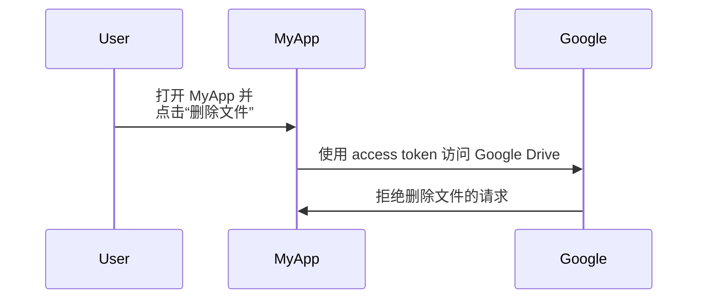

## 什么是 OAuth 2.0？

OAuth 2.0 是授权的事实标准，被广泛应用于网络中。它允许一个应用程序安全地获得对另一个应用程序的受保护资源的有限访问权限，例如用户的个人资料或数据，而无需暴露诸如密码等凭据。

让我们来看一个实际的例子来更好地理解。你有一个名为 MyApp 的 Web 应用程序，它想要访问用户的 Google Drive。 MyApp 可以使用 OAuth 2.0 代表用户请求访问 Google Drive，而无需要求用户分享他们的 Google Drive 凭据。以下是一个简化的流程：

在这个流程中，MyApp 从未看到用户的 Google Drive 凭据。相反，它从 Google 收到了一个 <Ref slug="access-token" />，可以用来代表用户访问 Google Drive。

### OAuth 2.0 的关键组件

对于上述例子，MyApp 是 <Ref slug="client" />，Google 即是 <Ref slug="authorization-server" /> 又是 <Ref slug="resource-server" />，用户是 <Ref slug="resource-owner" />。该流程涉及了 OAuth 2.0 的所有关键组件：

- **Client**: 想要访问受保护资源的应用程序。“Client”和“应用程序”经常可以互换使用。
- **Resource owner**: 拥有受保护资源的用户。资源所有者可以授予 (authorize) 或拒绝 client 的访问。
- **Authorization server**: 进行授权（通常与身份验证 (authentication) 一起）并向 client 发放 access token 的服务器。
- **Resource server**: 托管受保护资源的服务器。它验证 access token 并向 client 提供受保护的资源。

## OAuth 2.0 授权 (Grants)（流程）

<Ref slug="oauth-2.0-grant">授权 (Grant)</Ref> 是 OAuth 2.0 的基础，定义了 client 如何从授权服务器获取 access token。基本的 OAuth 2.0 规范定义了四种授权：

- <Ref slug="authorization-code-flow">授权码授权 (authorization code grant)</Ref>
- <Ref slug="implicit-flow">隐式授权 (implicit grant)</Ref>
- [资源所有者密码凭证 (ROPC) 授权](https://datatracker.ietf.org/doc/html/rfc6749#section-4.3)
- <Ref slug="client-credentials-flow">客户端凭证授权 (client credentials grant)</Ref>

不深入每种授权的细节，我们可以将这些授权分为两类：

- **授权授权 (authorization grants)**: 当 client 需要代表用户访问资源时使用，即需要用户的授权。
- **客户端凭证授权 (client credentials grant)**: 当 client 需要以自身名义访问资源时使用。此授权适合 <Ref slug="machine-to-machine" /> 通信。

### 授权授权

无论授权类型如何，授权授权都具有以下共同步骤：

1. client 向授权服务器发起 <Ref slug="authorization-request" />。
2. 授权服务器验证用户（资源所有者）并请求访问资源的权限。
3. 用户授予 client 权限。
4. 授权服务器向 client 颁发 access token。
5. client 使用 access token 访问 <Ref slug="resource-server" /> 上的受保护资源。

注意，根据授权类型，不同的步骤和参数可能有所不同。例如，<Ref slug="authorization-code-flow">授权码授权</Ref> 涉及更多步骤，如代码生成和交换。

### 客户端凭证授权

<Ref slug="client-credentials-flow">客户端凭证授权</Ref> 更加简单，不涉及用户授权。以下是一个简化的流程：

1. client 向授权服务器发送 <Ref slug="token-request" />。
2. 授权服务器认证 client 并发放 access token。
3. client 使用 access token 访问 <Ref slug="resource-server" /> 上的受保护资源。

---

关于 OAuth 2.0 授权的深入讨论，请参阅 <Ref slug="oauth-2.0-grant" /> 和特定的授权文章。

## OAuth 2.0 的访问控制 (access control)

OAuth 2.0 定义了 <Ref slug="scope" /> 参数用于指定 client 所请求的权限。授权服务器可能会完全或部分忽略请求的范围 (scopes)，并根据自身的访问控制 (access control) 策略授予访问权限。

然而，OAuth 2.0 让授权服务器自行决定如何实施 <Ref slug="access-control" />。这意味着授权服务器可以决定 subject（用户或 client）可以访问哪些资源，以及他们可以对这些资源执行哪些操作。

仍然以 Google Drive 为例。MyApp 可能错误地发起了访问另一用户 Google Drive 的授权请求。在这种情况下，Google 的授权服务器应拒绝该请求，因为用户没有访问另一用户 Google Drive 的必要权限。

另一个案例是当 MyApp 从 Google 收到了允许其读取用户 Google Drive 文件的 access token。然而，MyApp 尝试删除文件而不是读取文件。资源服务器（Google）应该拒绝该请求。

这两个案例演示了为什么在实施 OAuth 2.0 时需要 <Ref slug="access-control" />。<Ref slug="authorization-server" /> 和 <Ref slug="resource-server" /> 应该协同工作以执行访问控制策略并保护资源。

### 访问控制模型

为正确处理访问控制，建议使用标准的访问控制模型，如 <Ref slug="rbac" /> 和 <Ref slug="abac" />。这些模型已被业界证明有效，并提供未来需求的可扩展性。

## OAuth 2.1

<Ref slug="oauth-2.1" /> 是对 OAuth 2.0 规范的建议更新，旨在根据多年来的行业经验提高安全性和可用性。虽然 OAuth 2.1 尚未最终定稿，但我们仍然可以了解提议的更改，并理解它们可能如何影响当前的 OAuth 2.0 实现。OAuth 2.1 可以被视为业界广泛采用的最佳实践和安全建议的形式化。

## OAuth 2.0 和 OpenID Connect (OIDC)

OAuth 2.0 只定义了授权过程，并不涵盖用户身份验证 (authentication) 或身份识别。为此，<Ref slug="openid-connect" /> 作为身份层引入，构建于 OAuth 2.0 之上。OIDC 扩展了 OAuth 2.0，以 <Ref slug="id-token" /> 的形式提供用户身份验证和身份信息。

OpenID Connect 扩展了两种 OAuth 2.0 授权（授权码和隐式）以包含 ID tokens，并引入了一种称为 <Ref slug="hybrid-flow">混合流程 (hybrid flow)</Ref> 的新授权，结合了两者。

也就是说，你的所有 OAuth 2.0 知识和实践可以直接应用于 OIDC；所有 OAuth 2.0 扩展，如 <Ref slug="pkce" /> 和 <Ref slug="resource-indicator" />，也可以在 OIDC 中使用。

<SeeAlso slugs={["oauth-2.0-grant", "oauth-2.1", "openid-connect"]} />

<Resources
  urls={[
    "https://blog.logto.io/secure-cloud-apps-with-oauth-and-openid-connect",
    "https://blog.logto.io/oauth-2-1",
    "https://datatracker.ietf.org/doc/html/rfc6749",
    "https://datatracker.ietf.org/doc/draft-ietf-oauth-v2-1/",
  ]}
/>
