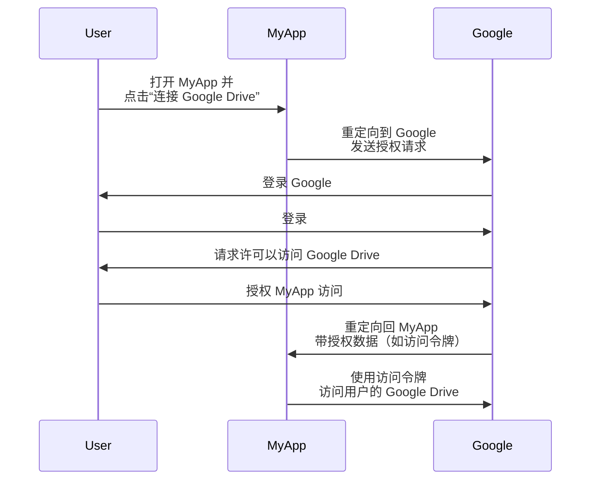
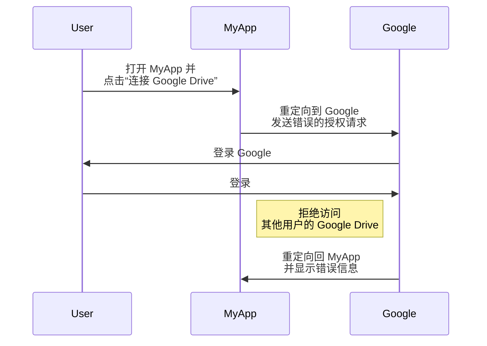
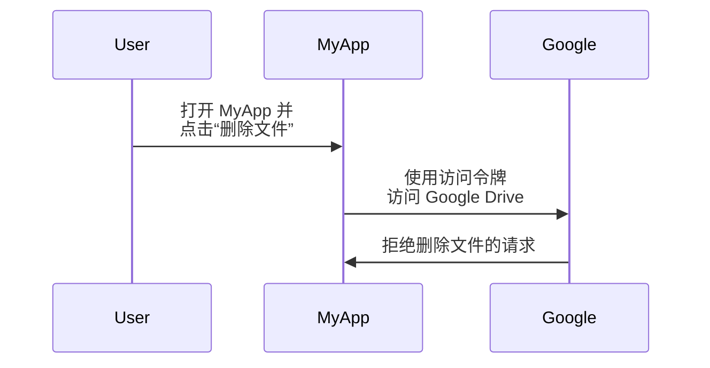

## 什么是 OAuth 2.0？

OAuth 2.0 是事实上的授权标准，在网络中被广泛使用。它允许应用程序安全地获取对另一个应用程序中受保护资源的有限访问，例如用户的个人资料或数据，而无需暴露诸如密码之类的凭证。

让我们通过一个真实的例子来更好地理解这一点。你有一个名为 MyApp 的网络应用程序，想要访问用户的 Google Drive。MyApp 无需要求用户分享他们的 Google Drive 凭据，而是可以使用 OAuth 2.0 来请求代表用户访问 Google Drive。以下是一个简化的流程：

在此流程中，MyApp 永远不会看到用户的 Google Drive 凭据。相反，它会从 Google 收到一个 <Ref slug="access-token" />，用于代表用户访问 Google Drive。

### OAuth 2.0 的关键组件

在上述示例中，MyApp 是 <Ref slug="client" />，Google 同时是 <Ref slug="authorization-server" /> 和 <Ref slug="resource-server" />，而用户是 <Ref slug="resource-owner" />。此流程涉及 OAuth 2.0 的所有关键组件：

- **Client**：想要访问受保护资源的应用程序。“客户端”和“应用程序”常被互换使用。
- **Resource owner**：拥有受保护资源的用户。资源所有者可以授权或拒绝客户端访问。
- **Authorization server**：执行授权（通常带有身份验证）并向客户端颁发访问令牌的服务器。
- **Resource server**：托管受保护资源的服务器。它验证访问令牌并将受保护资源提供给客户端。

## OAuth 2.0 授权模式（流程）

<Ref slug="oauth-2.0-grant">授权模式</Ref> 是 OAuth 2.0 的基础，定义了客户端如何从授权服务器获取访问令牌。基本的 OAuth 2.0 规范定义了四种授权模式：

- <Ref slug="authorization-code-flow">授权码模式</Ref>
- <Ref slug="implicit-flow">隐式模式</Ref>
- [资源所有者密码凭据（ROPC）模式](https://datatracker.ietf.org/doc/html/rfc6749#section-4.3)
- <Ref slug="client-credentials-flow">客户端凭据模式</Ref>

无需深入每种模式的细节，我们可以将这些模式分为两类：

- **授权模式**：当客户端需要代表用户访问资源时使用，即需要用户授权。
- **客户端凭据模式**：当客户端需要代表自身访问资源时使用。此模式适用于 <Ref slug="machine-to-machine" /> 通信。

### 授权模式

无论授权模式类型如何，授权模式都有以下共同步骤：

1. 客户端向授权服务器发起 <Ref slug="authorization-request" />。
2. 授权服务器对用户（资源所有者）进行身份验证并请求访问资源的权限。
3. 用户授予客户端访问权限。
4. 授权服务器向客户端颁发访问令牌。
5. 客户端使用访问令牌访问 <Ref slug="resource-server" /> 上的受保护资源。

请注意，具体步骤和参数可能会因授权模式而异。例如，<Ref slug="authorization-code-flow">授权码模式</Ref>涉及诸如代码生成和交换等更多步骤。

### 客户端凭据模式

<Ref slug="client-credentials-flow">客户端凭据模式</Ref> 简单得多，不涉及用户授权。简化流程如下：

1. 客户端向授权服务器发送 <Ref slug="token-request" />。
2. 授权服务器验证客户端并颁发访问令牌。
3. 客户端使用访问令牌访问 <Ref slug="resource-server" /> 上的受保护资源。

---

有关 OAuth 2.0 授权模式的深入讨论，请参阅 <Ref slug="oauth-2.0-grant" /> 和具体的授权模式文章。

## 使用 OAuth 2.0 进行访问控制

OAuth 2.0 定义了 <Ref slug="scope" /> 参数，用于指定客户端请求的权限。授权服务器可以完全或部分忽略请求的范围，并根据自身的访问控制策略授予访问权限。

然而，OAuth 2.0 允许授权服务器自行决定如何实施 <Ref slug="access-control" />。这意味着授权服务器可以决定主题（用户或客户端）可以访问哪些资源以及在这些资源上执行哪些操作。

继续使用 Google Drive 的例子，MyApp 可能错误地发起了请求访问其他用户的 Google Drive 的授权请求。在这种情况下，Google 的授权服务器应拒绝请求，因为用户没有访问其他用户 Google Drive 的权限。

另一个例子是，MyApp 收到来自 Google 的访问令牌，允许它读取用户的 Google Drive 文件。然而，MyApp 试图删除文件而不是读取文件。资源服务器（Google）应拒绝请求。

这两个示例说明了在实现 OAuth 2.0 时需要 <Ref slug="access-control" /> 的原因。<Ref slug="authorization-server" /> 和 <Ref slug="resource-server" /> 应协作实施访问控制策略并保护资源。

### 访问控制模型

为正确处理访问控制，建议使用标准的访问控制模型，如 <Ref slug="rbac" /> 和 <Ref slug="abac" />。这些模型在业界已被证明有效，并为未来需求提供了可扩展性。

## OAuth 2.1

<Ref slug="oauth-2.1" /> 是对 OAuth 2.0 规范的拟议更新，旨在根据多年来的行业经验提高安全性和可用性。尽管 OAuth 2.1 尚未最终确定，我们仍然可以了解拟议的更改，并了解它们可能如何影响当前的 OAuth 2.0 实现。OAuth 2.1 可以视为业界已广泛采用的最佳实践和安全建议的正式化。

## OAuth 2.0 与 OpenID Connect (OIDC)

OAuth 2.0 仅定义了授权过程，并未涉及用户身份验证或身份。因此，引入了 <Ref slug="openid-connect" /> 作为 OAuth 2.0 之上的身份层。OIDC 扩展了 OAuth 2.0，以 <Ref slug="id-token" /> 的形式提供用户身份验证和身份信息。

OpenID Connect 扩展了两种 OAuth 2.0 授权模式（授权码模式和隐式模式），以包含 ID 令牌，并引入了一种新的授权模式——<Ref slug="hybrid-flow">混合模式</Ref>，结合了两者。

也就是说，所有的 OAuth 2.0 知识和实践都可以直接应用于 OIDC；所有的 OAuth 2.0 扩展，如 <Ref slug="pkce" /> 和 <Ref slug="resource-indicator" /> 也可用于 OIDC。

<SeeAlso slugs={["oauth-2.0-grant", "oauth-2.1", "openid-connect"]} />

<Resources
  urls={[
    "https://blog.logto.io/secure-cloud-apps-with-oauth-and-openid-connect",
    "https://blog.logto.io/oauth-2-1",
    "https://datatracker.ietf.org/doc/html/rfc6749",
    "https://datatracker.ietf.org/doc/draft-ietf-oauth-v2-1/",
  ]}
/>
