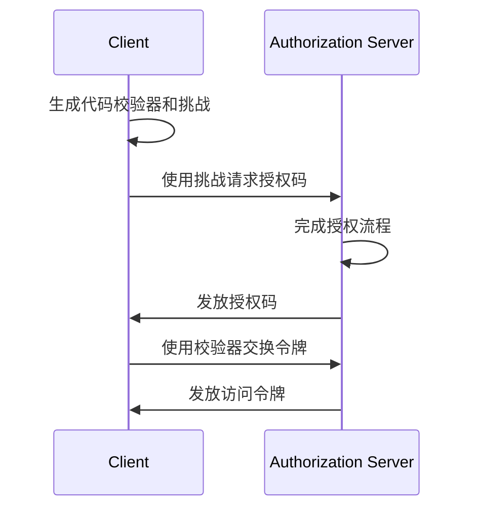

## 什么是 OAuth 2.1？

OAuth 2.1 是对 <Ref slug="oauth-2.0" /> 授权框架的提议更新。它涉及对现有 OAuth 2.0 规范的一系列更改和建议，整合了多年来在业界广泛采用的最佳实践和安全改进。

OAuth 2.1 的主要更新包括：

1. 因安全问题弃用 <Ref slug="implicit-flow">隐式授权</Ref> 和 [资源所有者密码凭据 (ROPC) 授权](https://datatracker.ietf.org/doc/html/rfc6749#section-4.3)。
2. 强制所有客户端使用 <Ref slug="pkce" />，包括 <Ref slug="client" headingId="confidential-clients">保密（私有）客户端</Ref>。
3. 精确匹配 <Ref slug="redirect-uri">重定向 URI</Ref>。
4. 明确定义 <Ref slug="client">客户端</Ref> 类型（公共客户端和保密客户端）。
5. <Ref slug="refresh-token">刷新令牌</Ref> 的安全要求。

## 弃用隐式授权

隐式授权最初是为单页面应用 (SPA) 和基于浏览器的应用设计的，这类应用无法安全存储客户端密钥。然而，由于该流程的安全风险，它已被弃用：该流程在前端通道（URL 片段）中返回访问令牌，可能通过浏览器历史记录和引用头暴露给攻击者。

OAuth 2.1 推荐浏览器应用使用带 <Ref slug="pkce" /> 的 <Ref slug="authorization-code-flow">授权码授权</Ref>。

## 弃用 ROPC 授权

ROPC 授权允许客户端直接交换用户凭据以获取访问令牌。它是为无法支持授权码流程的传统应用设计的。然而，该流程存在以下安全风险：

- 将用户凭据暴露给客户端。
- 绕过授权服务器的同意屏幕。
- 限制授权服务器实施其他安全措施的能力，如 <Ref slug="mfa" />。

OAuth 2.1 推荐使用带 <Ref slug="pkce" /> 的 <Ref slug="authorization-code-flow">授权码授权</Ref> 进行用户认证和授权。

## 强制所有客户端使用 PKCE

<Ref slug="pkce" /> 是授权码流程的一个安全扩展，用于缓解授权码拦截攻击的风险。它涉及客户端生成代码校验器和代码挑战，授权服务器在令牌交换期间验证该挑战。

以下是带 PKCE 的授权码流程的简化序列图：

最初建议 <Ref slug="client" headingId="public-clients">公共客户端</Ref> 使用 PKCE，但 OAuth 2.1 将这一建议扩展为对所有客户端的强制要求，包括 <Ref slug="client" headingId="confidential-clients">保密（私有）客户端</Ref>。

## 精确匹配重定向 URI

<Ref slug="redirect-uri">重定向 URI</Ref> 由客户端用于接收授权服务器的授权响应。OAuth 2.1 引入了一个新要求，即在授权请求中使用的重定向 URI 必须与客户端在 <Ref slug="authorization-server" /> 注册的重定向 URI 精确匹配，包括协议、主机和路径。

在一些 OAuth 2.0 实现中，重定向 URI 匹配较宽松，允许部分匹配或通配符字符。然而，这种灵活性可能带来安全风险，如开放重定向漏洞。

## 明确定义客户端类型

OAuth 2.0 没有明确定义客户端类型。你可能会在业界看到按访问级别（公共 vs. 保密）或应用类型（Web 应用 vs. 移动应用）进行的各种分类。对于 OAuth 框架而言，客户端如何实现并不重要（因为这些更多与客户端的业务属性有关），但访问级别在安全要求上有差异。

因此，OAuth 2.1 引入了对客户端类型的明确定义：

- <Ref slug="client" headingId="public-clients" />：无法维护其凭据机密性的客户端（例如，SPA、移动应用）。
- <Ref slug="client" headingId="confidential-clients" />：能够维护其凭据机密性的客户端（例如，服务器端 Web 应用、本地桌面应用）。

## 刷新令牌的安全要求

<Ref slug="refresh-token">刷新令牌</Ref> 是客户端用来在无需用户交互的情况下获取新访问令牌的长生命周期令牌。同时，它们也是攻击者的高价值目标。由于公共客户端无法安全存储凭据，OAuth 2.1 规定 <Ref slug="authorization-server" /> 应使用以下方法之一保护刷新令牌：

- 发放 <Ref slug="refresh-token" headingId="sender-constrained-refresh-tokens">发送者限制的刷新令牌</Ref>。
- 使用 <Ref slug="refresh-token" headingId="refresh-token-rotation">刷新令牌轮换</Ref> 来限制刷新令牌的可用性和生命周期。

## OAuth 2.1 与 OpenID Connect (OIDC)

由于 <Ref slug="openid-connect" /> 构建在 OAuth 2.0 之上，因此 OAuth 2.1 引入的更改也适用于 OIDC。例如，所有 OIDC 客户端应使用带 PKCE 的授权码流程进行用户认证和授权。

<SeeAlso slugs={["oauth-2.0", "authorization-code-flow", "pkce", "implicit-flow", "openid-connect"]} />

<Resources
  urls={[
    "https://datatracker.ietf.org/doc/draft-ietf-oauth-v2-1/",
    "https://blog.logto.io/oauth-2-1",
  ]}
/>
