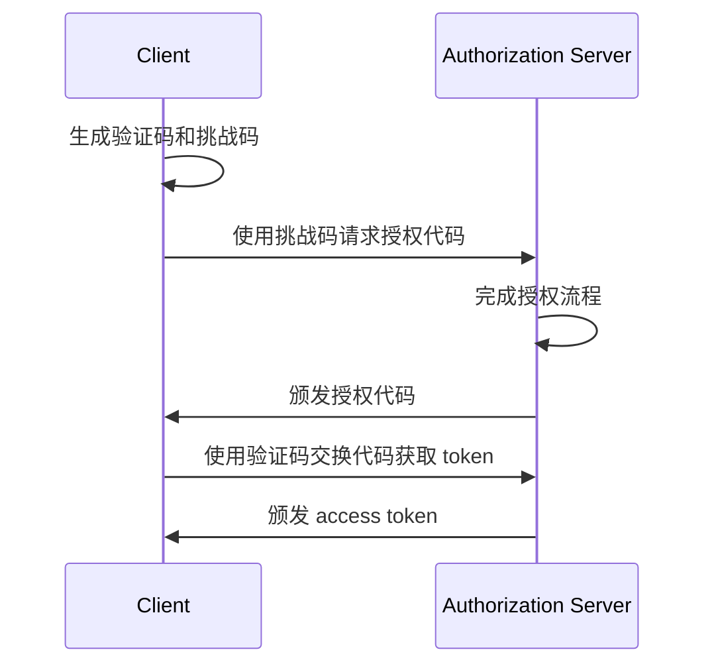

## 什么是 OAuth 2.1？

OAuth 2.1 是对 <Ref slug="oauth-2.0" /> 授权框架的拟议更新。它涉及对现有 OAuth 2.0 规范的一系列更改和建议，这些更改和建议汇总了多年来在业内广泛采用的最佳实践和安全性改进。

OAuth 2.1 的主要更新包括：

1. 由于安全问题，废弃 <Ref slug="implicit-flow">隐式授权</Ref> 和 [资源所有者密码凭据 (ROPC) 授权](https://datatracker.ietf.org/doc/html/rfc6749#section-4.3)。
2. 强制所有客户端使用 <Ref slug="pkce" />，包括 <Ref slug="client" headingId="confidential-clients">保密（私有）客户端</Ref>。
3. 精确匹配 <Ref slug="redirect-uri">重定向 URI</Ref>。
4. 明确定义 <Ref slug="client">客户端</Ref> 类型（公共和保密客户端）。
5. 针对 <Ref slug="refresh-token">刷新令牌</Ref> 的安全要求。

## 废弃隐式授权

隐式授权是为无法安全存储客户端密钥的单页应用程序 (SPAs) 和基于浏览器的应用程序设计的。然而，其安全风险导致了它的废弃：授权通过前端渠道（URL 片段）返回 access token，可能通过浏览器历史记录和引用头暴露给攻击者。

OAuth 2.1 推荐浏览器应用程序使用 <Ref slug="authorization-code-flow">授权代码授权</Ref>配合 <Ref slug="pkce" />。

## 废弃 ROPC 授权

ROPC 授权允许客户端直接交换用户凭据以获得 access token。它是为不支持授权代码流的旧应用程序设计的。但是，此授权在以下方面存在安全风险：

- 将用户凭据暴露给客户端。
- 绕过授权服务器的同意屏幕。
- 限制授权服务器执行其他安全措施的能力，例如 <Ref slug="mfa" />。

OAuth 2.1 推荐使用 <Ref slug="authorization-code-flow">授权代码授权</Ref>配合 <Ref slug="pkce" />进行用户认证 (Authentication) 和授权。

## 强制所有客户端使用 PKCE

<Ref slug="pkce" /> 是授权代码流的安全扩展，旨在减轻授权代码拦截攻击的风险。它涉及客户端生成验证码和挑战码，授权服务器在 token 交换期间验证挑战码。

以下是使用 PKCE 的授权代码流程的简化序列图：

最初建议 <Ref slug="client" headingId="public-clients">公共客户端</Ref>使用 PKCE，但 OAuth 2.1 将这一建议扩展为对包括 <Ref slug="client" headingId="confidential-clients">保密（私有）客户端</Ref>在内的所有客户端的强制要求。

## 精确匹配重定向 URI

<Ref slug="redirect-uri">重定向 URI</Ref> 由客户端用于接收来自授权服务器的授权响应。OAuth 2.1 引入了一项新要求，即授权请求中使用的重定向 URI 必须与客户端在 <Ref slug="authorization-server" />注册的重定向 URI 完全匹配，包括方案、主机和路径。

在某些 OAuth 2.0 实现中，重定向 URI 匹配较宽松，允许部分匹配或使用通配符。然而，这种灵活性可能导致安全风险，如开放重定向漏洞。

## 明确定义客户类型

OAuth 2.0 没有明确定义客户端类型。你可能会在业界看到各种分类，按访问级别（公共与保密）或应用类型（Web 应用与移动应用）。对于 OAuth 框架来说，客户端如何实现并不重要（因为它们更多的是关于客户端的业务属性），但访问级别在安全要求中有所不同。

因此，OAuth 2.1 引入了客户端类型的明确定义：

- <Ref slug="client" headingId="public-clients" />：无法维护其凭据机密性的客户端（例如，SPAs、移动应用）。
- <Ref slug="client" headingId="confidential-clients" />：可以维护其凭据机密性的客户端（例如，服务器端 Web 应用、本机桌面应用）。

## 针对刷新令牌的安全要求

<Ref slug="refresh-token">刷新令牌</Ref> 是客户端用于在无用户交互情况下获取新的 access token 的长期有效令牌。同时，它们也是攻击者的高价值目标。由于公共客户端无法安全地存储凭据，OAuth 2.1 指定 <Ref slug="authorization-server" /> 应该使用以下方法之一来保护刷新令牌：

- 发布<Ref slug="refresh-token" headingId="sender-constrained-refresh-tokens">发送者限制的刷新令牌</Ref>。
- 使用<Ref slug="refresh-token" headingId="refresh-token-rotation">刷新令牌轮换</Ref>来限制刷新令牌的可用性和生命周期。

## OAuth 2.1 和 OpenID Connect (OIDC)

由于 <Ref slug="openid-connect" /> 是基于 OAuth 2.0 构建的，OAuth 2.1 引入的更改也适用于 OIDC。例如，所有 OIDC 客户端都应使用带有 PKCE 的授权代码流进行用户认证 (Authentication) 和授权。

<SeeAlso slugs={["oauth-2.0", "authorization-code-flow", "pkce", "implicit-flow", "openid-connect"]} />

<Resources
  urls={[
    "https://datatracker.ietf.org/doc/draft-ietf-oauth-v2-1/",
    "https://blog.logto.io/oauth-2-1",
  ]}
/>
