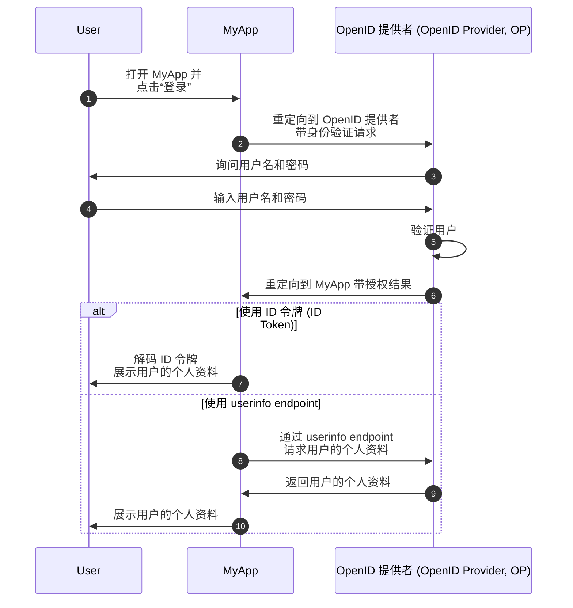
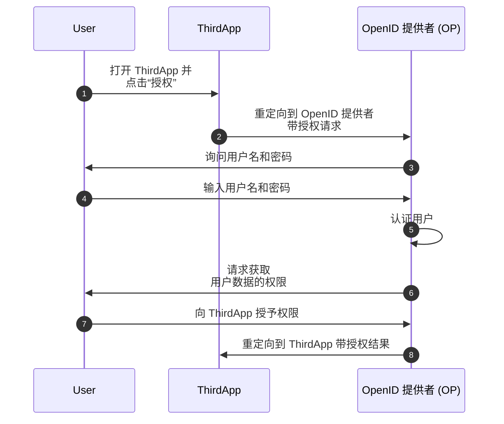

## 什么是 OpenID Connect (OIDC)？

OpenID Connect (OIDC) 在 <Ref slug="oauth-2.0" /> 授权框架之上引入了身份层，添加了身份验证 (Authentication) 的功能。OIDC 允许客户端验证用户并以 <Ref slug="id-token">ID 令牌 (ID Token)</Ref> 和 <Ref slug="userinfo-endpoint" /> 响应的形式获取身份信息。

让我们来看一个例子。假设你有一个名为 MyApp 的 Web 应用程序，用户可以使用用户名和密码登录；登录后，他们可以访问其个人资料信息。以下是一个简化的流程：



有些术语可能对你是新的，所以让我们澄清一下：

### OpenID 提供者 (OpenID Provider, OP) ||openid-provider-op||

OpenID 提供者 (OP) 是一个实现了 OIDC 和 OAuth 2.0 规范的 <Ref slug="identity-provider" />。也就是说，OP 也是 OAuth 2.0 <Ref slug="authorization-server" />。

OP 负责验证用户并向客户端颁发 ID 令牌 (ID Token) 和访问令牌 (Access Token)。

### 令牌

- <Ref slug="id-token">ID 令牌 (ID Token)</Ref> 是用于表示用户身份信息的 <Ref slug="jwt">JSON Web 令牌 (JWT)</Ref>，例如姓名、电子邮件和个人资料图片。
- <Ref slug="access-token">访问令牌 (Access Token)</Ref> 用于代表用户访问受保护的资源（与 OAuth 2.0 中相同），例如 userinfo endpoint。

### 身份验证请求和结果

- <Ref slug="authentication-request" /> 是由客户端向 OP 发出的用于验证用户的请求。它包括用于指定某些要求的参数，将影响身份验证过程。
- 根据身份验证请求，身份验证结果可能会有所不同。现在只需要知道结果携带客户端识别用户所需的信息。

### Userinfo endpoint

<Ref slug="userinfo-endpoint" /> 是一个 OIDC 专有 endpoint，允许客户端检索用户个人资料信息。它是使用 ID 令牌 (ID Token) 的替代方式，因为 userinfo endpoint 通常提供比 ID 令牌更多的用户信息。

OIDC 让 OpenID 提供者 (OP) 决定在 ID 令牌 (ID Token) 和 userinfo 响应中包含哪些信息。因此，在解析 ID 令牌或调用 userinfo endpoint 之前，你应该查看 OP 的文档以了解哪些信息可用。

## OAuth 2.0 和 OIDC 的术语差异

由于 OIDC 是建立在 OAuth 2.0 之上的，许多术语在两个规范之间是共享的。然而，虽然 OAuth 2.0 侧重于授权，OIDC 引入了身份验证 (Authentication) 和身份，使得某些术语在 OIDC 的上下文中不太适用。以下是一些显著的区别：

| OAuth 2.0             | OpenID Connect (OIDC)  |
|-----------------------|------------------------|
| 授权服务器 (Authorization Server)  | OpenID 提供者 (OpenID Provider, OP)   |
| 授权请求 (Authorization Request) | 身份验证请求 (Authentication Request) |
| 授权 (Grant)                 | 流程 (Flow)                   |

本质上，上述术语可能指向同一主体，但在 OAuth 2.0 和 OIDC 的上下文中含义不同：

- **OpenID 提供者 (OP)** 是具有用户验证和颁发 ID 令牌能力的 OAuth 2.0 <Ref slug="authorization-server" />。
- **<Ref slug="authentication-request" />** 是使用 OIDC 特定参数请求终端用户验证并获取 ID 令牌的 OAuth 2.0 <Ref slug="authorization-request" />。
- **流程 (Flow)** 是 OIDC 中用于描述用户验证和授权过程的更通用术语，它可能涉及多个步骤和交互，而不仅仅是单一的请求-响应循环。它实质上与 <Ref slug="oauth-2.0-grant" /> 相同。

## OIDC 流程

如上例所示，OIDC 流程由客户端（例如，MyApp）通过向 OP 发起身份验证请求来启动。身份验证请求指定要使用的流程，可以是以下之一：

- **<Ref slug="authorization-code-flow" />**：用户身份验证和授权的最安全和推荐的流程。<Ref slug="pkce" /> 在 <Ref slug="oauth-2.1" /> 中对所有客户端都已强制实施。
- **<Ref slug="implicit-flow" />**：由于安全问题，OAuth 2.1 中已废弃的简化流程。
- **<Ref slug="hybrid-flow" />**：一种将授权代码流程与隐式流程相结合的 OIDC 流程。由于安全问题，也不推荐用于新应用。

授权代码流程和隐式流程是从 OAuth 2.0 扩展出来以包含 ID 令牌，而混合流程是结合两者的 OIDC 特定流程。点击上面的链接了解每个流程的更多信息。

## OIDC 范围和声明

与 OAuth 2.0 类似，OIDC 使用 <Ref slug="scope" /> 值来指定客户端请求的权限。由于 <Ref slug="id-token">ID 令牌 (ID Token)</Ref> 是 <Ref slug="jwt">JSON Web 令牌 (JWT)</Ref>，它们可以根据在 <Ref slug="authentication-request" /> 中请求的范围包含表示用户身份信息的 <Ref slug="claim">声明 (Claims)</Ref>（名称-值对）。这些声明也以 <Ref slug="userinfo-endpoint" /> 响应的形式返回。

OIDC 定义了多个标准范围和对应的声明，客户端可以在身份验证请求中请求这些范围：

- **openid**：表示客户端是一个 OIDC 客户端并请求一个 ID 令牌。
- **profile**：请求访问用户的默认个人资料声明，包括：`name`，`family_name`，`given_name`，`middle_name`，`nickname`，`preferred_username`，`profile`，`picture`，`website`，`gender`，`birthdate`，`zoneinfo`，`locale` 和 `updated_at`。
- **email**：请求访问用户的 `email` 和 `email_verified` 声明。
- **address**：请求访问用户的 `address` 声明。
- **phone**：请求访问用户的 `phone_number` 和 `phone_number_verified` 声明。
- **offline_access**：请求一个刷新令牌 (Refresh Token)，允许客户端在没有用户交互的情况下获得新的访问令牌。

请查看 OIDC 规范中的[标准声明 (Standard Claims)](https://openid.net/specs/openid-connect-core-1_0.html#StandardClaims)和[使用范围值请求声明 (Requesting Claims using Scope Values)](https://openid.net/specs/openid-connect-core-1_0.html#ScopeClaims)以获取有关范围和声明的更多信息。也可查看 <Ref slug="offline-access" />，获取有关 `offline_access` 范围的详细说明。

> [!注意]
> OpenID 提供者 (OP) 可能支持标准范围之外的附加范围和声明。请查看 OP 的文档获取更多细节。

## OIDC 中的授权 (Authorization)

如果你熟悉 OAuth 2.0，你可能会注意到，上述示例中没有涉及任何 <Ref slug="authorization" /> 过程。示例中省略了用户同意部分，因为我们假设 MyApp 是一个不涉及第三方访问用户数据的第一方应用程序。授权 (Authorization) 仍由 OP 强制执行，但在流程中没有明确显示。

当一个第三方客户端（例如，不属于 OP 的应用程序）请求访问用户数据时，用户同意部分是必需的。在此情况下，OP 将要求用户在发出 ID 令牌或访问令牌之前向客户端授予权限。假设有一个名为 ThirdApp 的第三方应用程序想要访问用户数据：



一旦授权 (Authorization) 过程完成并且 ThirdApp 收到授权结果（通常是一个 <Ref slug="access-token">访问令牌</Ref>），它就可以从 <Ref slug="resource-server" /> 访问用户的数据。

有关 OAuth 2.0 和授权流程的更多信息，请参见 <Ref slug="oauth-2.0" />。

### 范围

与 OAuth 2.0 类似，OIDC 使用 <Ref slug="scope" /> 值来指定客户端请求的权限。我们在[OIDC 范围和声明](#oidc-scopes-and-claims)中讨论了标准范围和声明。值得注意的是，这些范围和声明应被视为 OIDC 中的保留值，这意味着不应该将它们用于特定业务的目的。

在实践中，你的 OpenID 提供者 (OP) 可能会支持针对你的业务需求的自定义范围和声明。查阅 OP 的文档以了解有关自定义范围和声明的更多信息。如果未定义自定义范围和声明，OP 可能会直接忽略它们或返回错误响应。

### 资源指标

由于像 OIDC 和 OP 这样的框架可能为特定目的保留某些范围和声明，通常 OP 推荐在定义自定义范围和声明时使用前缀或命名空间以避免与保留值冲突。例如，你可以使用 `myapp:` 前缀自定义范围，表示它们特定于你的应用程序。

```json
{
  "scope": "myapp:custom_scope"
}
```

然而，这不能保证你的自定义范围和声明不会与未来的保留值冲突，并且可能会增加令牌的大小。一个名为 <Ref slug="resource-indicator">资源指标 (Resource Indicator)</Ref> 的 OAuth 2.0 扩展提供了一种更灵活和可扩展的方法来实现相同的目标。资源指标是表示请求资源的 URI，它们可以是实际的 API 终端以反映现实世界的资源。例如，可以使用 `https://api.myapp.com` 作为资源指标来表示客户端希望访问的 API 资源。

同样，由于 OIDC 是构建在 OAuth 2.0 之上的，你可以在正确配置后，在 OIDC 身份验证请求中使用资源指标。以下是一个带资源指标的身份验证请求的非规范示例：

```http
GET /authorize?response_type=code
  &client_id=YOUR_CLIENT_ID
  &redirect_uri=https%3A%2F%2Fclient.example.com%2Fcallback
  &scope=openid%20profile
  &resource=https%3A%2F%2Fapi.example.com HTTP/1.1
Host: your-openid-provider.com
```

要使用资源指标，你需要首先确认你的 OP 支持此扩展 (RFC 8707)。如果支持，你应该在 OP 中注册一个资源指标 URI 并在身份验证请求的 `resource` 参数中使用它。

查阅 <Ref slug="resource-indicator" /> 获取有关资源指标的详细信息。

## OIDC 安全注意事项

### 安全通信

客户端、OP 和资源服务器之间的所有通信应使用 HTTPS 进行安全保护，以防止数据被窃听和篡改。

### 选择安全流程

在实现 OIDC 时，建议使用：

- 带 <Ref slug="pkce" /> 的 <Ref slug="authorization-code-flow" /> 用于用户身份验证和授权（<Ref slug="oauth-2.1" /> 中已强制实施）。
- <Ref slug="client-credentials-flow" /> 用于机器对机器通信。

由于安全问题，隐式流程和混合流程已被废弃，因此请避免在新应用程序中使用它们，并考虑将现有应用程序迁移到更安全的流程。

### ID 令牌 (ID Token) 验证

从 OP 接收到 ID 令牌时，客户端应验证该令牌以确保其完整性和真实性。验证过程至少应包括以下检查：

- **发行者**：`iss` 声明应与 OP 的发行者 URL 匹配。
- **受众 (Audience)**：`aud` 声明应与客户端的客户端 ID 匹配。
- **过期时间**：`exp` 声明应是一个未来的时间。
- **签名**：令牌应由 OP 的 <Ref slug="signing-key">签名密钥 (Signing Key)</Ref> 签名。

### 访问令牌使用

访问令牌用于代表用户访问受保护的资源。客户端应将访问令牌视为敏感信息并遵循以下最佳实践：

- **令牌存储**：安全存储访问令牌，避免将其暴露给未经授权的方。
- **令牌过期**：访问令牌应设置短过期时间（如 1 小时），以减少令牌被泄露后的未授权访问风险。
- **令牌撤销**：实现令牌撤销机制以在必要时使访问令牌失效。

### 用户同意

当第三方客户端请求访问用户数据时，OP 应确保用户知晓所请求的权限并授予同意。用户同意过程应透明并提供关于所访问数据及其用途的明确信息。

<SeeAlso slugs={["oauth-2.0", "authorization-code-flow", "implicit-flow", "hybrid-flow", "pkce", "resource-indicator"]} />

<Resources
  urls={[
    "https://blog.logto.io/secure-cloud-apps-with-oauth-and-openid-connect",
    "https://openid.net/specs/openid-connect-core-1_0.html",
  ]}
/>
