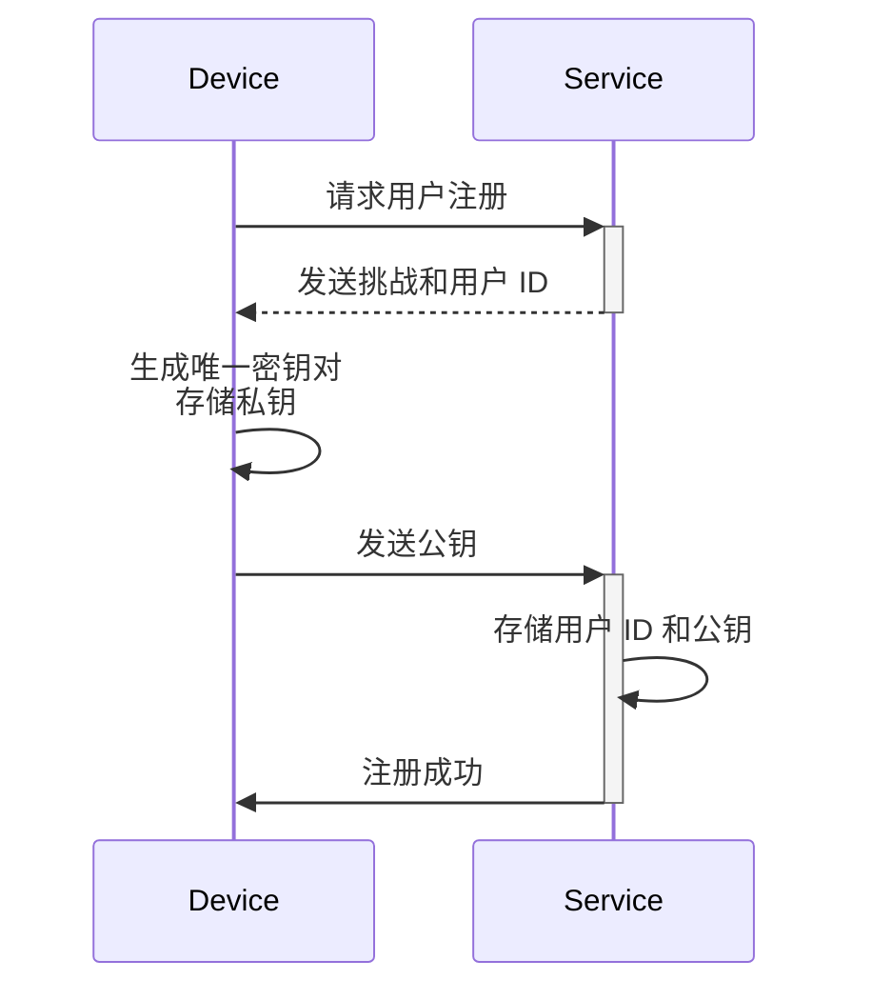
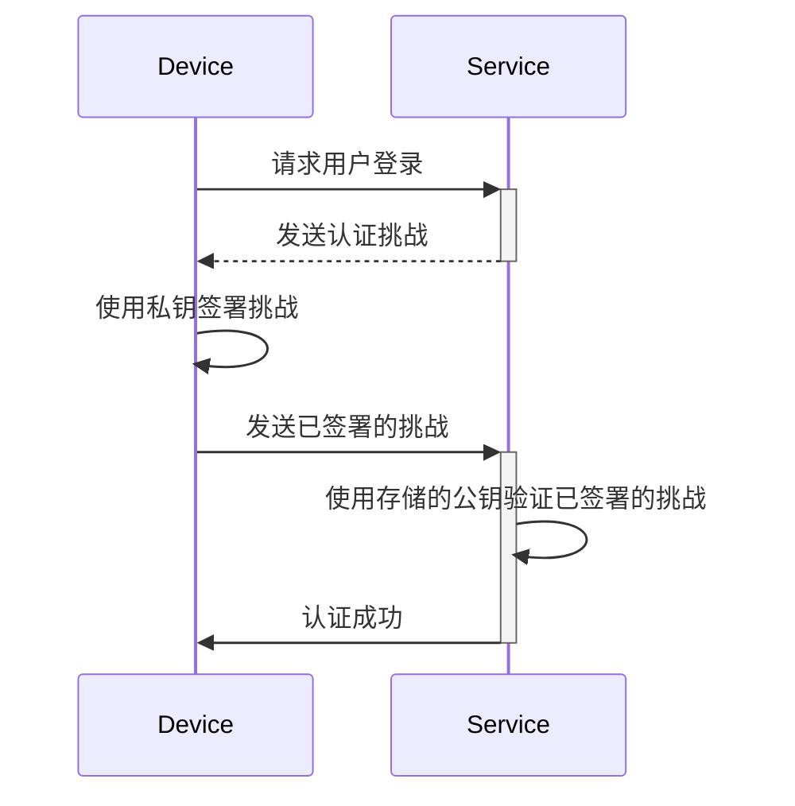

## 什么是密钥 (Passkey)？

**密钥 (Passkey)** 是一种基于 [FIDO](https://fidoalliance.org/) 的安全且方便的传统密码替代方案。它们使用先进的加密技术来保护你的账户免受[钓鱼](https://en.wikipedia.org/wiki/Phishing)攻击。

- **每个服务唯一**：当你注册一个服务时，你的设备会创建一个与该服务域名相关联的唯一密钥。
- **设备关联**：密钥通常与设备相关联，如手机、笔记本电脑、生物识别标识符或硬件安全密钥。
- **公私钥对**：设备保留私钥，而公钥与服务共享。这些加密密钥对称为密钥 (Passkey)。（引自 [FIDO](https://fidoalliance.org/how-fido-works/)）
- **多种认证方法**：你可以使用指纹扫描、人脸识别、设备 PIN、二维码扫描或安全密钥来使用密钥进行认证。
- **跨设备同步**：密钥可以通过安全的云存储（例如，Apple 的 iCloud 钥匙串或 Google 密码管理器）在设备间同步，使你可以从任何支持的设备登录。

## 密钥 (Passkey) 的工作流程是什么样的？

这里有一个真实的例子来帮助你更好地理解。你有一个名为 MyApp 的网络服务，想要实现密钥登录而不是基于密码的登录。用户选择当前设备的指纹扫描作为密钥认证方法。

**密钥 (Passkey)** 通过利用公钥加密来提供安全的凭证。

- **密钥注册**
    - 当你注册一个服务时，你的设备会生成一个与该服务相关联的唯一加密密钥对。
    - **私钥** 保留在你的设备上，而 **公钥** 与服务共享。

- **密钥认证**
    - 当你尝试登录时，服务会向你的设备发送一个 **挑战**。
    - 你的设备使用 **私钥** 基于挑战生成一个加密 **签名**。
    - **签名** 被发送回服务，服务使用 **公钥** 验证它。
    - 如果签名有效，认证成功。

阅读 <Ref slug="webauthn" />，了解实现密钥的 API 详情。

## 密钥 (Passkey) 的终端用户流程是什么样的？

密钥提供了两种类型的认证器的灵活性，适用于本地和云使用，用户可以为服务启用其中一种或两种。

- **平台认证器（内部认证器）**：绑定到特定设备操作系统（例如，手机、笔记本电脑），使用生物识别或设备密码进行授权。它快速且方便。
    - 示例：Apple 设备上的 iCloud 钥匙串（通过 Touch ID、Face ID 或设备密码验证），Windows Hello，Android 上的 Google 密码管理器。
- **漫游认证器（外部认证器）**：便携设备或软件，例如安全密钥、智能手机。可以跨多个设备使用，但可能需要额外步骤，如二维码扫描或 NFC/蓝牙配对。
    - 示例：YubiKey 和智能手机上的基于云的账户。移动认证器通常需要扫描二维码以与桌面设备连接，跨设备认证需要通过蓝牙、NFC 或 USB 连接以确保认证器在附近。

## 什么时候使用密钥 (Passkey)？

密钥是一种现代认证因素，可以用作第一或第二因素。

- **密钥登录**：密钥提供了一种比传统密码更快、更安全的无密码认证方法。
    - 现代应用程序通常在登录页面上有一个“使用密钥登录”按钮，提示用户主动点击此选项。
    - 此外，如果识别到用户正在访问其密钥注册的同一设备和浏览器，登录页面可以自动提示密钥登录弹出窗口。
- **密钥 MFA**：密钥也可以作为 MFA 的第二因素。
    - 当用户尝试登录时，他们首先输入他们的电子邮件和密码（或其他第一因素），然后服务提示他们使用密钥完成两步验证。
    - 如果浏览器中有现有会话，服务可以直接提示用户使用密钥登录，而无需再次输入密码。这一过程称为完成 MFA，因为密钥通过绑定到当前设备并通过生物识别、PIN 或其他硬件方法验证用户，提供了高级别的安全性。
- **安全验证**：在高安全环境中，密钥通常用于双重检查用户身份。例如，访问敏感的财务信息或执行关键操作（银行、政府、企业系统）。

### 为什么密钥是最安全的认证方法？

密钥是普通用户登录的最安全方式之一，因为它们使用 **公钥加密**。与密码或一次性代码 (TOTPs) 不同，你的私钥永远不会离开你的设备。即使攻击者窃取了自由可用的公钥，他们也无法伪造有效的登录尝试。

以下是一个比较，说明为什么密钥显著更安全：

| 攻击类型 | 密钥 | 软件 TOTP（认证器） |
| --- | --- | --- |
| **钓鱼攻击** | 对钓鱼高度抵抗，因为私钥从不离开设备或手动输入任何地方，使其更难被窃取。 | 易受钓鱼攻击，因为软件 TOTP 显示在你的屏幕上，攻击者可以诱骗你在假网站上透露。 |
| **中间人攻击 (MitM)** | 对 MitM 提供强保护，因为强大的加密协议使私钥仅保留在你的设备上。 | 易受 MitM 攻击，因为 TOTPs 可以被 MitM 攻击者拦截，然后用来冒充你登录。 |
| **重放攻击** | 对重放攻击提供强保护，因为每个密钥请求都是唯一的，使攻击者捕获并重放变得无用。 | 可能发生重放攻击，因为 TOTP 会定期更改，但如果在过期前被拦截，它们可能会被重用于未经授权的访问。 |

<SeeAlso slugs={["webauthn", "authentication", "authorization"]} />

<Resources
  urls={[
    "https://fidoalliance.org/passkeys/",
    "https://webauthn.io/"
  ]}
/>