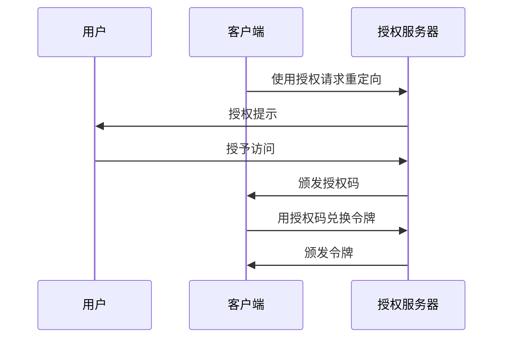

## 什么是代码交换证明密钥 (PKCE)？

代码交换证明密钥 (PKCE) 作为 <Ref slug="oauth-2.0" /> 中 <Ref slug="authorization-code-flow" /> 的安全扩展。它旨在保护授权码免受拦截和滥用，特别是在客户端密钥不安全的公共客户端中。

从 <Ref slug="oauth-2.1" /> 开始，PKCE 对包括 <Ref slug="client" headingId="public-clients" /> 和 <Ref slug="client" headingId="confidential-clients">机密（私有）客户端</Ref> 在内的所有类型的客户端都强制实施。

## PKCE 如何工作？

PKCE 在授权码流中引入了一些额外步骤，以确保交换授权码的 <Ref slug="client" /> 与初始化流的客户端是相同的。

> [!注意]
> PKCE 也适用于依赖于授权码流的 <Ref slug="openid-connect" /> 流。为简单起见，我们将专注于 OAuth 2.0 的实现。

在深入了解 PKCE 之前，让我们快速回顾一下标准的授权码流：



现在，让我们看看 PKCE 如何增强授权码流。

### 1. 准备授权请求

#### 1.1. 客户端生成一个代码验证器

在初始化 <Ref slug="authorization-request" /> 之前，客户端应生成一个随机字符串，称为 **代码验证器**。该字符串应为高熵的加密随机 URL 安全字符串，最小长度为 43 个字符，最大长度为 128 个字符。

以下是在 JavaScript 中生成代码验证器的示例：

```javascript
// `js-base64` 是一个可以在 Node.js 和浏览器中使用的通用库
import { fromUint8Array } from 'js-base64';

// 第二个参数 `true` 表示输出应为 URL 安全的
const codeVerifier = fromUint8Array(crypto.getRandomValues(new Uint8Array(64)), true);
```

#### 1.2. 客户端创建一个代码挑战

客户端应使用加密哈希函数（如 SHA-256）对 **代码验证器** 进行哈希，并将哈希结果编码为 URL 安全的 Base64 字符串。生成的字符串称为 **代码挑战**。

以下是在 JavaScript 中创建代码挑战的示例：

```javascript
// `js-base64` 是一个可以在 Node.js 和浏览器中使用的通用库
import { fromUint8Array } from 'js-base64';

const encodedCodeVerifier = new TextEncoder().encode(codeVerifier);
const codeChallenge = new Uint8Array(await crypto.subtle.digest('SHA-256', encodedCodeVerifier));

// 第二个参数 `true` 表示输出应为 URL 安全的
return fromUint8Array(codeChallenge, true);
```

#### 1.3. 客户端在授权请求中包含代码挑战

当客户端启动授权请求时，它在请求中包含参数 `code_challenge` 和 `code_challenge_method`。`code_challenge` 参数包含在前一步中生成的 **代码挑战**，而 `code_challenge_method` 参数指定用于创建 **代码挑战** 的哈希算法（例如，SHA-256 的 `S256`）。

支持的 `code_challenge_method` 值为 `plain` 和 `S256`，其中 `plain` 表示未经过任何哈希处理直接发送 **代码挑战**。通常，建议使用 `S256` 提供更好的安全性。

以下是带有 PKCE 的授权请求的非规范示例：

```http
GET /authorize?response_type=code
  &client_id=YOUR_CLIENT_ID
  &redirect_uri=https%3A%2F%2Fclient.example.com%2Fcallback
  &scope=openid%20profile
  &code_challenge=YOUR_CODE_CHALLENGE
  &code_challenge_method=S256
  &state=abc123
  &nonce=123456 HTTP/1.1
```

### 2. 用授权码兑换令牌

客户端应保存 **代码验证器** 以便后续使用，并按照通常的方式继续授权流程。一旦客户端收到授权码，它应使用 **代码验证器** 发送 <Ref slug="token-request" /> 给授权服务器。

以下是带有 PKCE 的令牌请求的非规范示例：

```http
POST /token HTTP/1.1
Host: your-authorization-server.com
Content-Type: application/x-www-form-urlencoded

grant_type=authorization_code
  &code=YOUR_AUTHORIZATION_CODE
  &redirect_uri=https%3A%2F%2Fclient.example.com%2Fcallback
  &client_id=YOUR_CLIENT_ID
  &code_verifier=YOUR_CODE_VERIFIER
```

授权服务器将验证 **代码挑战** 与 **代码验证器** 以确保客户端与初始化流的实体相同。如果验证失败，授权服务器将拒绝令牌请求。

## PKCE 如何增强安全性

PKCE 的主要安全优势在于它可以防止授权码拦截攻击，这种情况可能发生在公共客户端中。例如，如果攻击者拦截授权码，他们无法在没有 **代码验证器** 的情况下将其兑换成令牌。PKCE 确保只有发起该流的客户端可以完成令牌交换。

<SeeAlso slugs={['oauth-2.1', 'authorization-code-flow']} />

<Resources
  urls={[
    "https://blog.logto.io/how-pkce-protects-the-authorization-code-flow-for-native-apps",
    "https://datatracker.ietf.org/doc/html/rfc7636",
  ]}
/>
