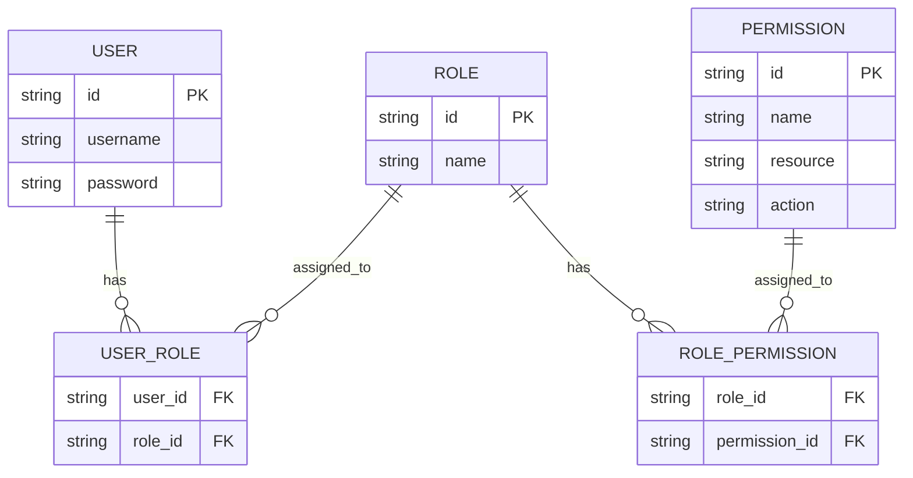
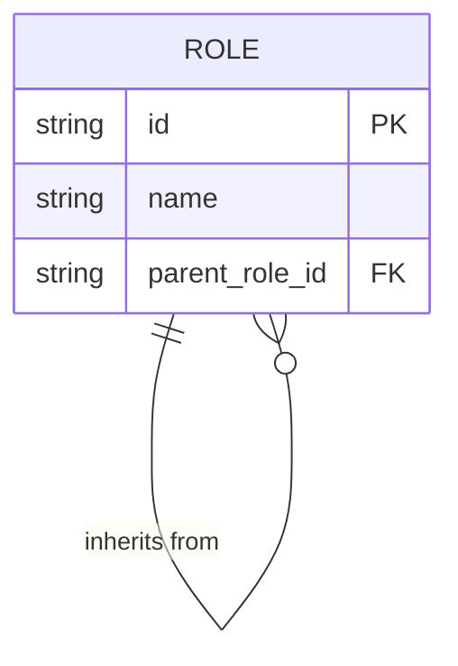
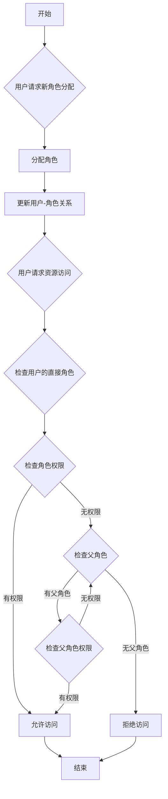
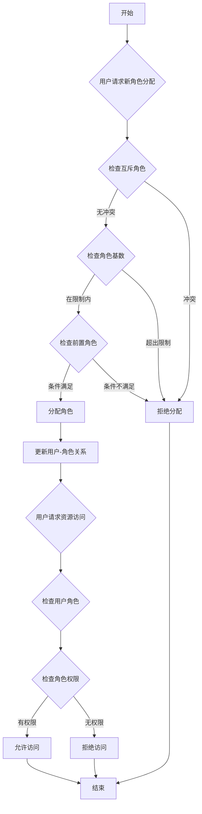

## 什么是基于角色的访问控制 (RBAC)？

基于角色的访问控制 (RBAC) 是一种被广泛采用的访问控制模型，它引入了“角色”的概念，以将用户与权限解耦，从而形成一个灵活且高效的权限管理系统。

RBAC 的核心思想简单而强大：不是直接将权限分配给用户，而是将权限分配给角色，然后再将角色分配给用户。这种间接的权限分配方法极大地简化了管理访问权限的过程。

## RBAC 的关键概念是什么？

RBAC 模型围绕四个主要元素：

1. 用户：系统中的个体，通常是真实的人。
2. 角色：组织中职位或职责的表示。
3. 权限：执行特定操作的授权。
4. 会话：用户激活某些角色的动态环境。

RBAC 的基本工作流程可以总结如下：
1. 根据组织结构或业务需求定义角色。
2. 为每个角色分配适当的权限。
3. 根据用户的职责为其分配一个或多个角色。
4. 当用户尝试访问资源时，系统检查其分配的角色是否具有必要的权限。

## RBAC 在现实应用中如何使用？

在典型的业务应用中使用 RBAC 时，你可以从回答以下三个基本问题开始：

1. 系统中需要保护哪些资源？
2. 需要对这些资源进行哪些操作控制？
3. 在现实场景中，哪些角色负责执行这些资源和操作？

以电子商务系统为例。

你可以首先识别需要保护的资源：

- 产品
- 订单

然后，你可以确定需要对这些资源进行哪些操作控制，即定义这些资源的权限：

- 产品
  - `read:product`
  - `create:product`
  - `delete:product`
- 订单
  - `read:order`
  - `create:order`
  - `delete:order`

有了上述权限后，你可以根据现实场景中的角色定义以下权限管理模型：

- 产品管理员
  - 产品
    - `read:product`
    - `create:product`
    - `delete:product`
- 订单管理员
  - 订单
    - `read:order`
    - `create:order`
    - `delete:order`

最后，根据用户的职责为其分配角色：

- Alice: 产品管理员
- Bob: 订单管理员

当用户访问资源时，系统将检查用户的分配角色是否具有必要的权限。

例如，当 Alice 尝试读取产品信息时，系统首先检索她的角色信息，发现她具有产品管理员角色。

然后，系统查询与该角色关联的权限，其中包括 `read:product`、`create:product` 和 `delete:product`。

系统接着检查她的权限列表中是否存在所需的 `read:product` 权限。

由于该权限存在，系统允许 Alice 访问产品列表。如果所需权限不在列表中，系统将拒绝访问请求。

## 为什么不应该直接使用角色进行访问控制

在 RBAC 实施中一个常见的错误是直接使用角色进行访问控制：

```typescript
// ❌ 有问题的方法
if (user.hasRole('product_admin')) {
  await deleteProduct(productId);
}
```

虽然这种方法看似简单，但随着系统的增长会产生问题。例如：
- 当市场团队需要更新产品描述时，你需要修改代码以检查市场角色。
- 当你希望某些产品经理只能发布而不能删除产品时，你需要为相关操作创建新的角色检查。
- 当新的内容团队需要部分产品访问时，你又需要更新代码。

相反，你应该始终检查特定的权限：

```typescript
// ✅ 推荐的方法
if (user.hasPermission('delete:product')) {
  await deleteProduct(productId);
}
```

这种基于权限的方法提供了几个优势：

1. 细粒度的权限控制：权限可以精确映射到特定的资源操作：

- 创建产品：`create:product`
- 更新产品：`update:product`
- 删除产品：`delete:product`
- 发布产品：`publish:product`

2. 灵活的角色配置：权限可以自由组合成角色而无需更改代码：

```typescript
const roles = {
  product_admin: ['create:product', 'update:product', 'delete:product', 'publish:product'],
  content_editor: ['update:product'],
  publisher: ['publish:product']  // 可以轻松添加新角色
};
```

这种设计使你的系统能够适应业务增长：
- 添加新角色只需进行权限配置
- 调整角色权限通过配置完成
- 新功能只需新的权限条目

记住：角色应该只是权限的容器，而不是访问控制决策的基础。这种设计使 RBAC 能够提供最大价值。

## RBAC 模型及其演变

### RBAC0: 基础

RBAC0 是定义用户、角色、权限和会话核心概念的基本模型。它是所有其他 RBAC 模型的基础。

关键特性：
- 用户-角色关联：多对多关系
- 角色-权限关联：多对多关系



此图展示了 RBAC0 的基本结构，显示了用户、角色和权限之间的关系。

关键操作：
1. 为用户分配角色
2. 为角色分配权限
3. 检查用户是否具有特定权限

虽然 RBAC0 提供了一个坚实的起点，但它有一些限制：
1. 角色爆炸：随着系统复杂性的增加，角色数量可能迅速增长。
2. 权限冗余：不同角色可能需要类似的权限集，导致重复。
3. 缺乏层次结构：无法表示角色之间的继承关系。

### RBAC1: 引入角色层次结构

RBAC1 在 RBAC0 的基础上增加了角色继承的概念。

```plaintext
RBAC1 = RBAC0 + 角色继承
```

关键特性：
- 角色层次结构：角色可以有父角色
- 权限继承：子角色继承其父角色的所有权限



此图展示了 RBAC1 中角色如何从其他角色继承。

关键操作：



此流程图展示了 RBAC1 中角色分配和权限检查的过程，包括角色继承方面。

RBAC1 提供了几个优势：
1. 减少角色数量：通过继承可以创建更少的基础角色
2. 简化权限管理：更容易反映组织层次结构

然而，RBAC1 仍然有一些限制：
1. 缺乏约束机制：无法限制用户同时持有潜在冲突的角色
2. 性能考虑：权限检查可能需要遍历整个角色层次结构

### RBAC2: 实施约束

RBAC2 也基于 RBAC0，但引入了约束的概念。

```plaintext
RBAC2 = RBAC0 + 约束
```

关键特性：
1. 互斥角色：用户不能同时被分配到这些角色
2. 角色基数：限制可以分配给特定角色的用户数量
3. 前置角色：用户必须拥有特定角色才能被分配到另一个角色



此流程图展示了 RBAC2 中角色分配和访问控制的过程，结合了各种约束。

RBAC2 通过防止权限过度集中增强了安全性，并允许更精确的访问控制。然而，由于需要为每个角色分配检查多个约束条件，它增加了系统复杂性并可能影响性能。

### RBAC3: 综合模型

RBAC3 结合了 RBAC1 和 RBAC2 的特性，提供了角色继承和约束机制：

```plaintext
RBAC3 = RBAC0 + 角色继承 + 约束
```

这个综合模型提供了最大的灵活性，但在实现和性能优化方面也带来了挑战。

## RBAC (基于角色的访问控制) 的优势是什么？

1. 简化的权限管理：通过角色进行批量授权，减少了管理单个用户权限的复杂性。
2. 增强的安全性：更精确的用户权限控制降低了安全风险。
3. 降低管理成本：修改角色权限会自动影响所有关联用户。
4. 与业务逻辑对齐：角色通常对应于组织结构或业务流程，使其更易于理解和管理。
5. 支持职责分离：通过互斥角色等约束可以分离关键职责。

## 实际实施的考虑因素是什么？

在现实场景中实施 RBAC 时，开发人员应考虑以下关键方面：

1. 数据库设计：利用关系数据库有效存储和查询 RBAC 结构。
2. 性能优化：实施缓存策略并优化权限检查，特别是对于复杂的 RBAC3 模型。
3. API 和前端集成：设计清晰的 API 来管理用户、角色和权限，并考虑如何在前端应用中使用 RBAC。
4. 安全和审计：确保 RBAC 系统本身的安全性，并实施详细的日志记录和审计功能。
5. 可扩展性：设计时考虑未来的扩展，例如支持更复杂的权限规则或与其他系统集成。
6. 用户体验：为系统管理员设计直观的界面，以便轻松配置和维护 RBAC 结构。

<SeeAlso slugs={['abac', 'access-control']} />

<Resources
  urls={[
    "https://blog.logto.io/rbac-and-abac",
    "https://blog.logto.io/mastering-rbac",
    "https://blog.logto.io/organization-and-role-based-access-control",
    "https://docs.logto.io/docs/recipes/rbac/",
    "https://en.wikipedia.org/wiki/Role-based_access_control"
  ]}
/>