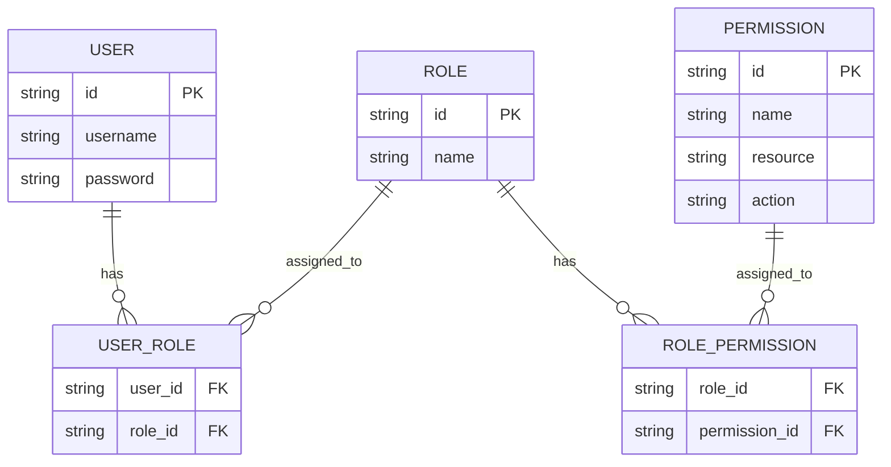
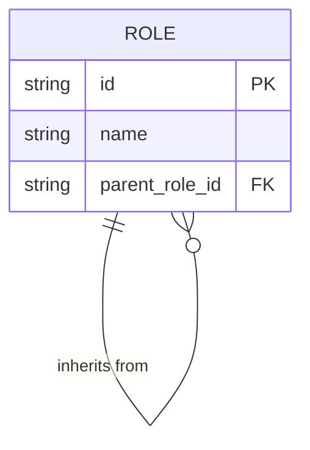
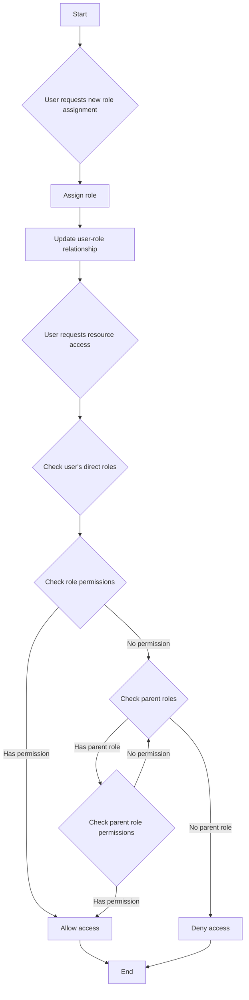
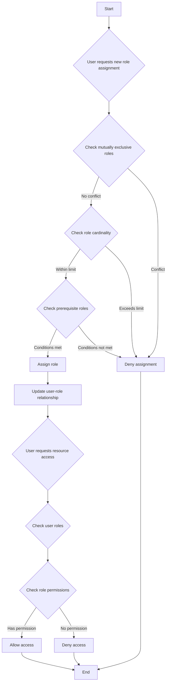

## 什么是基于角色的访问控制 (Role-based access control, RBAC)？

基于角色的访问控制 (Role-based access control, RBAC) 是一种被广泛采用的访问控制模型，它引入了“角色”的概念，以将用户与权限解耦，从而实现灵活且高效的权限管理系统。

RBAC 背后的核心思想简单而强大：与其直接将权限分配给用户，不如将权限分配给角色，再将角色分配给用户。这种间接的权限分配方法极大地简化了权限管理的过程。

### RBAC 中的关键概念

RBAC 模型围绕四个主要元素：

1. 用户：系统中的个体，通常是真实人物。
2. 角色：组织内职能或责任的表现。
3. 权限：执行特定操作的授权。
4. 会话：用户激活某些角色的动态环境。

RBAC 的基本工作流程可以总结为：
1. 根据组织结构或业务需求定义角色。
2. 为每个角色分配适当的权限。
3. 根据用户的责任分配一个或多个角色。
4. 当用户尝试访问资源时，系统检查其分配的角色是否具有必要的权限。

### RBAC 的类型

#### RBAC0：基础

RBAC0 是定义用户、角色、权限和会话核心概念的基本模型。它作为所有其他 RBAC 模型的基础。

关键特性：
- 用户角色关联：多对多关系
- 角色权限关联：多对多关系



此图展示了 RBAC0 的基本结构，显示了用户、角色和权限之间的关系。

关键操作：
1. 为用户分配角色
2. 为角色分配权限
3. 检查用户是否具有特定权限

虽然 RBAC0 提供了一个坚实的起点，但它有一些局限性：
1. 角色爆炸：随着系统复杂性增加，角色数量可能快速增长。
2. 权限冗余：不同角色可能需要类似的权限集合，导致重复。
3. 缺乏层次结构：不能表示角色之间的继承关系。

#### RBAC1：引入角色层次结构

RBAC1 在 RBAC0 的基础上增加了角色继承的概念。

```plaintext
RBAC1 = RBAC0 + Role Inheritance
```

关键特性：
- 角色层次结构：角色可以有父角色
- 权限继承：子角色继承其父角色的所有权限



此图显示了 RBAC1 中角色如何可以从其他角色继承。

关键操作：



此流程图说明了 RBAC1 中角色分配和权限检查的过程，包括角色继承方面。

RBAC1 提供了几个优点：
1. 减少角色数量：通过继承可以创建较少的基础角色
2. 简化权限管理：更容易反映组织层次结构

然而，RBAC1 仍有一些限制：
1. 缺乏约束机制：无法限制用户同时拥有可能冲突的角色
2. 性能考虑：权限检查可能需要遍历整个角色层次结构

#### RBAC2：实现约束

RBAC2 基于 RBAC0 并引入了约束的概念。

```plaintext
RBAC2 = RBAC0 + Constraints
```

关键特性：
1. 互斥角色：用户不能同时被分配到这些角色
2. 角色基数：限制可以分配给特定角色的用户数量
3. 前置角色：用户必须在被分配到另一个角色之前具备特定角色



此流程图展示了 RBAC2 中角色分配和访问控制的过程，结合了各种约束。

RBAC2 通过防止权限的过度集中增强了安全性，并允许更精确的访问控制。然而，它增加了系统的复杂性，并可能因为需要检查每个角色分配的多个约束条件而影响性能。

### RBAC3：综合模型

RBAC3 结合了 RBAC1 和 RBAC2 的特性，提供了角色继承和约束机制：

```plaintext
RBAC3 = RBAC0 + Role Inheritance + Constraints
```

此综合模型提供了最大的灵活性，但在实施和性能优化方面也带来了挑战。

## RBAC (基于角色的访问控制) 的优点是什么？

1. 简化权限管理：通过角色进行批量授权，减少了管理单个用户权限的复杂性。
2. 增强的安全性：更精确的用户权限控制降低了安全风险。
3. 降低管理成本：修改角色权限会自动影响所有关联的用户。
4. 符合业务逻辑：角色通常与组织结构或业务流程对应，使其更易于理解和管理。
5. 支持职责分离：通过互斥角色等约束，可以分离关键责任。

## 实现时的实际考虑因素是什么？

在真实场景中实施 RBAC 时，开发人员应考虑以下关键方面：

1. 数据库设计：使用关系数据库有效存储和查询 RBAC 结构。
2. 性能优化：实现缓存策略并优化权限检查，尤其是对于复杂的 RBAC3 模型。
3. API 和前端集成：设计清晰的 API 来管理用户、角色和权限，并考虑如何在前端应用中使用 RBAC。
4. 安全性和审计：确保 RBAC 系统本身的安全性，并实现详细的日志和审计功能。
5. 可扩展性：设计时考虑未来的扩展，例如支持更复杂的权限规则或与其他系统的集成。
6. 用户体验：为系统管理员设计直观的界面，以便轻松配置和维护 RBAC 结构。

<SeeAlso slugs={['abac', 'access-control']} />

<Resources
  urls={[
    "https://blog.logto.io/rbac-and-abac",
    "https://blog.logto.io/mastering-rbac",
    "https://blog.logto.io/organization-and-role-based-access-control",
    "https://docs.logto.io/docs/recipes/rbac/",
    "https://en.wikipedia.org/wiki/Role-based_access_control"
  ]}
/>