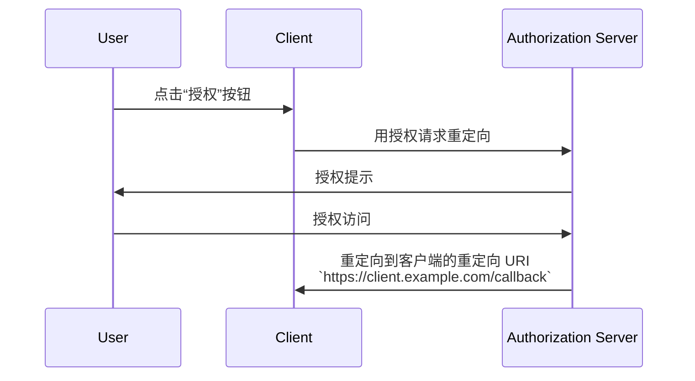

## 什么是重定向 URI (Redirect URI)？

重定向 URI，也称为回调 URL 或重定向 URL，是一个 URI，用于指示当 <Ref slug="authorization-server" /> 完成 <Ref slug="authorization-request" /> 后应该将用户代理重定向到哪里。

> 通用资源标识符 (URI) 通常与 URL (统一资源定位符) 混淆。想了解更多信息，请查阅 [揭开 URI、URL 和 URN 的面纱](https://blog.logto.io/unveiling-uri-url-and-urn)。

让我们来看一个包含重定向 URI 的授权请求 (authorization request) 示例：

```http
GET /authorize?response_type=code
  &client_id=YOUR_CLIENT_ID
  &redirect_uri=https%3A%2F%2Fclient.example.com%2Fcallback
  &scope=openid%20profile%20email
  &state=abc123
  &nonce=123456 HTTP/1.1
```

在这个示例中，`redirect_uri` 参数的原始值是 `https%3A%2F%2Fclient.example.com%2Fcallback`，这是 URL 编码的。实际值是 `https://client.example.com/callback`。

## 重定向 URI 如何工作？

> 在 <Ref slug="openid-connect" /> 的上下文中，OAuth 2.0 的 <Ref slug="authorization-request" /> 和 <Ref slug="authorization-server" /> 的工作流程同样适用。重定向 URI 在 <Ref slug="authentication-request" /> 和 <Ref slug="openid-connect" headingId="openid-provider-op" /> 中的功能与在 OAuth 2.0 中一样。

假设 <Ref slug="client" /> 从 `https://client.example.com` 发起授权请求 (authorization request)。用户完成授权过程后，授权服务器 (authorization server) 将把用户代理（浏览器）重定向回 `https://client.example.com/callback`。



显而易见，重定向 URI 对于授权服务器 (authorization server) 在授权过程完成后将用户代理重定向回来是至关重要的。此外，重定向 URI 还用于接收授权码或令牌，这取决于流程。

以下是 <Ref slug="authorization-code-flow" /> 中实际重定向可能的非规范示例：

```http
HTTP/1.1 302 Found
Location: https://client.example.com/callback?code=AUTHORIZATION_CODE&state=abc123
```

请注意，授权服务器 (authorization server) 附加到重定向 URI 的 URL 参数 `code` 和 `state`。客户端需要从 URL 中提取 `code` 和 `state` 参数以继续授权过程。

## 为什么需要重定向 URI？

正如我们在上述示例中看到的，授权服务器 (authorization server) 需要知道在成功授权请求 (authorization request) 后要重定向到哪里。当有多个客户端（例如，<Ref slug="single-sign-on" />）时，这尤其有用，而且每个客户端都有不同的重定向 URI。

使用 <Ref slug="authorization-code-flow" /> 时，重定向 URI 还用于将授权码传回给客户端，而不是使用前端通道（浏览器），以防止令牌暴露给潜在攻击。

[资源所有者密码凭证 (ROPC) 授权](https://datatracker.ietf.org/doc/html/rfc6749#section-4.3) 以前可以在没有重定向 URI 的情况下为用户获取令牌。然而，由于安全问题，它在 <Ref slug="oauth-2.1" /> 中已被弃用。

## 安全考虑

重定向 URI 是一个关键参数，也是攻击者常见的目标。以下是一些需要牢记的安全考虑：

- **白名单重定向 URI**：客户端应仅接受在授权服务器 (authorization server) 注册的重定向 URI。这可以防止攻击者将用户重定向到恶意网站。
- **使用 HTTPS**：始终使用 HTTPS 作为重定向 URI，以保护客户端和授权服务器之间的通信。
- **精确匹配**：重定向 URI 应与注册的 URI 完全匹配。授权服务器 (authorization server) 可能会实施严格的匹配规则，以禁止广泛的匹配模式。
- **状态参数**：使用 `state` 参数来防止 <Ref slug="csrf" /> 攻击。客户端应验证 `state` 参数，以确保其与授权请求 (authorization request) 中发送的值匹配。

<SeeAlso slugs={["csrf", "oauth-2.1", "authorization-code-flow"]} />

<Resources
  urls={[
    "https://blog.logto.io/oauth-2-1",
    "https://blog.logto.io/csrf",
    "https://blog.logto.io/redirect-uri-in-authorization-code-flow",
  ]}
/>
