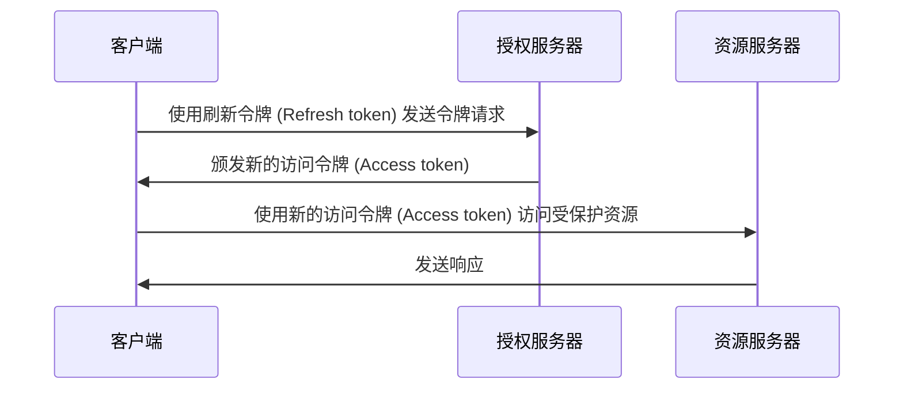

## 什么是刷新令牌 (Refresh token)？

刷新令牌 (Refresh token) 是一种长期有效的凭证，通常是一个随机字符串，用于在不需要用户重新认证 (Authentication) 的情况下获取新的 <Ref slug="access-token">访问令牌 (Access tokens)</Ref>。在 OAuth 2.0 和 OpenID Connect (OIDC) 的上下文中，当客户端 (应用程序) 请求 <Ref slug="offline-access" /> 时，<Ref slug="authorization-server">授权服务器 (Authorization servers)</Ref> 可以向客户端颁发刷新令牌 (Refresh tokens)。

虽然 [OAuth 2.0 RFC](https://datatracker.ietf.org/doc/html/rfc6749#section-1.5) 定义了刷新令牌 (Refresh token) 的高层生命周期，但具体的实现细节可能因授权服务器和客户端而异。我们将在接下来的部分中探讨这些细节。

## 刷新令牌 (Refresh token) 如何工作？

当客户端请求 <Ref slug="offline-access" /> 时，通常会与访问令牌 (Access token) 一起颁发刷新令牌 (Refresh token)。请求离线访问的行业规范是将 `offline_access` 范围包含在 <Ref slug="authorization-request">授权请求 (Authorization request)</Ref> 中，而 <Ref slug="openid-connect">OpenID Connect (OIDC)</Ref> 正式定义了用于此目的的 `offline_access` 范围（在 <Ref slug="authentication-request">认证请求 (Authentication request)</Ref> 中可用）。

以下是一个包含 `offline_access` 范围的授权请求 (Authorization request) 的非规范示例：

```http
GET /authorize?response_type=code
  &client_id=YOUR_CLIENT_ID
  &redirect_uri=https%3A%2F%2Fclient.example.com%2Fcallback
  &scope=openid%20profile%20email%20offline_access
  &state=abc123
  &nonce=123456 HTTP/1.1
```

一旦客户端收到刷新令牌 (Refresh token)，可以在当前访问令牌 (Access token) 过期时使用它请求新的访问令牌 (Access tokens)。以下是使用刷新令牌 (Refresh token) 的一个简化示例：



如序列图所示，使用刷新令牌 (Refresh token) 需要客户端和授权服务器的支持：

- 客户端应安全地存储刷新令牌 (Refresh token) 并在 <Ref slug="token-request">令牌请求 (Token request)</Ref> 中使用它获取新的访问令牌 (Access token)。
- 授权服务器应验证刷新令牌 (Refresh token) 并在客户端提供有效的刷新令牌时颁发新的访问令牌 (Access token)。

刷新令牌 (Refresh token) 不应与 <Ref slug="resource-server">资源服务器 (Resource server)</Ref> 共享。资源服务器应仅检查访问令牌 (Access token) 来进行授权。

以下是使用刷新令牌 (Refresh token) 的一个非规范化令牌请求 (Token request) 示例：

```http
POST /token HTTP/1.1
Host: your-authorization-server.com
Content-Type: application/x-www-form-urlencoded

grant_type=refresh_token
  &refresh_token=YOUR_REFRESH_TOKEN
  &client_id=YOUR_CLIENT_ID
  &client_secret=YOUR_CLIENT_SECRET
  &scope=openid%20profile%20email
```

## 安全考虑 ||security-considerations||

由于刷新令牌 (Refresh token) 是长期有效的（例如几天、几周），并且可以在无需用户交互的情况下获取新的访问令牌 (Access token)，因此相比访问令牌 (Access token)（例如几分钟、几小时）而言，它们会带来更高的安全风险。应该谨慎考虑和实施刷新令牌 (Refresh token) 的使用以减轻潜在的安全威胁。以下是一些最佳实践：

### 安全存储

在客户端侧安全地存储刷新令牌 (Refresh token) 以防止未经授权的访问。存储机制包括：

- **仅限 HTTP 的 Cookie**：使用仅限 HTTP 的 Cookie 来存储令牌以防止客户端 JavaScript 访问它们。
- **加密存储**：在移动设备上使用如 Keychain (iOS) 或 KeyStore (Android) 的安全存储，或在 web 应用中使用加密数据库。

### 刷新令牌 (Refresh token) 轮换 ||refresh-token-rotation||

虽然刷新令牌 (Refresh token) 可以长期有效，但定期轮换或基于某些条件（例如成功的令牌交换后）轮换可以显著降低未经授权访问的风险。具体的轮换策略可能根据应用程序的安全要求和授权服务器的能力不同而异。

两种常见的令牌轮换策略是：

- **基于时间的轮换**：每隔一段时间（例如每 7 天）轮换刷新令牌 (Refresh token)。
- **基于事件的轮换**：在特定事件发生后轮换刷新令牌 (Refresh token)（例如成功的令牌交换、密码更改）。

当刷新令牌 (Refresh token) 被轮换时，先前的刷新令牌 (Refresh token) 应失效以防止其重用。这些策略通常与会话 TTL（生存时间）结合使用，以确保无论刷新令牌 (Refresh token) 的有效性如何，在一定时间后用户必须重新认证 (Authenticate)。

### 发送者约束的刷新令牌 (Refresh token) ||sender-constrained-refresh-tokens||

发送者约束的刷新令牌 (Refresh token) 是一种安全机制，用于绑定刷新令牌 (Refresh token) 到请求它的客户端，适用于非 <Ref slug="client" headingId="confidential-clients">机密客户端 (Confidential clients)</Ref>。常见的方法包括 [DPoP](https://datatracker.ietf.org/doc/html/rfc9449) 和 [mTLS](https://datatracker.ietf.org/doc/html/rfc8705)。

### 客户端类型

限制刷新令牌 (Refresh token) 的使用至 <Ref slug="client" headingId="confidential-clients">机密 (Private) 客户端</Ref> 是个好习惯。

- 公共客户端（例如单页应用）将源代码暴露给客户端侧，这使得攻击者更容易提取和滥用刷新令牌 (Refresh token)。通常，对于公共客户端如果需要使用刷新令牌 (Refresh token)，会使用更安全的机制如 <Ref slug="pkce" /> 和刷新令牌 (Refresh token) 轮换。
- 另一方面，机密客户端在一个安全的服务器环境中运行，源代码和环境不暴露给客户端侧。刷新令牌 (Refresh token) 可以在这样的环境中更加安全地使用。

### 令牌撤销

由于刷新令牌 (Refresh token) 通常是 <Ref slug="opaque-token">不透明令牌 (Opaque tokens)</Ref>（即对客户端没有意义）且必须由授权服务器验证，授权服务器可以轻松实现令牌撤销机制，以便在必要时使刷新令牌 (Refresh token) 失效。这在诸如用户注销、账户被盗或令牌滥用等情况下很有用。

<SeeAlso slugs={["access-token", "id-token", "jwt", "opaque-token"]} />

<Resources urls={[
  "https://blog.logto.io/understanding-refresh-token-rotation",
  "https://blog.logto.io/understanding-tokens-in-oidc",
  {
    url: "https://openid.net/specs/openid-connect-core-1_0.html#OfflineAccess",
    result: {
      ogTitle: "Offline Access in OpenID Connect Core 1.0",
    }
  },
  {
    url: "https://datatracker.ietf.org/doc/html/rfc6749#section-1.5",
    result: {
      ogTitle: "Refresh Token in OAuth 2.0",
      ogDescription: "Refresh tokens are credentials used to obtain access tokens."
    },
  },
]} />
