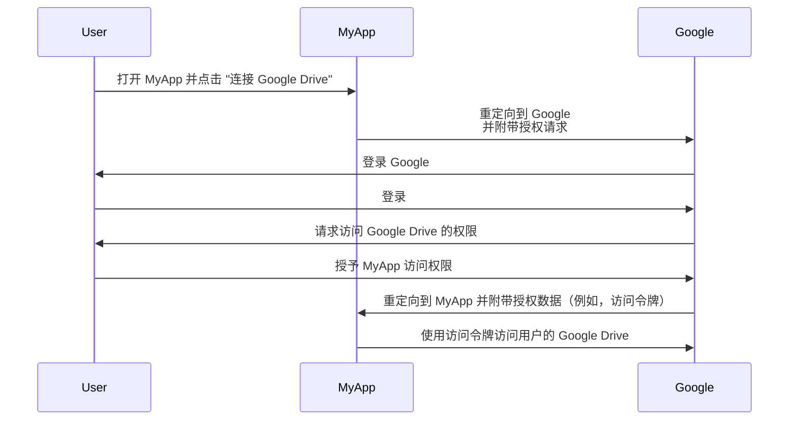

## 什么是资源所有者 (Resource owner)？

在 <Ref slug="oauth-2.0" /> 的上下文中，资源所有者是一个身份（通常是用户），可以授予对受保护资源（例如数据、文件或服务）的访问权限。

例如，你有一个名为 MyApp 的 Web 应用程序，想要访问用户的 Google Drive。以下是一个典型的 OAuth 2.0 流程：

在这个流程中，**用户**是授予 MyApp 访问其 Google Drive 的**资源所有者**，而 **MyApp** 是想要访问受保护资源的 <Ref slug="client" />，**Google** 则同时是 <Ref slug="authorization-server" /> 和 <Ref slug="resource-server" />。

顾名思义，资源所有者在 <Ref slug="resource-server" /> 中拥有一些资源，并且可以在 <Ref slug="oauth-2.0" /> 上下文中授权客户端代表他们访问这些资源。

## 为什么资源所有者很重要？

在 <Ref slug="authorization" /> 过程中，资源所有者是不可或缺的，因为他们是明确授予或拒绝访问其资源的主体。出于技术和合规性原因，资源所有者的同意是强制性的：

- **技术**：资源所有者的同意确保客户端拥有访问资源的必要权限。与其进行全有或全无的访问，资源所有者可以根据客户端的请求授予部分访问权限。另一方面，资源所有者也可以在任何时候明确撤销访问权限。这种方法为 <Ref slug="access-control" /> 提供了明确且可审计的方式。
- **合规**：在许多司法管辖区中，资源所有者的同意是法律要求，尤其是在处理敏感数据时。例如，《通用数据保护条例 (GDPR)》要求数据主体（资源所有者）必须对数据处理活动提供明确的同意。

## 资源所有者 vs. 资源服务器

<Ref slug="resource-server">资源服务器</Ref> 负责托管和提供**受保护的资源**。它们是验证访问令牌并向客户端提供资源的看门人。

另一方面，根据 <Ref slug="access-control" /> 策略，资源所有者可能对资源服务器中的受保护资源拥有全部或部分控制权。

<SeeAlso slugs={["resource-server", "oauth-2.0", "resource-indicator", "access-control"]} />

<Resources
  urls={[
    "https://tools.ietf.org/html/rfc6749",
  ]}
/>
