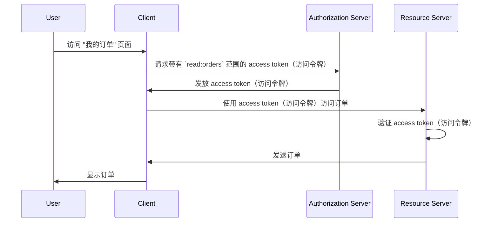

## 什么是资源服务器 (Resource server)？

在 <Ref slug="oauth-2.0" /> 的上下文中，**资源服务器**是托管<Ref slug="client" />想要访问的**受保护资源**的服务器。资源服务器还负责验证<Ref slug="access-token" />并根据<Ref slug="access-control" />策略向客户端提供受保护的资源。

例如，考虑一个叫做 MyApp 的网络应用程序，它想要访问用户的 Google Drive。在这一场景下：

- **MyApp** 是想要访问受保护资源的客户端。
- **Google** 是托管用户 Google Drive 的资源服务器。
- **Google** 也是向 MyApp 发放 access token（访问令牌）的<Ref slug="authorization-server" />。

让我们再考虑一个电子商务网站想要从一个内部订单服务访问用户订单历史的例子。在这种情况下：

- **电子商务网站** 是想要访问受保护资源的客户端。
- **订单服务** 是托管用户订单历史的资源服务器。
- 如果电子商务网站集成了 OAuth 2.0 服务或 OpenID 提供商，该服务（提供商）就充当了授权服务器。

## 资源服务器如何工作？

OAuth 2.0 分别定义了资源服务器和授权服务器的角色，以提供明确的关注点分离。然而，它并没有在框架中定义资源服务器的具体表示，而是将其称为托管受保护资源的虚拟概念；<Ref slug="client" /> 需要为它想要访问的受保护资源指定<Ref slug="scope">范围</Ref>。

假设客户端想要从订单服务访问用户订单历史。一个非规范性地发送<Ref slug="token-request" />以访问订单的示例可能如下所示：



在上面的序列图中，客户端向授权服务器请求一个带有 `read:orders` 范围的 access token（访问令牌）。我们假设所有参与方都已经就 `read:orders` 范围的含义达成一致：它指定客户端想要对资源服务器提供的 `orders` 执行 `read` 操作。然后，客户端使用 access token（访问令牌）从资源服务器访问订单。

> [!Note]
> 范围的含义和结构并不是由 OAuth 2.0 定义的，应由客户端、授权服务器和资源服务器共同商定。

资源服务器负责验证 access token（访问令牌）并确定客户端是否拥有根据<Ref slug="access-control" />策略访问请求资源的必要权限。根据实现的不同，access token（访问令牌）可以是<Ref slug="opaque-token" />或<Ref slug="jwt" />。

## 命名约定

可以根据应用程序的上下文灵活地命名资源服务器。由于 OAuth 2.0 在<Ref slug="scope" />参数中没有为资源服务器定义具体表示，您可以在行业中看到多种命名约定：

- 省略资源服务器名称，仅使用动作：例如，`read` 和 `write`。
- `[verb]:[resource]`：一个常见的约定是使用 `verb` 和 `resource` 的组合来指定客户端可以对资源执行的操作。例如，`read:orders` 和 `write:profile`。有时它们被反转为 `orders:read` 和 `profile:write`。
- `[uri]:[action]`：另一种约定是使用资源的 URI 和客户端可以执行的动作。例如，`https://api.example.com/orders:read` 和 `https://api.example.com/profile:write`。

## 资源指示器

让我们看一个<Ref slug="authentication-request" />（解码后）中 scope 参数的例子：

```plaintext
openid profile email https://api.example.com/orders:read
```

在这个例子中，`scope` 参数包括 `openid`、`profile` 和 `email` 范围，它们是<Ref slug="openid-connect" />标准范围，以及 `https://api.example.com/orders:read` 范围，指定资源服务器的位置和读取资源的权限。

在这种特定情况下看起来不错，但随着资源和范围数量的增加，管理和理解范围可能变得具有挑战性。为了解决这个问题，OAuth 2.0 引入了一个称为<Ref slug="resource-indicator">资源指示器</Ref>（RFC 8707）的扩展，允许客户端使用 URI 来指定他们想要访问的资源，使资源服务器在过程中更加明确。

在身份验证请求中添加资源指示器参数 (`resource=https://api.example.com/orders`) 之后，scope 参数可以简化为：

```plaintext
openid profile email read
```

这看起来更简洁，也更容易管理。

> [!Note]
> 并非所有的授权服务器（OpenID 提供商）都支持资源指示器扩展。在使用之前，请仔细检查授权服务器的文档。

<SeeAlso slugs={["access-control", "resource-indicator", "resource-owner", "client"]} />

<Resources
  urls={[
    "https://datatracker.ietf.org/doc/html/rfc8707",
  ]}
/>
