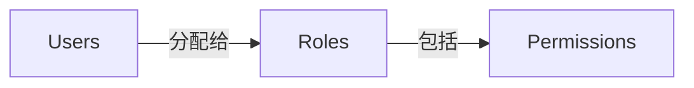

## 角色

角色是 <Ref slug="rbac" /> 中的核心组件之一。它作为可以分配给用户的权限的容器，充当用户和其访问权限之间的中介。



一个典型的角色结构包含一个名称和一组权限：

```typescript
const role = {
  name: 'order_admin',
  permissions: [
    'read:orders',   // 查看订单详情
    'write:orders',  // 编辑订单
    'read:products'  // 查看产品
  ]
}
```

> [!Note]
> 角色主要用于权限管理。对于访问控制的实现，建议直接检查权限而不是角色。有关更多信息，请参见 <Ref slug="rbac" />。

<SeeAlso slugs={["rbac", "authorization", "access-control"]} />