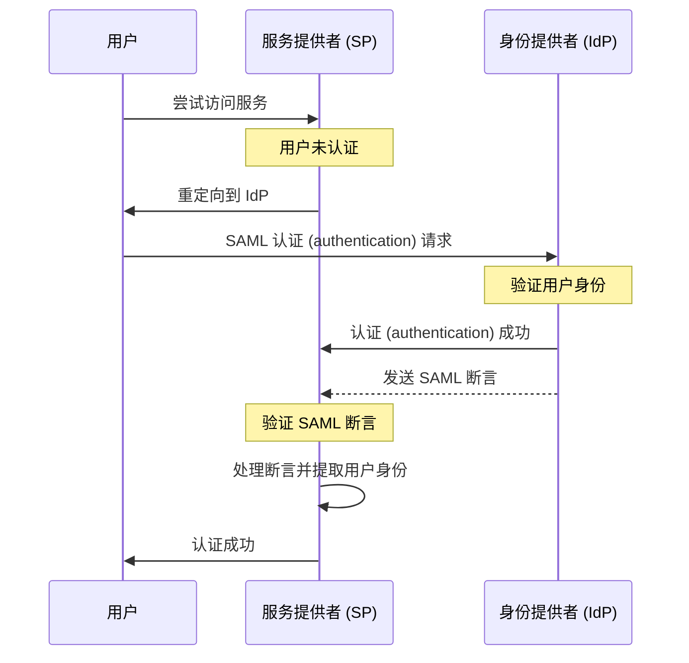

## 什么是 SAML？

SAML（通常被称为 SAML 2.0）是一种基于 XML 的标准，用于在两个方之间交换认证 (authentication) 和授权 (authorization) 数据：<Ref slug="identity-provider" /> 和 <Ref slug="service-provider" />。它广泛用于身份联合和 <Ref slug="enterprise-sso" /> 解决方案。

顾名思义，SAML 传递关于用户身份和属性的断言。这些断言经过数字签名，并可选地加密以确保其完整性和机密性。

## SAML 如何工作？

在深入了解 SAML 认证 (authentication) 流程之前，我们需要了解身份提供者和服务提供者如何识别和信任彼此。这种信任通过元数据交换建立，其中双方共享以下信息：

- **实体 ID**：身份提供者或服务提供者的唯一标识符。
- **公钥**：用于验证 SAML 断言中的数字签名。
- **端点**：用于不同 SAML 操作的 URL，例如认证请求和响应。

一旦建立信任，SAML 认证 (authentication) 流程就可以进行：

### RelayState

在 SAML 流程中，`RelayState` 参数用于在认证 (authentication) 过程中保持用户状态。它作为用户在被重定向到身份提供者之前的原始请求的引用。服务提供者可以使用此参数在成功认证 (authentication) 后将用户重定向回原始页面或资源。

RelayState 还用于防止 <Ref slug="csrf" /> 攻击，确保用户在认证 (authentication) 后正确重定向回原页面。

### SAML 断言

SAML 断言是 SAML 协议的核心组件。它们包含关于用户的身份、属性和认证 (authentication) 状态的信息。SAML 断言有三种类型：

- **认证 (authentication) 断言**：表明用户已被身份提供者认证 (authentication)。
- **属性断言**：包含关于用户的附加信息，例如角色、权限和个人资料数据。
- **授权决策断言**：指定用户对特定资源的访问权限。

## 采用 SAML 的注意事项

自 2000 年代初出现以来，SAML 已在企业环境中得到广泛采用。以下是在你的应用中采用 SAML 时的一些关键考虑因素：

- 复杂性：与现代框架如 <Ref slug="oauth-2.0" /> 和 <Ref slug="openid-connect" /> 相比，SAML 实现可能较复杂。
- 传输效率：由于 XML 格式，SAML 消息可能很大，会影响网络性能。
- 安全性：必须保护 SAML 断言不被篡改和窃听。确保你的 SAML 实现遵循加密和数字签名的最佳实践。

尽管有这些考虑，SAML 仍然是一个用于安全身份联合和单点登录 (single sign on) 解决方案的强大且广泛使用的标准。然而，对于新应用或服务，你可能想考虑现代替代方案，如 OAuth 2.0 和 OpenID Connect，以获取更轻量且开发者友好的认证 (authentication) 和授权 (authorization) 方法。

<SeeAlso slugs={["enterprise-sso", "oauth-2.0", "openid-connect"]} />

<Resources
  urls={[
    "https://blog.logto.io/saml-security-cheat-sheet",
    "https://blog.logto.io/picking-your-sso-method",
    "https://blog.logto.io/differences-between-saml-and-oidc",
  ]}
/>