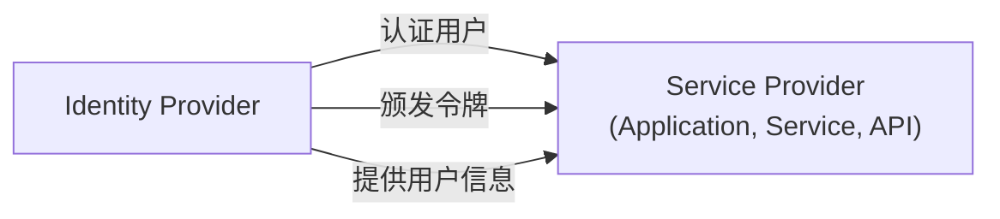

## 什么是服务提供者 (Service provider, SP)？

在 <Ref slug="iam" /> 的领域中，服务提供者 (SP) （或在 <Ref slug="openid-connect" /> 的上下文中称为**依赖方**）是一个依赖于 <Ref slug="identity-provider" /> 进行认证 (Authentication) 和授权的应用程序或服务。它负责向用户提供服务，并根据身份提供者颁发的令牌来执行 <Ref slug="access-control" /> 策略。

## 服务提供者标准

服务提供者没有严格的标准，因为它们可以是任何需要身份管理的类型的应用程序或服务。然而，服务提供者通常遵循其依赖的身份提供者设定的标准。例如，如果身份提供者支持 <Ref slug="openid-connect" />，服务提供者通常会使用 OIDC 进行认证 (Authentication) 和授权。

## 服务提供者架构

“服务提供者”这个术语并不指定特定的架构或实现。通常，服务提供者需要注册到身份提供者以建立信任并启用安全通信。注册过程通常涉及交换元数据和客户端凭证。

例如，在 OpenID Connect 的上下文中，服务提供者元数据通常包括：

- **Client ID**：服务提供者的唯一标识符。
- **Client secret**：用于认证服务提供者的共享密钥。
- **<Ref slug="redirect-uri">重定向 URIs</Ref>**：身份提供者在认证 (Authentication) 和授权后将用户重定向回去的 URI。

一旦注册，服务提供者可以通过将用户重定向到身份提供者指定的终端来启动认证 (Authentication) 过程。

当服务提供者为非交互式用例构建时，通常被称为需要 <Ref slug="machine-to-machine" /> 通信的 <Ref slug="client">客户端</Ref>。

<SeeAlso slugs={["identity-provider", "openid-connect", "oauth-2.0"]} />

<Resources
  urls={[
    "https://blog.logto.io/secure-cloud-apps-with-oauth-and-openid-connect",
    "https://blog.logto.io/incorporate-identity-solution",
    "https://blog.logto.io/centralized-identity-system"
  ]}
/>