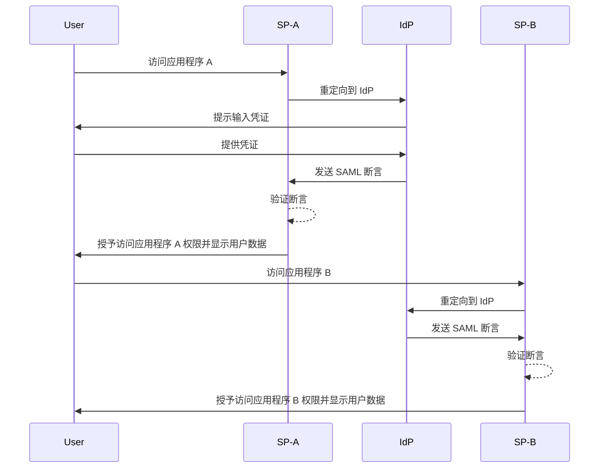
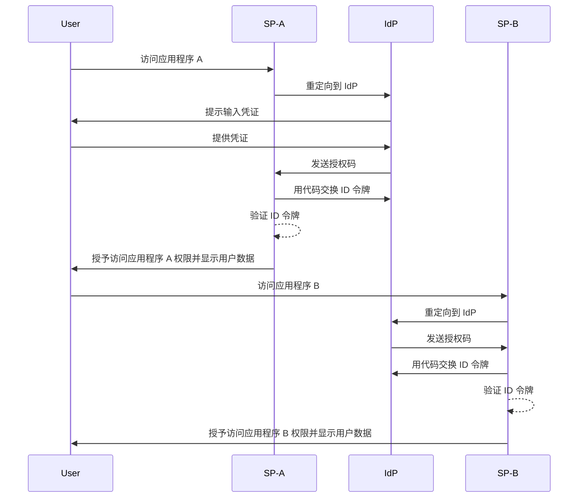

## 什么是单点登录 (Single sign-on, SSO)？

单点登录 (Single sign-on, SSO) 是一种 <Ref slug="authentication" /> 方法，允许用户通过一组凭证访问多个应用程序或服务。用户无需为每个系统单独管理登录，而是一次认证便可自动登录到所有连接的平台。

SSO 通常在个人和商业环境中使用，尤其是在企业环境中，员工或远程工作者依赖各种 SaaS 应用程序来完成工作。通过实施 SSO，组织可以提高安全性，简化访问管理，并提升用户生产力。

一个著名的 SSO 示例是 Google 的一系列服务，例如 Gmail、Google Drive 和 Google Calendar。用户登录他们的 Google 账户后，即可轻松访问所有这些服务，而无需重新输入凭证。

## 单点登录如何工作？

SSO 基于应用程序或服务（称为 <Ref slug="service-provider" />）与 <Ref slug="identity-provider" /> 之间的信任关系进行操作。IdP 负责用户认证，并安全地与 SP 共享必要的信息以授予访问权限。此信任关系通过一个称为联合的过程建立，在该过程中，SP 和 IdP 都同意特定的标准和协议以安全地交换认证数据。

当用户尝试访问支持 SSO 的应用程序时，SP 会将其重定向到 IdP 进行认证。IdP 提示用户输入其凭证，验证其身份，并生成包含用户信息的安全令牌或断言。此令牌被发回给 SP，SP 随后使用该令牌授予访问权限。

如果用户尝试访问另一个支持 SSO 的应用程序，该过程会自动重复，而无需他们再次登录。IdP 直接将所需的认证数据发送给 SP，使用户能够无缝访问新应用程序。

<Ref slug="saml" /> 和 <Ref slug="openid-connect" /> 是实现 SSO 的两种广泛使用的协议。这些标准定义了 IsP 和 SP 之间如何交换认证数据，确保安全和可靠的通信。

### 基于 SAML 的 SSO

在基于 SAML 的 SSO 中，一旦用户通过 IdP 认证，就会生成 XML 格式的 SAML 断言，签署并安全地发送到 SP。SP 然后验证断言并根据用户的身份授予访问权限。

### 基于 OIDC 的 SSO

OIDC 相比之下构建在 <Ref slug="oauth-2.0" /> 之上，提供了一种更现代的 SSO 方法。它使用 <Ref slug="jwt" /> 在 IdP 和 SP 之间交换身份信息，提供了增强的安全性和更大的灵活性。

## 单点登录的好处

1. **增强安全性**：SSO 通过减少用户需要记住的凭证数量来降低与密码相关的安全漏洞风险。它还允许组织实施更强的认证方法，例如 <Ref slug="mfa" /> 保护用户账户。

2. **改善用户体验**：用户可以无缝访问多个应用程序，无需重复登录，提高了生产力并减少了挫折感。SSO 简化了登录过程，并在不同平台上提供一致的用户体验。

3. **集中访问管理**：组织可以通过 IdP 集中管理用户访问和权限，确保在所有连接的应用程序中实施一致的安全策略和访问控制。这简化了用户供应、取消供应和审计过程。

## 何时使用单点登录

1. **企业和组织环境**：对于依赖多个应用程序和服务来简化工作流程的企业，SSO 特别有益。它简化了用户访问并减少了 IT 团队管理单个用户账户的负担。例如，使用多个 SaaS 应用程序的公司，如 CRM、HR 和协作工具。
2. **面向客户的应用程序**：对于访问在线服务或电子商务平台的客户，SSO 也可以增强用户体验。例如，允许用户使用其社交媒体账户或电子邮件地址登录，而不是为每个服务创建新账户。
3. **多产品服务**：提供一组互联产品或服务的公司可以利用 SSO 在其产品中提供无缝用户体验。用户可以在不同的应用程序之间导航，而无需重复登录。例如，Google 的 G Suite。用户可以在其 Chrome 浏览器上一次登录后访问多个 Google 服务，而无需重新输入凭证。

SSO 的使用不限于这些场景，可以根据组织或应用程序的具体需求适应各种用例。它被广泛认为是增强现代数字环境中的安全性、用户体验和操作效率的最佳实践。

<SeeAlso slugs={["enterprise-sso"]} />