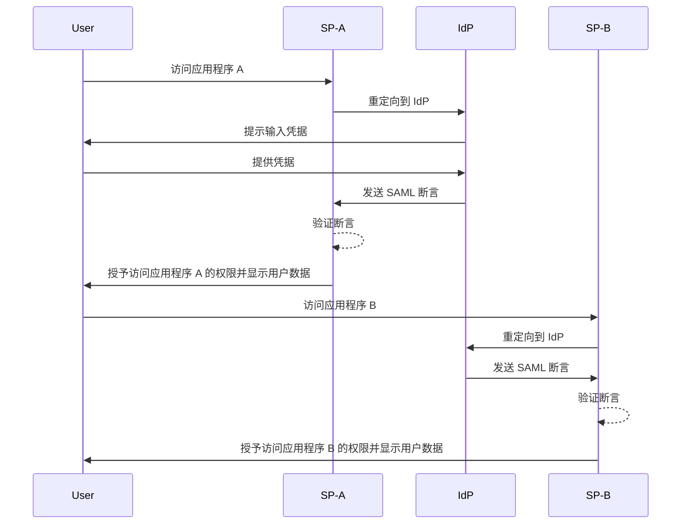
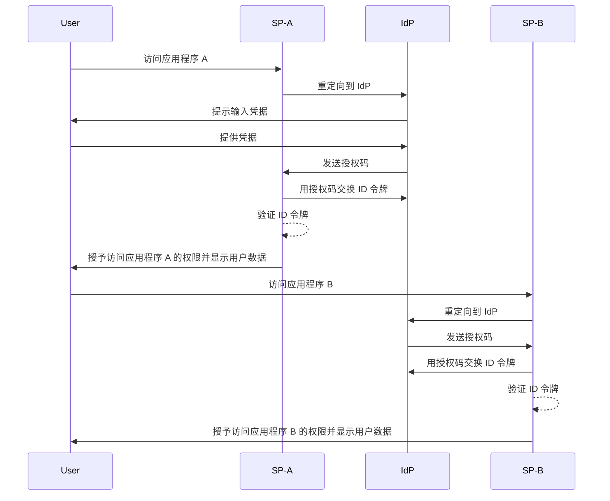

## 什么是单点登录 (Single sign-on, SSO)？

单点登录 (Single sign-on, SSO) 是一种 <Ref slug="authentication" /> 方法，允许用户使用一组凭据访问多个应用程序或服务。用户无需为每个系统管理单独的登录信息，只需认证一次即可自动登录所有连接的平台。

SSO 通常用于个人和商业环境，尤其是在企业环境中，员工或远程工作者依赖各种 SaaS 应用程序来完成工作。通过实施 SSO，组织可以增强安全性、简化访问管理并提高用户生产力。

一个众所周知的 SSO 示例是 Google 的服务套件，如 Gmail、Google Drive 和 Google Calendar。用户登录他们的 Google 账户后，可以轻松访问所有这些服务，而无需重新输入凭据。

## 单点登录如何工作？

SSO 依赖于应用程序或服务（称为 <Ref slug="service-provider" />）与 <Ref slug="identity-provider" /> 之间的信任关系。IdP 处理用户认证，并安全地与 SP 共享必要的信息以授予访问权限。这种信任通过称为联合的过程建立，其中 SP 和 IdP 同意特定的标准和协议，以安全地交换认证数据。

当用户尝试访问启用 SSO 的应用程序时，SP 会将其重定向到 IdP 进行认证。IdP 提示用户提供凭据，验证其身份，并在其系统中建立认证会话。此会话通常使用会话 cookie 维护，安全地存储在 IdP 的域下。

一旦用户通过认证，IdP 会生成一个安全令牌或断言，其中包含用户同意与 SP 共享的信息。此令牌或断言被安全地传输回 SP，SP 验证后授予用户访问权限。

如果用户访问另一个启用 SSO 的应用程序，该过程将顺利进行，无需额外登录。这种便利性得益于 IdP 维护的用户认证会话，使 IdP 能够自动验证用户身份，并在不再次提示输入凭据的情况下发出新的安全令牌。

像 <Ref slug="saml" /> 和 <Ref slug="openid-connect" /> 这样的协议被广泛用于实现 SSO。这些标准定义了 IdP 和 SP 之间如何安全地交换认证数据，确保可靠和安全的通信，同时保持用户在应用程序间的无缝体验。

### 基于 SAML 的 SSO

在基于 SAML 的 SSO 中，一旦用户通过 IdP 认证，就会生成一个基于 XML 的 SAML 断言，签名并安全地发送给 SP。然后 SP 验证断言，并根据用户的身份授予访问权限。

### 基于 OIDC 的 SSO

OIDC 相比之下，建立在 <Ref slug="oauth-2.0" /> 之上，提供了一种更现代的 SSO 方法。它使用 <Ref slug="jwt" /> 在 IdP 和 SP 之间交换身份信息，提供增强的安全性和更大的灵活性。

## 单点登录的好处

1. **增强的安全性**：SSO 通过减少用户需要记住的凭据数量来降低与密码相关的安全漏洞风险。它还允许组织实施更强的认证方法，如 <Ref slug="mfa" />，以保护用户账户。

2. **改善的用户体验**：用户可以无缝访问多个应用程序，而无需重复登录，提高生产力并减少挫折感。SSO 简化了登录过程，并在不同平台上提供一致的用户体验。

3. **集中化的访问管理**：组织可以通过 IdP 集中管理用户访问和权限，确保所有连接应用程序的一致安全策略和访问控制。这简化了用户配置、取消配置和审计过程。

## 何时使用单点登录

1. **企业和组织环境**：SSO 对于依赖多个应用程序和服务以简化工作流程的企业特别有利。它简化了用户访问，并减少了 IT 团队管理单个用户账户的负担。例如，使用多个 SaaS 应用程序的公司，如 CRM、HR 和协作工具。
2. **面向客户的应用程序**：SSO 还可以增强客户访问在线服务或电子商务平台的用户体验。例如，允许用户使用他们的社交媒体账户或电子邮件地址登录，而不是为每个服务创建新账户。
3. **多产品服务**：提供一套互联产品或服务的公司可以利用 SSO 在其产品中提供无缝的用户体验。用户可以在不同应用程序之间导航，而无需重复登录的麻烦。例如，Google 的 G Suite。用户可以在 Chrome 浏览器上登录一次，并访问多个 Google 服务，而无需重新输入凭据。

SSO 的使用不限于这些场景，可以根据组织或应用程序的具体需求适应各种用例。它被广泛认为是增强安全性、用户体验和现代数字环境中运营效率的最佳实践。

<SeeAlso slugs={["enterprise-sso"]} />