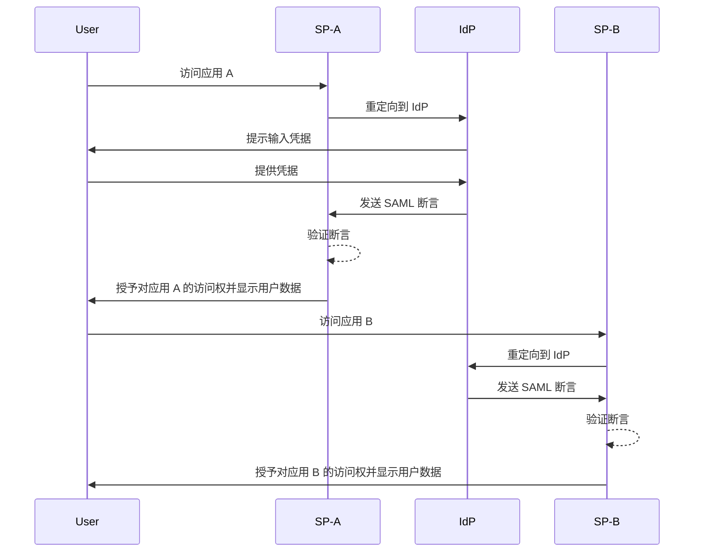
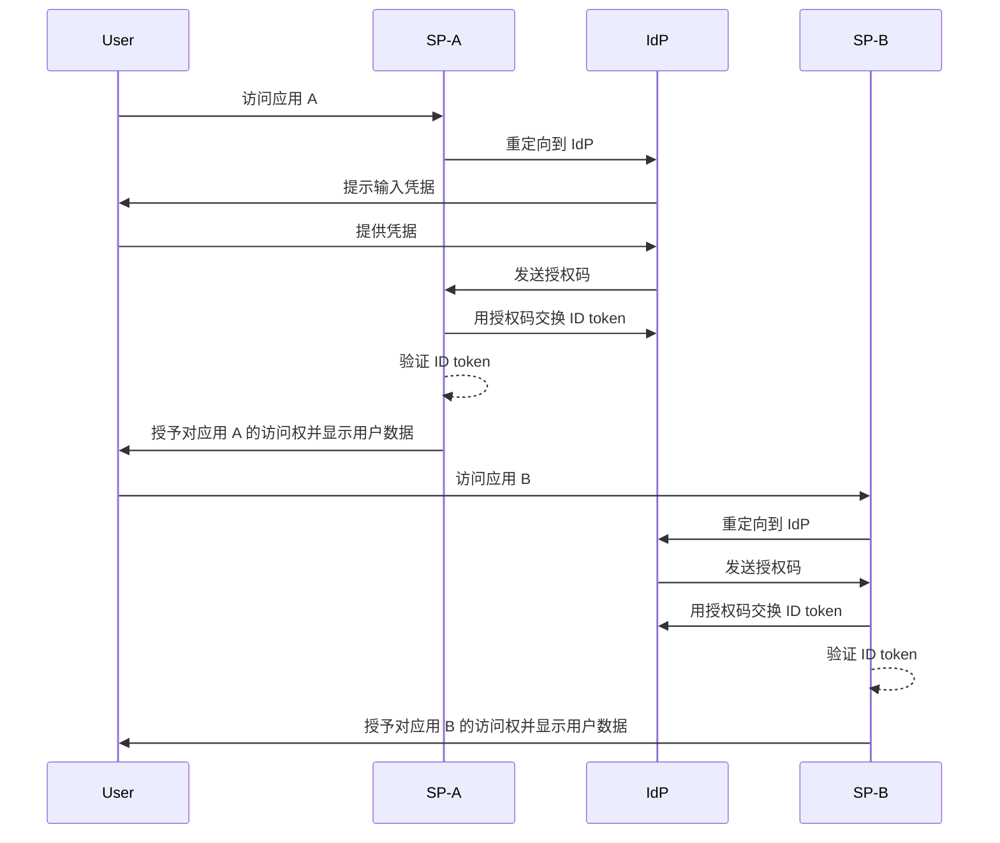

## 什么是单点登录 (Single sign-on, SSO)？

单点登录 (Single sign-on, SSO) 是一种认证方法，允许用户使用一组凭据访问多个应用或服务。用户无需为每个系统管理单独的登录信息，只需认证一次，即可自动登录所有连接的平台。

SSO 常用于个人和商业环境，特别是在企业环境中，员工或远程工作者依赖各种 SaaS 应用来完成工作。通过实施 SSO，组织可以提升安全性，简化访问管理，并提高用户生产力。

一个著名的 SSO 示例是 Google 的一系列服务，如 Gmail、Google Drive 和 Google Calendar。用户登录其 Google 账户后，可以轻松访问所有这些服务而无需重新输入凭据。

## 单点登录的工作原理是什么？

SSO 基于应用或服务（被称为 <Ref slug="service-provider" />）与 <Ref slug="identity-provider" /> 之间的信任关系进行操作。IdP 负责用户认证，并安全地与 SP 共享必要的信息以授予访问权限。这种信任通过联盟过程建立，其中 SP 和 IdP 同意特定的标准和协议以安全地交换认证数据。

当用户试图访问一个启用 SSO 的应用时，SP 会将其重定向到 IdP 进行认证。IdP 提示用户输入其凭据，验证其身份，并生成一个包含用户信息的安全令牌或断言。该令牌被发送回 SP，SP 然后使用它来授予访问权限。

如果用户尝试访问另一个启用 SSO 的应用，这个过程会自动重复，而不需要他们再次登录。IdP 会将所需的认证数据直接发送给 SP，允许用户无缝访问新应用。

SAML（Security Assertion Markup Language）和 OIDC（OpenID Connect）是实现 SSO 的两种广泛使用的协议。这些标准定义了 IsP 和 SP 之间如何交换认证数据，以确保安全可靠的通信。

### 基于 SAML 的 SSO

在基于 SAML 的 SSO 中，一旦用户被 IdP 认证，便会生成一个基于 XML 的 SAML 断言，并安全地发送给 SP。SP 然后验证断言，并根据用户的身份授予访问权限。

### 基于 OIDC 的 SSO

OIDC 是建立在 OAuth 2.0 之上的，提供了一种更现代的 SSO 方法。它使用 JSON Web Token (JWT) 在 IdP 和 SP 之间交换身份信息，提供增强的安全性和更大的灵活性。

## 单点登录的好处

1. **增强的安全性**：SSO 通过减少用户需要记住的凭据数量来降低与密码相关的安全风险。它还允许组织实施更强的认证方法，比如多因素认证 (MFA)，以保护用户账户。

2. **改进的用户体验**：用户无需反复登录就能无缝访问多个应用，提升了生产力并减少了挫败感。SSO 简化了登录过程，并在不同平台上提供一致的用户体验。

3. **集中的访问管理**：组织可以通过 IdP 集中管理用户访问和权限，确保所有连接应用的一致安全策略和访问控制。这简化了用户配置、取消配置和审计流程。

## 什么时候使用单点登录

1. **企业和组织环境**：对于依赖多个应用和服务来简化工作流程的企业，SSO 尤其有利。它简化了用户访问，并减轻了 IT 团队管理单个用户账户的负担。例如，使用多个 SaaS 应用（如 CRM、HR 和协作工具）的公司。
2. **面向客户的应用**：对于客户访问在线服务或电子商务平台，SSO 也可以提升用户体验。例如，允许用户使用其社交媒体账户或电子邮件地址登录，而不是为每项服务创建新账户。
3. **多产品服务**：提供一系列互联产品或服务的公司可以利用 SSO 在其产品之间提供无缝的用户体验。用户可以在不同的应用之间导航，而无需重复登录。例如，Google 的 G Suite。用户可以在 Chrome 浏览器上登录一次，然后访问多个 Google 服务而无需重新输入凭据。

SSO 的使用不限于这些场景，可以根据组织或应用的具体需求适应各种用例。在现代数字环境中，SSO 被广泛认为是增强安全性、用户体验和运营效率的最佳实践之一。

<SeeAlso slugs={['enterprise-sso']} />