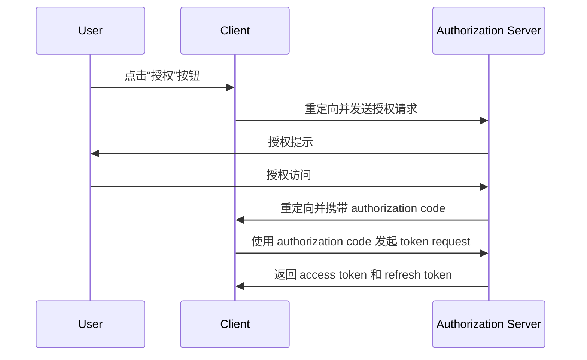
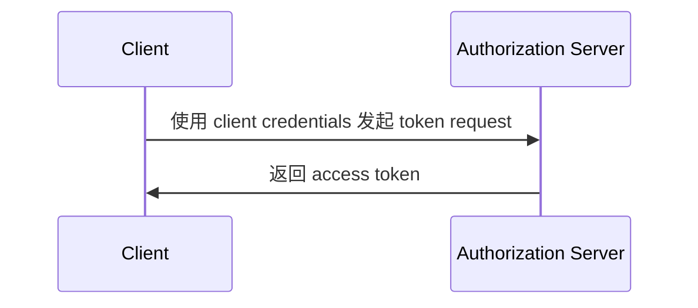

## 什么是 token 请求 (Token request)？

在 <Ref slug="oauth-2.0" /> 和 <Ref slug="openid-connect" /> 中，token request （Token 请求）是向 <Ref slug="authorization-server" />（在 OIDC 中为 <Ref slug="openid-connect" headingId="openid-provider-op" />）发送请求以交换凭据（例如，authorization code、refresh token）以获取一组令牌。令牌集通常包括以下一项或多项：

- <Ref slug="access-token" />：授予访问受保护资源的令牌。
- <Ref slug="id-token" />：包含用户信息的令牌（OIDC 专用）。
- <Ref slug="refresh-token" />：可以用于在不进行用户交互的情况下获得新的 access token 的令牌。

根据使用的 <Ref slug="oauth-2.0-grant">授权类型</Ref>，请求可能包含不同的参数并返回不同的令牌。

例如，在 <Ref slug="client-credentials-flow" /> 中，<Ref slug="client" /> 直接通过 client credentials 请求一个 <Ref slug="access-token" />。以下是 token request 的非规范示例：

```http
POST /token HTTP/1.1
Host: authorization-server.example.com
Content-Type: application/x-www-form-urlencoded

grant_type=client_credentials
  &client_id=client-id
  &client_secret=client-secret
  &scope=read
```

如果请求成功，authorization server 将回复一个 access token：

```http
HTTP/1.1 200 OK
Content-Type: application/json

{
  "access_token": "eyJhbGci...zHg",
  "token_type": "Bearer",
  "expires_in": 3600,
  "scope": "read"
}
```

## Token 请求 (Token request)如何工作？

如上例所示，token request 本身很简单。client 向 authorization server 的 token endpoint 发送带有必要参数的 HTTP 请求。authorization server 验证请求，处理它，并在响应中返回令牌。

但是，根据使用的特定授权类型（flow），token request 可能需要更多的准备。

### Authorization code flow（授权码流程）

在 <Ref slug="authorization-code-flow" /> 中，client 首先通过向授权服务器发起 <Ref slug="authorization-request" />（在 OIDC 中为 <Ref slug="authentication-request" />）获取 authorization code。当用户授予权限后，client 通过 token request 交换 authorization code 来获得 access token 和可选的 refresh token。

以下是授权码流程的简化序列图：



### Client credentials flow（客户端凭据流程）

如第一部分的示例所示，<Ref slug="client-credentials-flow" /> 要简单得多。client 直接使用其 client credentials 请求一个 access token。authorization server 验证 client credentials 并在成功时颁发一个 access token。

以下是客户端凭据流程的非规范序列图：



### Refresh token（刷新令牌）

在一些授权类型中，client 还可以通过在授权请求中包含 `offline_access` scope，请求 <Ref slug="offline-access" />。如果被授予，authorization server 会与 access token 一起颁发 refresh token。client 可以使用 refresh token 通过 token request 在不进行用户交互的情况下获得新的 access token。

以下是使用 refresh token 获得新的 access token 的非规范示例：

```http
POST /token HTTP/1.1
Host: authorization-server.example.com
Content-Type: application/x-www-form-urlencoded

grant_type=refresh_token
  &refresh_token=refresh-token
  &client_id=client-id
  &client_secret=client-secret
```

---

其他 <Ref slug="oauth-2.0-grant">授权类型</Ref> 也可能涉及 token requests，但基本理念是相同的。

## Token 请求 (Token request)的关键参数

以下是 token request 中常用的一些关键参数：

- **`grant_type`**：请求的授权类型。常见值包括 `authorization_code`、`client_credentials`、`refresh_token` 等。
- **`client_id`**：authorization server 发放的 client 标识符。
- **`client_secret`**：authorization server 为 client 发放的密钥（用于机密 client）。
- **`code`**：从 authorization server 获取的 authorization code（用于授权码流程）。
- **`refresh_token`**：从 authorization server 获取的 refresh token（用于刷新 access tokens）。
- **`scope`**：请求的 <Ref slug="scope">scopes</Ref>（权限）用于 access token。
- **`redirect_uri`**：authorization server 发送响应的 URI（用于授权码流程）。
- **`code_verifier`**：在 <Ref slug="pkce" /> 扩展中使用的 code 验证器（用于授权码流程）。

实际的参数及其值取决于授权类型及应用的具体要求。在进行 token request 前，应参考你所使用的特定授权类型的完整参数列表。

<SeeAlso slugs={["oauth-2.0", "openid-connect", "authorization-request", "authentication-request"]} />
