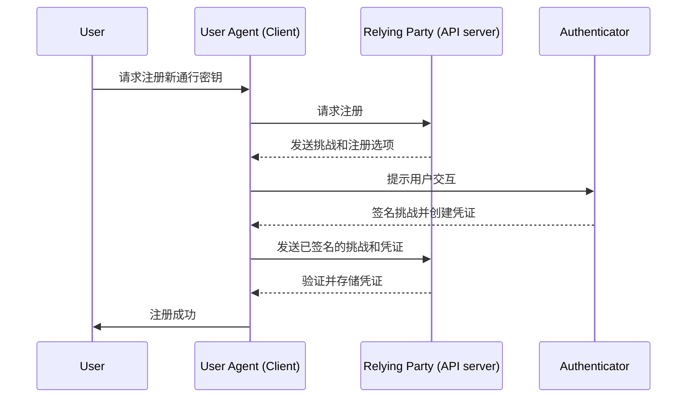
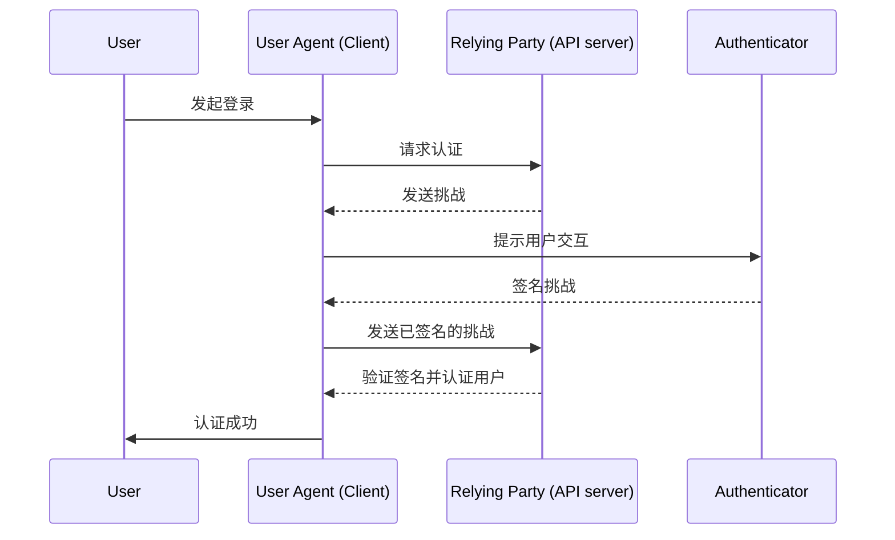

## 什么是 WebAuthn？

WebAuthn (Web Authentication API)，由 [W3C](https://www.w3.org/) 和 [FIDO Alliance](https://fidoalliance.org/) 开发，是一种使用 FIDO2 标准进行安全 Web 认证的规范。WebAuthn 提供一个 API，允许网站实现<Ref slug="passkey" />，这是一种通过公钥加密技术保护的抗钓鱼凭证。通行密钥可以替代密码，用于无密码登录和多因素认证 (MFA)。

## WebAuthn 工作流程是什么样的？

为了提供更详细的说明，我们可以将过程分为两个阶段：注册和认证。首先，需要了解 WebAuthn 流程中涉及的四个关键实体。

### 4 个关键实体

1. **用户：** 尝试访问 Web 应用程序的个人。
2. **用户代理：** 处理 WebAuthn API 调用的 Web 浏览器，管理用户、依赖方和认证器之间的认证过程。
3. **依赖方：** 用户希望访问的服务、应用或 API 服务器。
4. **认证器：** 用于验证用户身份的硬件或软件组件。它可以根据平台或浏览器能力以不同形式出现，如安全密钥（例如 Yubikeys）、手机或平板电脑（通过蓝牙、NFC 或 USB 连接）、基于设备的生物识别或 PIN 等。

### WebAuthn 注册

非对称公钥加密是核心过程。

1. **密钥对生成**：
用户代理生成一个公钥-私钥对。
    - **公钥**：与依赖方共享。
    - **私钥**：安全地存储在用户的认证器中。
2. **注册挑战**：
当用户尝试注册通行密钥时，依赖方向用户代理发送注册挑战。
3. **用户验证**：
用户代理将挑战转发给认证器，认证器会提示用户进行验证（例如，生物认证或硬件安全密钥）。
4. **加密签名：**
认证器使用其私钥对挑战进行签名，创建一个加密签名。
5. **验证和访问：**
用户代理将已签名的挑战发送回依赖方，依赖方使用公钥验证签名并完成注册过程。



### WebAuthn 认证

1. **认证挑战：**
当用户尝试登录时，依赖方向用户代理发送一个认证挑战。
2. **用户验证：**
用户代理将挑战发送给认证器，认证器会提示用户进行验证（例如，生物识别认证或硬件安全密钥）。
3. **加密签名：**
认证器使用其私钥对挑战进行签名，创建一个加密签名。
4. **验证和访问：**
用户代理使用公钥验证签名，并通知依赖方认证成功。如果验证成功，则授予访问权限。



## 如何使用 WebAuthn？

WebAuthn API 可用于实现通行密钥登录或两步验证。参考通行密钥体验以了解更多详细信息。

要使用 Web Authentication API (WebAuthn) 进行安全认证，你需要处理两个主要过程：注册和认证。以下是如何使用 JavaScript 可能实现这些过程的简单代码示例。

**注册**

依赖方（你的 Web 应用程序）通过调用 `navigator.credentials.create()` 方法启动注册过程。

```jsx
// Registration
navigator.credentials.create({
  publicKey: {
    rp: {
      name: "Your Relying Party Name",
      id: "your-relying-party-id"
    },
    user: {
      id: "user-id",
      displayName: "User Name",
      name: "User Name"
    },
    challenge: "your-challenge-value",
    timeout: 60000 // 60 seconds
  }
}).then(credential => {
  // Store the credential's id for future authentication
  localStorage.setItem("credentialId", credential.id);
}).catch(error => {
  console.error("Registration error:", error);
});
```

依赖方通过调用 `navigator.credentials.get()` 方法启动认证过程。

```jsx
// Authentication
navigator.credentials.get({
  publicKey: {
    rp: {
      name: "Your Relying Party Name",
      id: "your-relying-party-id"
    },
    challenge: "your-challenge-value",
    timeout: 60000 // 60 seconds
  }
}).then(credential => {
  // Verify the credential's id and other properties
  if (credential.id === localStorage.getItem("credentialId")) {
    // Authentication successful
    console.log("User authenticated successfully");
  } else {
    console.error("Invalid credential");
  }
}).catch(error => {
  console.error("Authentication error:", error);
});
```

要了解详细信息，请阅读规范：https://fidoalliance.org/specifications/download/。

注意：在 WebAuthn 操作中，无论是注册还是认证，“rp ID”（依赖方 ID）都是必填字段。它表示当前网页的域名主机名。如果不匹配当前域，浏览器将拒绝请求。这意味着通行密钥绑定到特定域，目前无法将现有通行密钥迁移到不同域。此外，通行密钥无法跨不同域使用。

## WebAuthn 和 CTAP2 有什么区别？

**WebAuthn** 和 **CTAP2** 都是 FIDO2 标准的重要组成部分，但它们具有不同的目的：

- **CTAP2 (Client to Authenticator Protocol 2)：** 该协议定义了设备（如安全密钥或智能手机）如何与 Web 应用程序通信。它在 **认证器** 和 **用户设备** 之间建立了一个安全通道，以确保敏感的认证数据得到保护。
- **WebAuthn (Web Authentication API)：** 该 API 提供了一种标准化方式，使 Web 应用程序能够与 CTAP2 兼容的认证器交互。它处理认证过程，包括处理 **用户设备** 和 **依赖方** 之间的认证数据交换。

## 需要了解的术语

- <Ref slug="passkey" />
- FIDO
- FIDO2
- CTAP2
- MFA
- Authenticator

<Resources
  urls={[
    "https://fidoalliance.org/specs/fido-v2.0-id-20180227/fido-client-to-authenticator-protocol-v2.0-id-20180227.html",
    "https://blog.logto.io/webauthn-nextjs",
    "https://blog.logto.io/webauthn-base-knowledge"
  ]}
/>