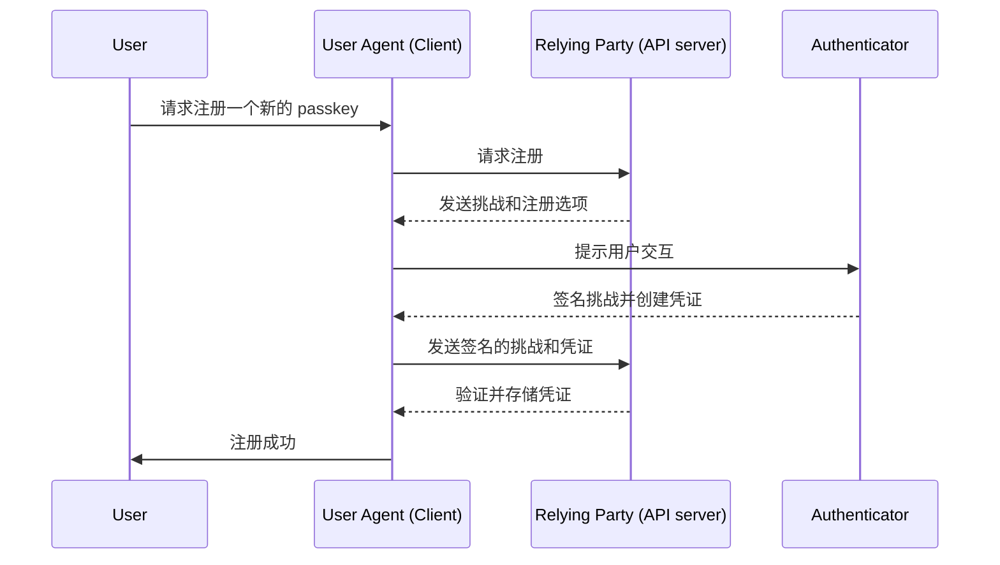

## 什么是 WebAuthn？

WebAuthn (Web Authentication API) 是由 [W3C](https://www.w3.org/) 和 [FIDO Alliance](https://fidoalliance.org/) 开发的一个规范，使用 FIDO2 标准进行安全的网络认证。WebAuthn 提供了一个 API，允许网站实现 <Ref slug="passkey" />，这些凭证具有防钓鱼特性，并通过公钥加密技术进行保护。Passkeys 可以替代密码用于无密码登录和 <Ref slug="mfa" />。

## WebAuthn 的工作流程是什么样的？

这里有一个现实世界的例子来帮助更好地理解。你有一个名为 MyApp 的网络应用程序，想要集成 WebAuthn API 来实现多因素认证的 Passkey。

**注册阶段：** 在通过电子邮件验证并设置新密码后，用户会被提示创建一个 Passkey。他们选择使用指纹将设备链接起来。这在他们的设备上安全地建立了 Passkey。

**认证阶段：** 在下次登录时，用户在输入密码后被要求验证他们的 Passkey。只需快速扫描指纹，他们就可以轻松完成认证过程。


为了提供更详细的解释，我们可以将过程分为两个阶段：注册和认证。首先，了解 WebAuthn 流程中涉及的四个关键实体是很重要的。

### 4 个关键实体

1. **用户：** 试图访问网络应用程序的个人。
2. **用户代理：** 处理 WebAuthn API 调用的网络浏览器，并管理用户、依赖方和认证器之间的认证过程。
3. **依赖方：** 用户希望访问的服务、应用程序或 API 服务器。
4. **认证器：** 用于验证用户身份的硬件或软件组件。它可以根据平台或浏览器的能力采取多种形式，例如安全密钥（如 Yubikeys）、通过蓝牙、NFC 或 USB 连接的手机或平板电脑、基于设备的生物识别或 PIN 等。

### WebAuthn 注册

非对称公钥加密是核心过程。

1. **密钥对生成：** 
用户代理生成一个公钥-私钥对。
   - **公钥：** 与依赖方共享。
   - **私钥：** 安全地存储在用户的认证器中。
2. **注册挑战：** 
当用户尝试注册一个 passkey 时，依赖方向用户代理发送一个注册挑战。
3. **用户验证：** 
用户代理将挑战转发给认证器，认证器提示用户进行验证（例如，生物识别认证或硬件安全密钥）。
4. **加密签名：** 
认证器使用其私钥对挑战进行签名，创建一个加密签名。
5. **验证和访问：** 
用户代理将签名的挑战发送回依赖方，依赖方使用公钥验证签名并完成注册过程。



### WebAuthn 认证

1. **认证挑战：**
当用户尝试登录时，依赖方向用户代理发送一个认证挑战。
2. **用户验证：**
用户代理将挑战发送给认证器，认证器提示用户进行验证（例如，生物识别认证或硬件安全密钥）。
3. **加密签名：**
认证器使用其私钥对挑战进行签名，创建一个加密签名。
4. **验证和访问：**
用户代理使用公钥验证签名，并通知依赖方认证成功。如果验证成功，则授予访问权限。


## 如何使用 WebAuthn？

WebAuthn API 可用于实现 passkey 登录或两步验证。参考 Passkey 体验以了解更多细节。

要使用 Web Authentication API (WebAuthn) 进行安全认证，你需要处理两个主要过程：注册和认证。以下是如何使用 JavaScript 实现这些过程的简单代码示例。

**注册**

依赖方（你的网络应用程序）通过调用 `navigator.credentials.create()` 方法启动注册过程。

```jsx
// 注册
navigator.credentials.create({
  publicKey: {
    rp: {
      name: "Your Relying Party Name",
      id: "your-relying-party-id"
    },
    user: {
      id: "user-id",
      displayName: "User Name",
      name: "User Name"
    },
    challenge: "your-challenge-value",
    timeout: 60000 // 60 秒
  }
}).then(credential => {
  // 存储凭证的 id 以便将来认证
  localStorage.setItem("credentialId", credential.id);
}).catch(error => {
  console.error("注册错误:", error);
});
```

依赖方通过调用 `navigator.credentials.get()` 方法启动认证过程。

```jsx
// 认证
navigator.credentials.get({
  publicKey: {
    rp: {
      name: "Your Relying Party Name",
      id: "your-relying-party-id"
    },
    challenge: "your-challenge-value",
    timeout: 60000 // 60 秒
  }
}).then(credential => {
  // 验证凭证的 id 和其他属性
  if (credential.id === localStorage.getItem("credentialId")) {
    // 认证成功
    console.log("用户认证成功");
  } else {
    console.error("无效凭证");
  }
}).catch(error => {
  console.error("认证错误:", error);
});
```

要了解详细信息，请阅读规范：https://fidoalliance.org/specifications/download/。

注意：在 WebAuthn 操作中，无论是注册还是认证，“rp ID”（依赖方 ID）都是必填字段。它代表当前网页的域名主机。如果它与当前域不匹配，浏览器将拒绝请求。这意味着 passkeys 绑定到特定域，目前没有办法将现有的 passkeys 迁移到不同的域。此外，passkeys 不能跨不同域使用。

## WebAuth 和 OpenID Connect (OIDC)

通过将 WebAuthn 的强大安全性与 OIDC 的标准化身份协议相结合，我们可以创建一个更安全和用户友好的认证体验。

了解其工作原理：

- **注册阶段：** 用户完成标准的 <Ref slug="openid-connect" /> 注册过程（例如，电子邮件验证和密码创建）。WebAuthn 生成一个公钥-私钥对，将公钥存储在 OIDC <Ref slug="identity-provider" /> 中，并将私钥保存在用户的设备上。
- **认证阶段：** 用户访问一个 OIDC 保护的资源，并被重定向到登录页面。在提供基本凭证（例如，电子邮件和密码）后，系统调用 WebAuthn 进行 passkey 认证。一旦 Passkey 验证通过，OIDC 会为用户访问颁发一个 Access Token 或 ID Token。

## WebAuthn 和 CTAP2 有什么区别？

**WebAuthn** 和 **CTAP2** 都是 FIDO2 标准的重要组成部分，但它们的作用不同：

- **CTAP2 (Client to Authenticator Protocol 2)：** 该协议定义了设备（如安全密钥或智能手机）如何与网络应用程序通信。它在 **认证器** 和 **用户设备** 之间建立了一个安全通道，确保敏感的认证数据得到保护。
- **WebAuthn (Web Authentication API)：** 该 API 为网络应用程序提供了一种与 CTAP2 兼容的认证器进行交互的标准化方式。它处理认证过程，包括在 **用户设备** 和 **依赖方** 之间交换认证数据。

<SeeAlso slugs={["passkey", "mfa", "openid-connect"]} />

<Resources
  urls={[
    "https://fidoalliance.org/specs/fido-v2.0-id-20180227/fido-client-to-authenticator-protocol-v2.0-id-20180227.html",
    "https://blog.logto.io/webauthn-nextjs",
    "https://blog.logto.io/webauthn-base-knowledge"
  ]}
/>