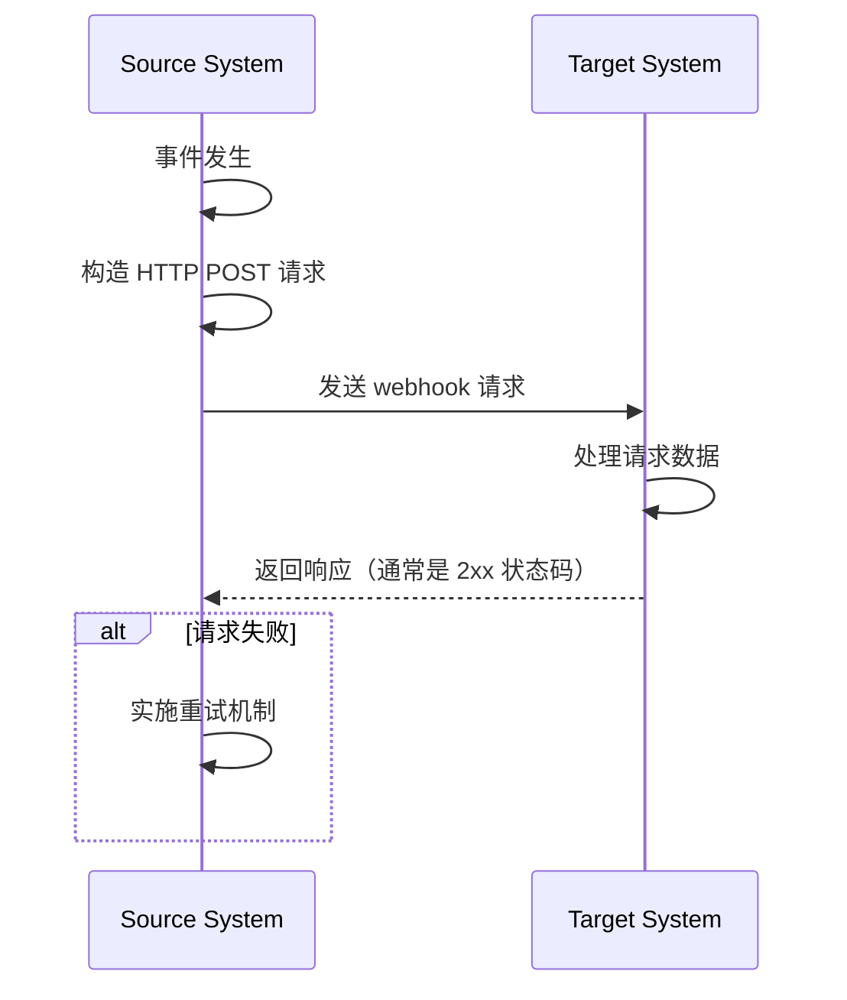
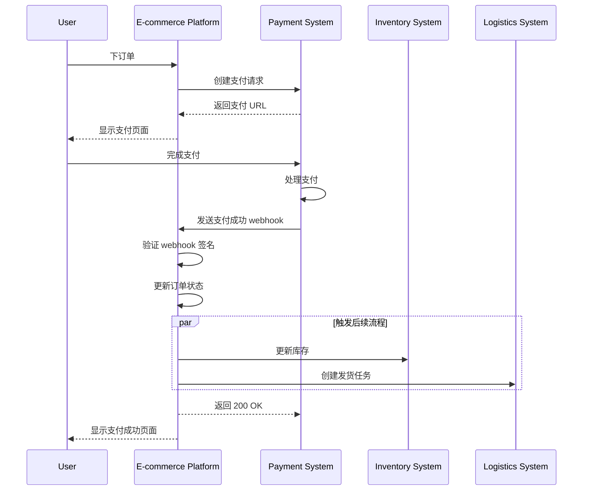

## 什么是 webhook？

webhook 是一种 HTTP 回调机制，当特定事件发生时，允许应用程序向预定义的 URL 发送实时通知。这种机制能够在系统之间进行自动数据交换和实时通信。

## webhook 如何工作？



1. 事件在源系统中发生
2. 源系统构建包含事件数据的 HTTP POST 请求
3. 源系统将请求发送到预配置的目标系统 URL
4. 目标系统接收请求并处理数据
5. 目标系统向源系统返回响应
6. 如果请求失败，源系统可能会实施重试机制

## webhook 的常见用例是什么？

1. 支付系统：通知订单状态更改
2. 版本控制系统：通知代码提交、合并请求和其他事件
3. CRM 系统：客户信息更新通知
4. 物联网设备：设备状态更改通知
5. 社交媒体平台：新消息和评论通知

## 在真实场景中，webhook 如何工作？

我们来看看一个涉及电子商务平台和第三方支付系统集成的场景：

### 场景

一个电子商务平台使用第三方支付系统来处理订单支付。当用户完成支付时，支付系统需要通过 webhook 实时通知电子商务平台支付状态，以便平台更新订单状态并触发后续流程。

### Webhook 实施流程



1. 订单创建和支付请求：
   - 用户在电子商务平台上下订单。
   - 平台向支付系统发送支付请求。
   - 支付系统返回一个支付 URL，平台将其显示给用户。

2. 用户支付：
   - 用户在支付系统上完成支付。

3. Webhook 触发：
   - 支付系统检测到“支付成功”事件。
   - 它构建包含支付详情的 webhook 负载。

4. 发送 webhook：
   - 支付系统向预配置的电子商务平台 URL 发送 POST 请求。

5. 接收方处理：
   - 电子商务平台接收 webhook，首先验证请求签名以确保安全。
   - 验证后，平台将相应订单状态更新为“已支付”。
   - 平台触发后续流程，如更新库存和创建发货任务。

6. 响应处理：
   - 电子商务平台在接收到 webhook 后立即返回 200 OK 响应。
   - 如果处理过程中出现错误，平台将在后台重试或进行人工干预。

7. 用户体验：
   - 电子商务平台向用户显示支付成功页面。

这个例子展示了 webhook 如何实现第三方支付系统与电子商务平台之间的实时通信。通过 webhook，支付系统可以在支付完成时立即通知电子商务平台，允许立即更新订单状态并快速触发后续业务流程。这提高了系统响应能力和效率，最终为用户提供更好的购物体验。

## 实施 webhook 的最佳实践是什么？

当你是 webhook 的发送者（生产者）时，考虑以下方面：

### Webhook 设计

设计清晰且一致的 webhook 结构：

- 定义明确的事件类型：例如，`order.created`，`user.updated` 等。
- 使用标准 JSON 格式：确保数据结构清晰且易于解析。
- 版本控制：在请求头或负载中包含版本信息。例如：

  ```javascript
  // 在请求头中
  headers: {
    'Content-Type': 'application/json',
    'X-Webhook-Version': '1.0'
  }
  
  // 或在负载中
  {
    "version": "1.0",
    "event_type": "order.created",
    "data": {
      // 事件详情
    }
  }
  ```

- 提供足够的上下文：包括事件发生的时间戳、相关资源的唯一标识符等。
- 保持一致性：在所有事件类型中使用一致的命名约定和数据结构。

### 发送机制

实现可靠的 webhook 发送机制：

- 使用异步任务队列：避免阻塞主程序，提高系统响应能力。
- 实施重试机制：处理网络故障或接收方暂时不可用的情况。

### 重试策略

设计适当的重试策略：

- 实现指数退避：避免频繁重试给系统和接收方带来压力。
- 设置最大重试次数：防止无限重试消耗系统资源。
- 提供手动重试机制：为最终失败的 webhook 提供手动重试接口。

### 安全实现

实施签名机制以允许接收方验证请求的真实性：

```javascript
const crypto = require('crypto');

function generateSignature(payload, secret) {
  return crypto.createHmac('sha256', secret)
    .update(JSON.stringify(payload))
    .digest('hex');
}

function sendWebhookWithSignature(url, payload, secret) {
  const signature = generateSignature(payload, secret);
  return axios.post(url, payload, {
    headers: { 'X-Webhook-Signature': signature }
  });
}
```

### 性能优化

优化 webhook 发送性能：

- 使用连接池：减少建立连接的开销，提高性能。
- 实施批量处理：在合适时批量发送 webhook，以减少网络交互次数。

### 文档和测试工具

为 webhook 用户提供支持：

- 详细的 API 文档：包括所有可能的事件类型、请求格式和字段说明。
- 提供测试工具：实现 webhook 测试端点，允许用户模拟接收 webhook 通知。
- 示例代码：提供在各种编程语言中的集成示例。

## 使用 webhook 的最佳实践是什么？

当你是 webhook 的接收方（消费者）时，考虑以下方面：

### 安全性

由于 webhook 接收端通常是公开可访问的，安全性是首要考虑的。注意以下几点：

- 验证请求真实性：实施签名验证机制，以确保请求来自预期的发送方。
  
  ```javascript
  const crypto = require('crypto');

  function verifySignature(payload, signature, secret) {
    const expectedSignature = crypto
      .createHmac('sha256', secret)
      .update(JSON.stringify(payload))
      .digest('hex');
    
    return crypto.timingSafeEqual(
      Buffer.from(signature),
      Buffer.from(expectedSignature)
    );
  }
  ```

- 使用 HTTPS：确保你的 webhook 接收端点使用 HTTPS，以防数据在传输过程中被拦截或篡改。
- 实施 IP 白名单：仅接受来自受信任 IP 地址的 webhook 请求，以降低攻击风险。

### 可靠性

确保可靠地处理接收到的 webhook：

- 实现幂等处理：设计系统以正确处理重复的 webhook 通知，因为发送方可能会重试失败的请求。
- 迅速响应：在接收到 webhook 请求后立即返回响应（通常是 2xx 状态码），以防发送方认为请求失败并触发重试。

### 性能

保持系统高效运行：

- 异步处理：接收到 webhook 后，在后台执行实际数据处理，不阻塞响应。
- 设置超时限制：设置合理的 webhook 处理超时时间，以防长时间运行的任务影响系统性能。

### 错误处理

妥善处理可能的错误情况：

- 日志记录：详细记录接收到的 webhook 请求和处理过程，以便于问题调查。
- 平稳降级：处理 webhook 无法处理时的错误机制，确保系统其他部分不受影响。

### 版本兼容性

由于 webhook 格式可能会随时间改变：

- 处理版本信息：准备处理不同版本的 webhook 格式。版本信息通常提供在 URL 或请求头中。
- 向后兼容：在更新 webhook 处理逻辑时，确保继续支持旧格式版本。

### 监控

持续监控 webhook 的接收和处理：

- 设置警报：对异常情况（如高失败率或异常流量）实施实时监控和警报。
- 性能指标：跟踪 webhook 处理的性能指标，如响应时间和成功率。

<Resources
  urls={[
    "https://docs.logto.io/docs/recipes/webhooks/",
    "https://docs.logto.io/docs/recipes/webhooks/securing-your-webhooks/",
    "https://en.wikipedia.org/wiki/Webhook"
  ]}
/>